# 一、安装docker

## 环境查看

> ```shell
> #系统内核是3.10及以上的
> [root@localhost /]# uname -r
> 3.10.0-1127.19.1.el7.x86_64
> 
> 
> #系统版本
> [root@localhost /]# cat /etc/os-release 
> NAME="CentOS Linux"
> VERSION="7 (Core)"
> ID="centos"
> ID_LIKE="rhel fedora"
> VERSION_ID="7"
> PRETTY_NAME="CentOS Linux 7 (Core)"
> ANSI_COLOR="0;31"
> CPE_NAME="cpe:/o:centos:centos:7"
> HOME_URL="https://www.centos.org/"
> BUG_REPORT_URL="https://bugs.centos.org/"
> 
> CENTOS_MANTISBT_PROJECT="CentOS-7"
> CENTOS_MANTISBT_PROJECT_VERSION="7"
> REDHAT_SUPPORT_PRODUCT="centos"
> REDHAT_SUPPORT_PRODUCT_VERSION="7"
> ```

## 帮助文档

https://docs.docker.com/engine/install/centos/

## 安装步骤

> ```shell
> #1.卸载旧版本docker
> yum remove docker \
>                   docker-client \
>                   docker-client-latest \
>                   docker-common \
>                   docker-latest \
>                   docker-latest-logrotate \
>                   docker-logrotate \
>                   docker-selinux \
>                   docker-engine-selinux \
>                   docker-engine
>                   
> #2.安装必要软件包
> yum install -y yum-utils
> 
> #3.设置镜像的仓库
> yum-config-manager \
>     --add-repo \
>     https://download.docker.com/linux/centos/docker-ce.repo #默认是国外的
>     
> yum-config-manager \
>     --add-repo \
>     http://mirrors.aliyun.com/docker-ce/linux/centos/docker-ce.repo #阿里云镜像地址
>     
> #4.更新yum软件包索引
> yum makecache fast
> 
> #5.安装dockcer
> yum install docker-ce docker-ce-cli containerd.io
> 
> #6.启动docker
> systemctl start docker
> 
> #7.查看否安装成功
> docker version
> 
> #8.设置开机自动启动
> systemctl enable docker
> ```

## 卸载步骤

>```shell
>#1.卸载docker
>yum remove docker-ce docker-ce-cli containerd.io
>
>#2.删除资源
>rm -rf /var/lib/docker  #是其工作路径
>
>#3.双重保险
>yum remove docker \
>                  docker-client \
>                  docker-client-latest \
>                  docker-common \
>                  docker-latest \
>                  docker-latest-logrotate \
>                  docker-logrotate \
>                  docker-selinux \
>                  docker-engine-selinux \
>                  docker-engine
>```

## 配置ustc镜像

编辑该文件：

```
vim /etc/docker/daemon.json
```

输入以下内容：

```
{
"registry-mirrors":["https://docker.mirrors.ustc.edu.cn"]
}
```

重启docker

```
systemctl restart docker
```

查看docker状态

```
systemctl status docker
```

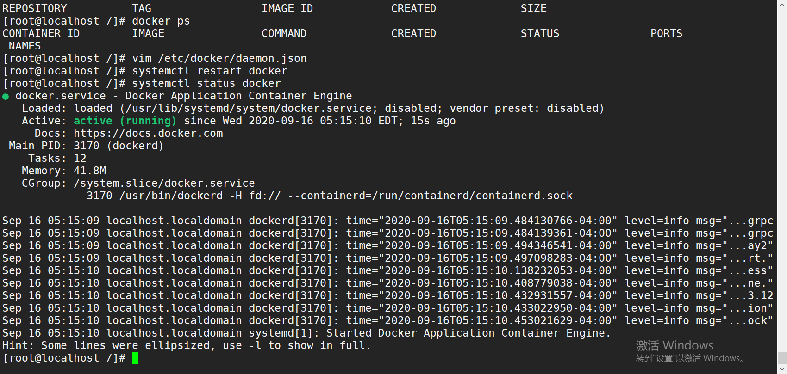

设置开机自动启动

# 二、docker常用命令

## 帮助命令

```shell
docker version    #显示docker的版本信息。
docker info       #显示docker的系统信息，包括镜像和容器的数量
docker 命令 --help #帮助命
```

## 镜像命令

**基本命令**

```shell
docker images #查看所有本地主机上的镜像 

docker search #搜索镜像

docker pull #下载镜像 

docker rmi #删除镜像 
```

---


> docker images查看所有本地的主机上的镜像

```shell
[root@iz2zeak7sgj6i7hrb2g862z ~]# docker images
REPOSITORY            TAG                 IMAGE ID            CREATED           SIZE
hello-world           latest              bf756fb1ae65        4 months ago     13.3kB
mysql                 5.7                 b84d68d0a7db        6 days ago       448MB

# 解释
#REPOSITORY			# 镜像的仓库源
#TAG				# 镜像的标签(版本)		---lastest 表示最新版本
#IMAGE ID			# 镜像的id
#CREATED			# 镜像的创建时间
#SIZE				# 镜像的大小

# 可选项
Options:
  -a, --all         Show all images (default hides intermediate images) #列出所有镜像
  -q, --quiet       Only show numeric IDs # 只显示镜像的id
  
[root@iz2zeak7sgj6i7hrb2g862z ~]# docker images -a  #列出所有镜像详细信息
[root@iz2zeak7sgj6i7hrb2g862z ~]# docker images -aq #列出所有镜像的id
d5f28a0bb0d0
f19c56ce92a8
1b6b1fe7261e
1b6b1fe7261e

```

> ##### docker search 搜索镜像

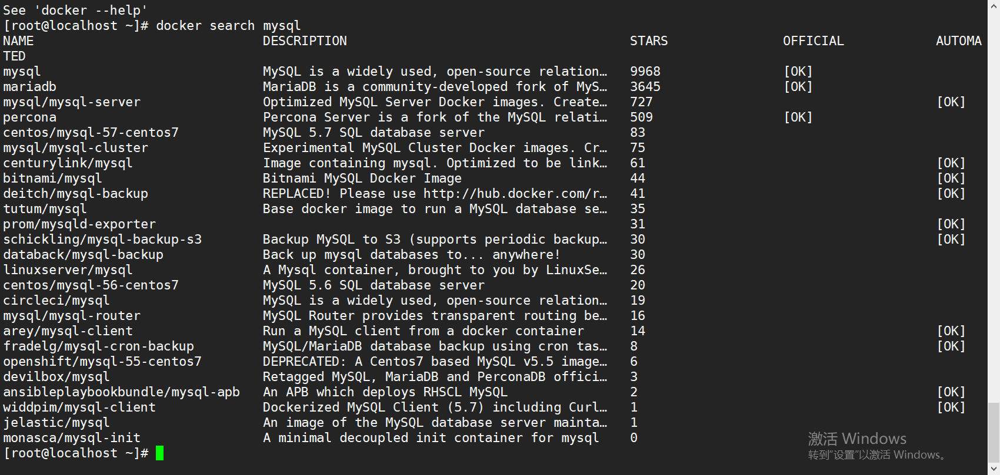

```shell
[root@iz2zeak7sgj6i7hrb2g862z ~]# docker search mysql

# --filter=STARS=3000 #过滤，搜索出来的镜像收藏STARS数量大于3000的
Options:
  -f, --filter filter   Filter output based on conditions provided
      --format string   Pretty-print search using a Go template
      --limit int       Max number of search results (default 25)
      --no-trunc        Don't truncate output
      
[root@iz2zeak7sgj6i7hrb2g862z ~]# docker search mysql --filter=STARS=3000
NAME        DESCRIPTION         STARS            OFFICIAL        AUTOMATED
mysql       MySQL IS ...        9520             [OK]                
mariadb     MariaDB IS ...      3456             [OK]   

```

> ##### docker pull 下载镜像
>
> ```shell
> [root@localhost ~]# docker pull mysql
> Using default tag: latest
> latest: Pulling from library/mysql
> d121f8d1c412: Downloading 
> f3cebc0b4691: Download complete 
> 1862755a0b37: Download complete 
> 489b44f3dbb4: Download complete 
> 690874f836db: Download complete 
> baa8be383ffb: Download complete 
> 55356608b4ac: Download complete 
> dd35ceccb6eb: Download complete 
> 429b35712b19: Download complete 
> 162d8291095c: Download complete 
> 5e500ef7181b: Download complete 
> af7528e958b6: Download complete 
> latest: Pulling from library/mysql
> d121f8d1c412: Pull complete 
> f3cebc0b4691: Pull complete 
> 1862755a0b37: Pull complete 
> 489b44f3dbb4: Pull complete 
> 690874f836db: Pull complete 
> baa8be383ffb: Pull complete 
> 55356608b4ac: Pull complete 
> dd35ceccb6eb: Pull complete 
> 429b35712b19: Pull complete 
> 162d8291095c: Pull complete 
> 5e500ef7181b: Pull complete 
> af7528e958b6: Pull complete 
> Digest: sha256:e1bfe11693ed2052cb3b4e5fa356c65381129e87e38551c6cd6ec532ebe0e808
> Status: Downloaded newer image for mysql:latest
> docker.io/library/mysql:latest
> 
> ```
>
> 
>
> ```sh
> # 下载镜像 docker pull 镜像名[:tag]
> [root@iz2zeak7sgj6i7hrb2g862z ~]# docker pull tomcat:8
> 8: Pulling from library/tomcat #如果不写tag，默认就是latest
> 90fe46dd8199: Already exists   #分层下载： docker image 的核心 联合文件系统
> 35a4f1977689: Already exists 
> bbc37f14aded: Already exists 
> 74e27dc593d4: Already exists 
> 93a01fbfad7f: Already exists 
> 1478df405869: Pull complete 
> 64f0dd11682b: Pull complete 
> 68ff4e050d11: Pull complete 
> f576086003cf: Pull complete 
> 3b72593ce10e: Pull complete 
> Digest: sha256:0c6234e7ec9d10ab32c06423ab829b32e3183ba5bf2620ee66de866df # 签名防伪
> Status: Downloaded newer image for tomcat:8
> docker.io/library/tomcat:8 #真实地址
> 
> #等价于
> docker pull tomcat:8
> docker pull docker.io/library/tomcat:8
> 
> ```

> ##### docker rmi 删除镜像

```shell
docker rmi -f 镜像id #删除指定id的镜像
[root@iz2zeak7sgj6i7hrb2g862z ~]# docker rmi -f f19c56ce92a8

docker rmi -f $(docker images -aq) #删除全部的镜像
[root@iz2zeak7sgj6i7hrb2g862z ~]# docker stop $(docker ps -a -q)

```

> ##### docker rmi 删除镜像

```shell
docker rmi -f 镜像id #删除指定id的镜像
[root@iz2zeak7sgj6i7hrb2g862z ~]# docker rmi -f f19c56ce92a8

docker rmi -f $(docker images -aq) #删除全部的镜像
[root@iz2zeak7sgj6i7hrb2g862z ~]# docker stop $(docker ps -a -q)
```

## 容器命令

> **常用命令**
>
> ```sh
> docker run 镜像id #新建容器
> 
> docker ps #列出所有运行的容器 
> 
> docker rm 容器id #删除指定容器
> docker rm $(docker ps -aq) #删除所有容器
> 
> docker start 容器id	#启动容器
> docker restart 容器id	#重启容器
> docker attach 容器id #进入容器
> 容器内部Ctrl+q+p #退出容器
> docker stop 容器id	#停止当前正在运行的容器
> docker kill 容器id	#强制停止当前容器
> ```

> **新建容器并启动**
>
> ```sh
> docker run [可选参数] image 
> #参书说明
> --name="Name"		#容器名字 tomcat01 tomcat02 用来区分容器
> -d					#后台方式运行
> -it 				#使用交互方式运行，进入容器查看内容
> -p					#指定容器的端口 -p 8080(宿主机):8080(容器)
> 		-p ip:主机端口:容器端口
> 		-p 主机端口:容器端口(常用)
> 		-p 容器端口
> 		容器端口
> -P(大写) 				随机指定端口
> 
> # 测试、启动并进入容器
> [root@iz2zeak7sgj6i7hrb2g
> [root@iz2zeak7sgj6i7hrb2g862z ~]# docker run -it centos /bin/bash
> [root@241b5abce65e /]# ls
> bin  dev  etc  home  lib  lib64  lost+found  media  mnt  opt  proc  root  run  sbin  srv  sys  tmp  usr  var
> [root@241b5abce65e /]# exit #从容器退回主机
> exit
> ```
>
> **进入、退出容器**
>
> ```sh
> # 方式一
> docker exec -it 容器id bashshell
> # 方式二
> docker attach 容器id
> 
> #区别
> #docker exec #进入当前容器后开启一个新的终端，可以在里面操作。（常用）
> #docker attach # 进入容器正在执行的终端
> 
> exit #退出容器但不会停止容器
> ```
>
> **从容器内拷贝到主机上**
>
> ```sh
> docker cp 容器id:容器内路径  主机目的路径
> 
> #将容器内的hello.java拷贝到home文件加下
> [root@iz2zeak7sgj6i7hrb2g862z /]# docker cp 56a5583b25b4:/hello.java /home 
> [root@iz2zeak7sgj6i7hrb2g862z /]# cd /home
> [root@iz2zeak7sgj6i7hrb2g862z home]# ls -l	#可以看见hello.java存在
> total 8
> -rw-r--r-- 1 root root    0 May 19 22:09 haust.java
> -rw-r--r-- 1 root root    6 May 22 11:12 java.java
> drwx------ 3 www  www  4096 May  8 12:14 www
> ```
>
> ##### 查看容器中进程信息ps
>
> ```sh
> # 命令 docker top 容器id
> ```
>
> **列出所有运行容器**
>
> ```sh
> docker ps 命令  		#列出当前正在运行的容器
>   -a, --all     	 #列出当前正在运行的容器 + 带出历史运行过的容器
>   -n=?, --last int   #列出最近创建的?个容器 ?为1则只列出最近创建的一个容器,为2则列出2个
>   -q, --quiet        #只列出容器的编号
> ```
>
> **退出容器**
>
> ```sh
> exit 		#容器直接退出
> ctrl +P +Q  #容器不停止退出 	---注意：这个很有用的操作
> ```
>
> **删除容器**
>
> ```sh
> docker rm 容器id   				#删除指定的容器，不能删除正在运行的容器，如果要强制删除 rm -rf
> docker rm -f $(docker ps -aq)  	 #删除所有的容器
> docker ps -a -q|xargs docker rm  #删除所有的容器
> ```

## 其他命令

> 后台启动命令
>
> ```sh
> # 命令 docker run -d 镜像名
> [root@iz2zeak7sgj6i7hrb2g862z ~]# docker run -d centos
> a8f922c255859622ac45ce3a535b7a0e8253329be4756ed6e32265d2dd2fac6c
> 
> [root@iz2zeak7sgj6i7hrb2g862z ~]# docker ps    
> CONTAINER ID      IMAGE       COMMAND    CREATED     STATUS   PORTS    NAMES
> # 问题docker ps. 发现centos 停止了
> # 常见的坑，docker容器使用后台运行，就必须要有要一个前台进程，docker发现没有应用，就会自动停止
> # nginx，容器启动后，发现自己没有提供服务，就会立刻停止，就是没有程序了
> ```
>
> **查看日志**
>
> ```sh
> docker logs --help
> Options:
>       --details        Show extra details provided to logs 
> *  -f, --follow         Follow log output
>       --since string   Show logs since timestamp (e.g. 2013-01-02T13:23:37) or relative (e.g. 42m for 42 minutes)
> *      --tail string    Number of lines to show from the end of the logs (default "all")
> *  -t, --timestamps     Show timestamps
>       --until string   Show logs before a timestamp (e.g. 2013-01-02T13:23:37) or relative (e.g. 42m for 42 minutes)
> ➜  ~ docker run -d centos /bin/sh -c "while true;do echo 6666;sleep 1;done" #模拟日志      
> #显示日志
> -tf		#显示日志信息（一直更新）
> --tail number #需要显示日志条数
> docker logs -t --tail n 容器id #查看n行日志
> docker logs -ft 容器id #跟着日志
> 
> ```
>
> **查看镜像元数据**
>
> ```sh
> # 命令
> docker inspect 容器id
> ```

# 三、实际操作

## ddocker安装nginx

```sh
#1. 搜索镜像 search 建议大家去docker搜索，可以看到帮助文档
[root@iz2zeak7sgj6i7hrb2g862z ~]# docker search nginx

#2. 拉取下载镜像 pull
[root@iz2zeak7sgj6i7hrb2g862z ~]# docker pull nginx

#3. 查看是否下载成功镜像
[root@iz2zeak7sgj6i7hrb2g862z ~]# docker images

#3. 运行测试
# -d 后台运行
# --name 给容器命名
# -p 宿主机端口：容器内部端口
[root@iz2zeak7sgj6i7hrb2g862z ~]# docker run -d --name nginx01 -p 3344:80 nginx
aa664b0c8ed98f532453ce1c599be823bcc1f3c9209e5078615af416ccb454c2

#4. 查看正在启动的镜像
[root@iz2zeak7sgj6i7hrb2g862z ~]# docker ps
CONTAINER ID        IMAGE               COMMAND                  CREATED             STATUS              PORTS                NAMES
75943663c116        nginx               "nginx -g 'daemon of…"   41 seconds ago      Up 40 seconds       0.0.0.0:82->80/tcp   nginx00

#5. 进入容器
[root@iz2zeak7sgj6i7hrb2g862z ~]# docker exec -it nginx01 /bin/bash #进入
root@aa664b0c8ed9:/# whereis nginx	#找到nginx位置
nginx: /usr/sbin/nginx /usr/lib/nginx /etc/nginx /usr/share/nginx
root@aa664b0c8ed9:/# cd /etc/nginx/
root@aa664b0c8ed9:/etc/nginx# ls
conf.d	fastcgi_params	koi-utf  koi-win  mime.types  modules  nginx.conf  scgi_params	uwsgi_params  win-utf

#6. 退出容器
root@aa664b0c8ed9:/etc/nginx# exit
exit

#7. 停止容器
[root@iz2zeak7sgj6i7hrb2g862z ~]# docker ps
CONTAINER ID        IMAGE               COMMAND                  CREATED             STATUS              PORTS                  NAMES
aa664b0c8ed9        nginx               "nginx -g 'daemon of…"   10 minutes ago      Up 10 minutes       0.0.0.0:3344->80/tcp   nginx01
[root@iz2zeak7sgj6i7hrb2g862z ~]# docker stop aa664b0c8ed9
```

**宿主机端口** 和 **容器内部端口** 以及端口暴露：

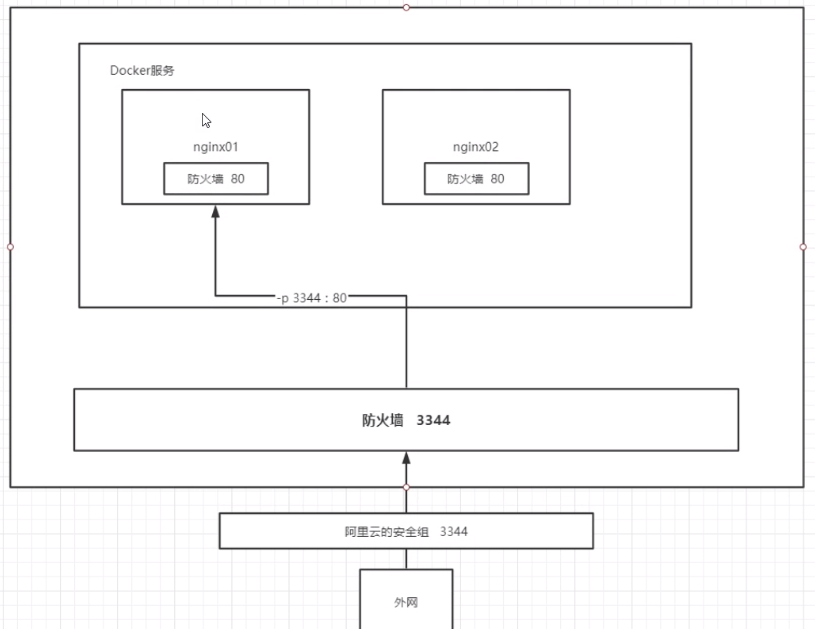

## docker安装tomcat

```sh
# 下载 tomcat9.0
# 之前的启动都是后台，停止了容器，容器还是可以查到， docker run -it --rm 镜像名 一般是用来测试，用完就删除
[root@iz2zeak7sgj6i7hrb2g862z ~]# docker run -it --rm tomcat:9.0

--rm       Automatically remove the container when it exits 用完即删

#下载 最新版
[root@iz2zeak7sgj6i7hrb2g862z ~]# docker pull tomcat

#查看下载的镜像
[root@iz2zeak7sgj6i7hrb2g862z ~]# docker images

#以后台方式，暴露端口方式，启动运行
[root@iz2zeak7sgj6i7hrb2g862z ~]# docker run -d -p 8080:8080 --name tomcat01 tomcat

#测试访问有没有问题
curl localhost:8080

#根据容器id进入tomcat容器
[root@iz2zeak7sgj6i7hrb2g862z ~]# docker exec -it 645596565d3f /bin/bash
root@645596565d3f:/usr/local/tomcat# 
#查看tomcat容器内部内容：
root@645596565d3f:/usr/local/tomcat# ls -l
total 152
-rw-r--r-- 1 root root 18982 May  5 20:40 BUILDING.txt
-rw-r--r-- 1 root root  5409 May  5 20:40 CONTRIBUTING.md
-rw-r--r-- 1 root root 57092 May  5 20:40 LICENSE
-rw-r--r-- 1 root root  2333 May  5 20:40 NOTICE
-rw-r--r-- 1 root root  3255 May  5 20:40 README.md
-rw-r--r-- 1 root root  6898 May  5 20:40 RELEASE-NOTES
-rw-r--r-- 1 root root 16262 May  5 20:40 RUNNING.txt
drwxr-xr-x 2 root root  4096 May 16 12:05 bin
drwxr-xr-x 1 root root  4096 May 21 11:04 conf
drwxr-xr-x 2 root root  4096 May 16 12:05 lib
drwxrwxrwx 1 root root  4096 May 21 11:04 logs
drwxr-xr-x 2 root root  4096 May 16 12:05 native-jni-lib
drwxrwxrwx 2 root root  4096 May 16 12:05 temp
drwxr-xr-x 2 root root  4096 May 16 12:05 webapps
drwxr-xr-x 7 root root  4096 May  5 20:37 webapps.dist
drwxrwxrwx 2 root root  4096 May  5 20:36 work
root@645596565d3f:/usr/local/tomcat# 
#进入webapps目录
root@645596565d3f:/usr/local/tomcat# cd webapps
root@645596565d3f:/usr/local/tomcat/webapps# ls
root@645596565d3f:/usr/local/tomcat/webapps# 

# 发现问题：1、linux命令少了。 2.webapps目录为空 
# 原因：阿里云镜像的原因，阿里云默认是最小的镜像，所以不必要的都剔除掉
# 保证最小可运行的环境！
# 解决方案：
# 将webapps.dist下的文件都拷贝到webapps下即可
root@645596565d3f:/usr/local/tomcat# ls 找到webapps.dist
BUILDING.txt	 LICENSE  README.md	 RUNNING.txt  conf  logs  temp     webapps.dist
CONTRIBUTING.md  NOTICE   RELEASE-NOTES  bin   lib   native-jni-lib  webapps  work

root@645596565d3f:/usr/local/tomcat# cd webapps.dist/ # 进入webapps.dist 
root@645596565d3f:/usr/local/tomcat/webapps.dist# ls # 查看内容
ROOT  docs  examples  host-manager  manager

root@645596565d3f:/usr/local/tomcat/webapps.dist# cd ..
root@645596565d3f:/usr/local/tomcat# cp -r webapps.dist/* webapps # 拷贝webapps.dist 内容给webapps
root@645596565d3f:/usr/local/tomcat# cd webapps #进入webapps
root@645596565d3f:/usr/local/tomcat/webapps# ls #查看拷贝结果
ROOT  docs  examples  host-manager  manager
```

这样docker部署tomcat就可以访问了。

## docker安装elasticsearch+kibana

```sh
# es 暴露的端口很多！
# es 十分耗内存
# es 的数据一般需要放置到安全目录！挂载
# --net somenetwork ? 网络配置

# 启动elasticsearch
[root@iz2zeak7sgj6i7hrb2g862z ~]# docker run -d --name elasticsearch -p 9200:9200 -p 9300:9300 -e "discovery.type=single-node" elasticsearch:7.6.2

# 测试一下es是否成功启动
➜  ~ curl localhost:9200
{
  "name" : "d73ad2f22dd3",
  "cluster_name" : "docker-cluster",
  "cluster_uuid" : "atFKgANxS8CzgIyCB8PGxA",
  "version" : {
    "number" : "7.6.2",
    "build_flavor" : "default",
    "build_type" : "docker",
    "build_hash" : "ef48eb35cf30adf4db14086e8aabd07ef6fb113f",
    "build_date" : "2020-03-26T06:34:37.794943Z",
    "build_snapshot" : false,
    "lucene_version" : "8.4.0",
    "minimum_wire_compatibility_version" : "6.8.0",
    "minimum_index_compatibility_version" : "6.0.0-beta1"
  },
  "tagline" : "You Know, for Search"
}

#测试成功就关掉elasticSearch，防止耗内存
[root@iz2zeak7sgj6i7hrb2g862z ~]# docker stop d834ce2bd306
d834ce2bd306

[root@iz2zeak7sgj6i7hrb2g862z ~]# docker stats  # 查看docker容器使用内存情况
```

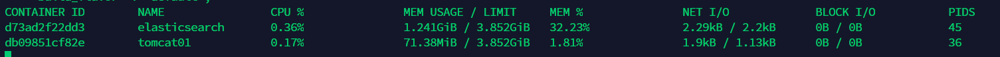

```sh
#测试成功就关掉elasticSearch，可以添加内存的限制，修改配置文件 -e 环境配置修改
docker rm -f d73ad2f22dd3            # stop命令也行                               
docker run -d --name elasticsearch -p 9200:9200 -p 9300:9300 -e "discovery.type=single-node" -e ES_JAVA_OPTS="-Xms64m -Xmx512m" elasticsearch:7.6.2
```

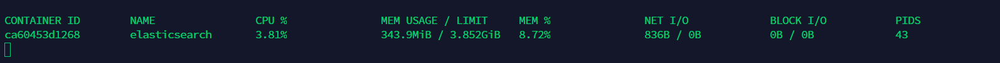

```sh
➜  ~ curl localhost:9200
{
  "name" : "b72c9847ec48",
  "cluster_name" : "docker-cluster",
  "cluster_uuid" : "yNAK0EORSvq3Wtaqe2QqAg",
  "version" : {
    "number" : "7.6.2",
    "build_flavor" : "default",
    "build_type" : "docker",
    "build_hash" : "ef48eb35cf30adf4db14086e8aabd07ef6fb113f",
    "build_date" : "2020-03-26T06:34:37.794943Z",
    "build_snapshot" : false,
    "lucene_version" : "8.4.0",
    "minimum_wire_compatibility_version" : "6.8.0",
    "minimum_index_compatibility_version" : "6.0.0-beta1"
  },
  "tagline" : "You Know, for Search"
}
```

> 使用kibana连接es (elasticSearch)？思考网络如何才能连接

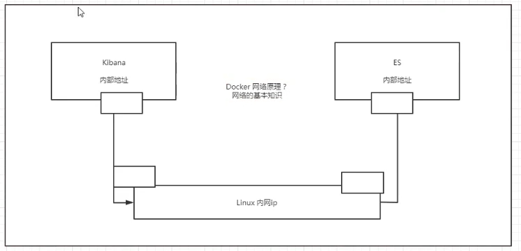

## docker安装Portainer

- **什么是portainer？**

Docker图形化界面管理工具！提供一个后台面板供我们操作！

```sh
# 安装命令
[root@iz2zeak7sgj6i7hrb2g862z ~]# docker run -d -p 8088:9000 \
> --restart=always -v /var/run/docker.sock:/var/run/docker.sock --privileged=true portainer/portainer

Unable to find image 'portainer/portainer:latest' locally
latest: Pulling from portainer/portainer
d1e017099d17: Pull complete 
a7dca5b5a9e8: Pull complete 
Digest: sha256:4ae7f14330b56ffc8728e63d355bc4bc7381417fa45ba0597e5dd32682901080
Status: Downloaded newer image for portainer/portainer:latest
81753869c4fd438cec0e31659cbed0d112ad22bbcfcb9605483b126ee8ff306d
```

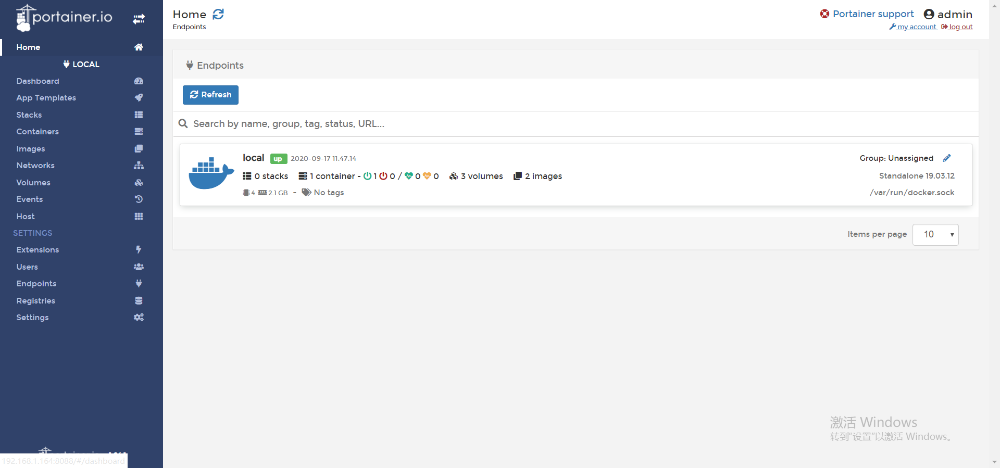


# 四、镜像原理

## **镜像是什么**

镜像是一种轻量级、可执行的独立软件保，用来打包软件运行环境和基于运行环境开发的软件，他包含运行某个软件所需的所有内容，包括代码、运行时库、环境变量和配置文件。

所有应用，直接打包docker镜像，就可以直接跑起来！

**如何得到镜像**

- 从远程仓库下载
- 别人拷贝给你
- 自己制作一个镜像 DockerFile

## **镜像加载原理**

> UnionFs （联合文件系统）

UnionFs（联合文件系统）：Union文件系统（UnionFs）是一种分层、轻量级并且高性能的文件系统，他支持对文件系统的修改作为一次提交来一层层的叠加，同时可以将不同目录挂载到同一个虚拟文件系统下（ unite several directories into a single virtual filesystem)。Union文件系统是 Docker镜像的基础。镜像可以通过分层来进行继承，基于基础镜像（没有父镜像），可以制作各种具体的应用镜像
特性：一次同时加载多个文件系统，但从外面看起来，只能看到一个文件系统，联合加载会把各层文件系统叠加起来，这样最终的文件系统会包含所有底层的文件和目录。

> Docker镜像加载原理

docker的镜像实际上由一层一层的文件系统组成，这种层级的文件系统UnionFS。
boots(boot file system）主要包含 bootloader和 Kernel, bootloader主要是引导加 kernel, Linux刚启动时会加bootfs文件系统，在 Docker镜像的最底层是 boots。这一层与我们典型的Linux/Unix系统是一样的，包含boot加載器和内核。当boot加载完成之后整个内核就都在内存中了，此时内存的使用权已由 bootfs转交给内核，此时系统也会卸载bootfs。
rootfs（root file system),在 bootfs之上。包含的就是典型 Linux系统中的/dev,/proc,/bin,/etc等标准目录和文件。 rootfs就是各种不同的操作系统发行版，比如 Ubuntu, Centos等等。


平时我们安装进虚拟机的CentOS都是好几个G，为什么Docker这里才200M？

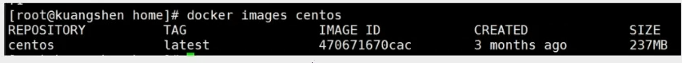

对于个精简的OS,rootfs可以很小，只需要包合最基本的命令，工具和程序库就可以了，因为底层直接用Host的kernel，自己只需要提供rootfs就可以了。由此可见对于不同的Linux发行版， boots基本是一致的， rootfs会有差別，因此不同的发行版可以公用bootfs.

虚拟机是分钟级别，容器是秒级！

## 分层理解

> 分层的镜像

我们可以去下载一个镜像，注意观察下载的日志输出，可以看到是一层层的在下载


**思考：为什么Docker镜像要采用这种分层的结构呢？**

最大的好处，我觉得莫过于资源共享了！比如有多个镜像都从相同的Base镜像构建而来，那么宿主机只需在磁盘上保留一份base镜像，同时内存中也只需要加载一份base镜像，这样就可以为所有的容器服务了，而且镜像的每一层都可以被共享。

查看镜像分层的方式可以通过docker image inspect 命令

**理解：**

所有的 Docker镜像都起始于一个基础镜像层，当进行修改或培加新的内容时，就会在当前镜像层之上，创建新的镜像层。

举一个简单的例子，假如基于 Ubuntu Linux16.04创建一个新的镜像，这就是新镜像的第一层；如果在该镜像中添加 Python包，
就会在基础镜像层之上创建第二个镜像层；如果继续添加一个安全补丁，就会创健第三个镜像层该像当前已经包含3个镜像层，如下图所示（这只是一个用于演示的很简单的例子）。

在添加额外的镜像层的同时，镜像始终保持是当前所有镜像的组合，理解这一点.


在添加额外的镜像层的同时，镜像始终保持是当前所有镜像的组合，理解这一点非常重要。下图中举了一个简单的例子，每个镜像层包含3个文件，而镜像包含了来自两个镜像层的6个文件。


上图中的镜像层跟之前图中的略有区別，主要目的是便于展示文件
下图中展示了一个稍微复杂的三层镜像，在外部看来整个镜像只有6个文件，这是因为最上层中的文件7是文件5的一个更新版。

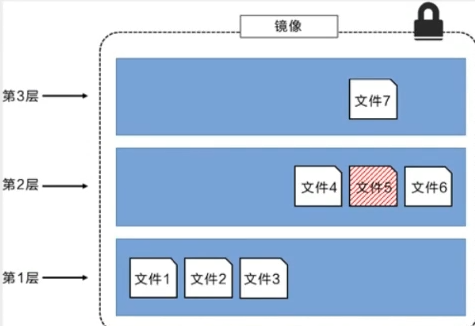

文种情況下，上层镜像层中的文件覆盖了底层镜像层中的文件。这样就使得文件的更新版本作为一个新镜像层添加到镜像当中

Docker通过存储引擎（新版本采用快照机制）的方式来实现镜像层堆栈，并保证多镜像层对外展示为统一的文件系统

Linux上可用的存储引撃有AUFS、 Overlay2、 Device Mapper、Btrfs以及ZFS。顾名思义，每种存储引擎都基于 Linux中对应的
件系统或者块设备技术，井且每种存储引擎都有其独有的性能特点。

Docker在 Windows上仅支持 windowsfilter 一种存储引擎，该引擎基于NTFS文件系统之上实现了分层和CoW [1]。

下图展示了与系统显示相同的三层镜像。所有镜像层堆并合井，对外提供统一的视图。


> 特点

Docker 镜像都是只读的，当容器启动时，一个新的可写层加载到镜像的顶部！

这一层就是我们通常说的容器层，容器之下的都叫镜像层！


## commit镜像

```sh
docker commit 提交容器成为一个新的副本

# 命令和git原理类似
docker commit -m="描述信息" -a="作者" 容器id 目标镜像名:[版本TAG]
docker commit -m="changeTheTomcat" -a="wangchenyang" d4a3cfb7bc90 tomcat_v0.1
```

测试：

```sh
# 1、启动一个默认的tomcat
[root@iz2zeak7sgj6i7hrb2g862z ~]# docker run -d -p 8080:8080 tomcat
de57d0ace5716d27d0e3a7341503d07ed4695ffc266aef78e0a855b270c4064e

# 2、发现这个默认的tomcat 是没有webapps应用，官方的镜像默认webapps下面是没有文件的！
#docker exec -it 容器id /bin/bash
[root@iz2zeak7sgj6i7hrb2g862z ~]# docker exec -it de57d0ace571 /bin/bash
root@de57d0ace571:/usr/local/tomcat# 

# 3、从webapps.dist拷贝文件进去webapp
root@de57d0ace571:/usr/local/tomcat# cp -r webapps.dist/* webapps
root@de57d0ace571:/usr/local/tomcat# cd webapps
root@de57d0ace571:/usr/local/tomcat/webapps# ls
ROOT  docs  examples  host-manager  manager

# 4、将操作过的容器通过commit调教为一个镜像！我们以后就使用我们修改过的镜像即可，而不需要每次都重新拷贝webapps.dist下的文件到webapps了，这就是我们自己的一个修改的镜像。
docker commit -m="描述信息" -a="作者" 容器id 目标镜像名:[TAG]
docker commit -m="changeTheTomcat" -a="wangchenyang" d4a3cfb7bc90 tomcat_V0.1

[root@localhost ~]# docker commit -m="changeTheTomcat" -a="wangchenyang" d4a3cfb7bc90 tomcat_v0.1
sha256:a7b8233fa48936786e0fcc4a2e1adce7cec045c867a2cd157da34850f562f66e

[root@localhost ~]# docker images
REPOSITORY            TAG                 IMAGE ID            CREATED              SIZE
tomcat_v0.1           latest              a7b8233fa489        About a minute ago   652MB
tomcat                latest              f796d3d2c195        32 hours ago         647MB
centos                latest              0d120b6ccaa8        5 weeks ago          215MB
portainer/portainer   latest              62771b0b9b09        8 weeks ago          79.1MB

```

如果你想要保存当前容器的状态，就可以通过commit来提交，获得一个镜像。

# 五、容器数据卷

## 挂载卷概念

容器数据卷是将应用和环境打包成一个镜像！

数据如果数据都在容器中，那么我们容器删除，数据就会丢失！需求：**数据可以持久化**

容器之间可以有一个数据共享的技术！Docker容器中产生的数据，同步到本地！

这就是卷技术！目录的挂载，将我们容器内的目录，挂载到Linux上面！

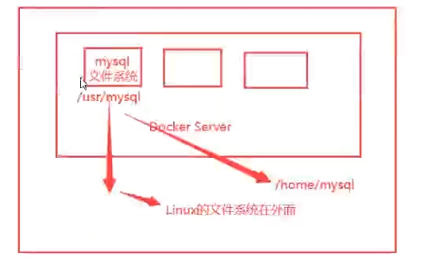

**总结一句话：容器的持久化和同步操作！容器间也是可以数据共享的！**

>  方式一 ：直接使用命令挂载 -v

```sh
-v, --volume list                    Bind mount a volume

#docker run -it -v 主机目录:容器内目录  -p 主机端口:容器内端口
docker run -it -v /home/ceshi:/home centos /bin/bash

#这时候主机的/home/ceshi文件夹就和容器的/home文件夹关联了,二者可以实现文件或数据同步了

#通过 docker inspect 容器id 查看
[root@iz2zeak7sgj6i7hrb2g862z home]# docker inspect 6064c490c371
```

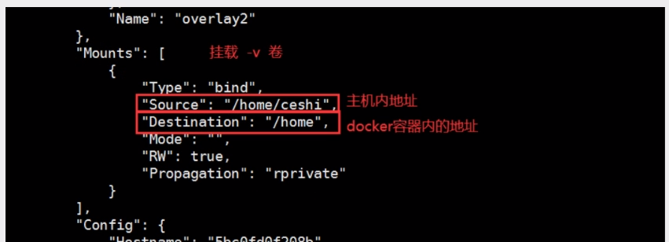

好处：我们以后修改只需要在本地修改即可，容器内会自动同步！

## MySQL挂载

```sh
# 获取mysql镜像
[root@iz2zeak7sgj6i7hrb2g862z home]# docker pull mysql:5.7

# 运行容器,需要做数据挂载 #安装启动mysql，需要配置密码的，这是要注意点！
# 参考官网hub 
docker run --name some-mysql -e MYSQL_ROOT_PASSWORD=my-secret-pw -d mysql:tag

#启动我们得
-d 后台运行
-p 端口映射
-v 卷挂载
-e 环境配置
-- name 容器名字
$ docker run -d -p 3310:3306 -v /home/mysql/conf:/etc/mysql/conf.d -v /home/mysql/data:/var/lib/mysql -e MYSQL_ROOT_PASSWORD=123456 --name mysql03 mysql:5.7

# 启动成功之后，我们在本地使用sqlyog来测试一下
# sqlyog-连接到服务器的3306--和容器内的3306映射 

# 在本地测试创建一个数据库，查看一下我们映射的路径是否ok！
```

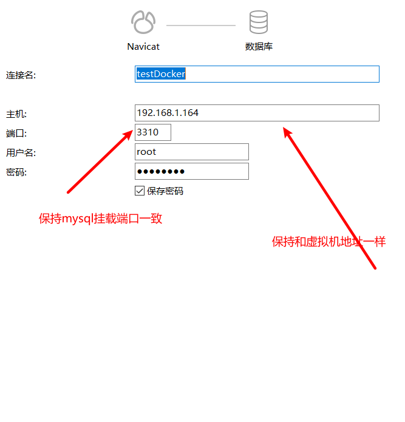

> 当我们在本地用SQLyog新建名称为test的数据库时候，容器容器也会创建
>
> 假设我们将包含mysql的容器删除时，发现**我们挂载到本地的数据卷依旧没有丢失，这就实现了容器数据持久化功能**。


## 具名挂载和匿名挂载

```sh
# 匿名挂载
-v 容器内路径!
$ docker run -d -P --name nginx01 -v /etc/nginx nginx

# 查看所有的volume(卷)的情况
$ docker volume ls    
DRIVER              VOLUME NAME # 容器内的卷名(匿名卷挂载)
local               21159a8518abd468728cdbe8594a75b204a10c26be6c36090cde1ee88965f0d0
local               b17f52d38f528893dd5720899f555caf22b31bf50b0680e7c6d5431dbda2802c
         
# 这里发现，这种就是匿名挂载，我们在 -v只写了容器内的路径，没有写容器外的路径！

# 具名挂载 -P:表示随机映射端口
$ docker run -d -P --name nginx02 -v juming-nginx:/etc/nginx nginx
9663cfcb1e5a9a1548867481bfddab9fd7824a6dc4c778bf438a040fe891f0ee

# 查看所有的volume(卷)的情况
$ docker volume ls                  
DRIVER              VOLUME NAME
local               21159a8518abd468728cdbe8594a75b204a10c26be6c36090cde1ee88965f0d0
local               b17f52d38f528893dd5720899f555caf22b31bf50b0680e7c6d5431dbda2802c
local               juming-nginx #多了一个名字


# 通过 -v 卷名：查看容器内路径
# 查看一下这个卷
$ docker volume inspect juming-nginx
[
    {
        "CreatedAt": "2020-05-23T13:55:34+08:00",
        "Driver": "local",
        "Labels": null,
        "Mountpoint": "/var/lib/docker/volumes/juming-nginx/_data", #默认目录
        "Name": "juming-nginx",
        "Options": null,
        "Scope": "local"
    }
]
```


所有的docker容器内的卷，没有指定目录的情况下都是在**/var/lib/docker/volumes/自定义的卷名/_data**下，
**如果指定了目录，docker volume ls 是查看不到的**。


**区分三种挂载方式**

```sh
# 三种挂载： 匿名挂载、具名挂载、指定路径挂载
-v 容器内路径			#匿名挂载
-v 卷名：容器内路径		  #具名挂载
-v /宿主机路径：容器内路径 #指定路径挂载 docker volume ls 是查看不到的
```

```sh
# 通过 -v 容器内路径： ro rw 改变读写权限
ro #readonly 只读
rw #readwrite 可读可写
$ docker run -d -P --name nginx05 -v juming:/etc/nginx:ro nginx
$ docker run -d -P --name nginx05 -v juming:/etc/nginx:rw nginx

# ro 只要看到ro就说明这个路径只能通过宿主机来操作，容器内部是无法操作！
```

# 六、Dockerfile

## 初识Dockerfile

**Dockerfile 就是用来构建docker镜像的构建文件**！命令脚本！先体验一下！

通过这个**脚本可以生成镜像**，镜像是一层一层的，脚本是一个个的命令，每个命令都是一层！

```shell
# 创建一个dockerfile文件，名字可以随便 建议Dockerfile
# 文件中的内容： 指令(大写) + 参数
$ vim dockerfile1
    FROM centos 					# 当前这个镜像是以centos为基础的

    VOLUME ["volume01","volume02"] 	# 挂载卷的卷目录列表(多个目录)

    CMD echo "-----end-----"		# 输出一下用于测试
    CMD /bin/bash					# 默认走bash控制台

# 这里的每个命令，就是镜像的一层！
# 构建出这个镜像 
-f dockerfile1 			# f代表file，指这个当前文件的地址(这里是当前目录下的dockerfile1)
-t caoshipeng/centos 	# t就代表target，指目标目录(注意caoshipeng镜像名前不能加斜杠‘/’)
. 						# 表示生成在当前目录下
$ docker build -f dockerfile1 -t caoshipeng/centos .
Sending build context to Docker daemon   2.56kB
Step 1/4 : FROM centos
latest: Pulling from library/centos
8a29a15cefae: Already exists 
Digest: sha256:fe8d824220415eed5477b63addf40fb06c3b049404242b31982106ac204f6700
Status: Downloaded newer image for centos:latest
 ---> 470671670cac
Step 2/4 : VOLUME ["volume01","volume02"] 			# 卷名列表
 ---> Running in c18eefc2c233
Removing intermediate container c18eefc2c233
 ---> 623ae1d40fb8
Step 3/4 : CMD echo "-----end-----"					# 输出 脚本命令
 ---> Running in 70e403669f3c
Removing intermediate container 70e403669f3c
 ---> 0eba1989c4e6
Step 4/4 : CMD /bin/bash
 ---> Running in 4342feb3a05b
Removing intermediate container 4342feb3a05b
 ---> f4a6b0d4d948
Successfully built f4a6b0d4d948
Successfully tagged caoshipeng/centos:latest

# 查看自己构建的镜像
$ docker images
REPOSITORY          TAG          IMAGE ID            CREATED              SIZE
caoshipeng/centos   latest       f4a6b0d4d948        About a minute ago   237MB
```

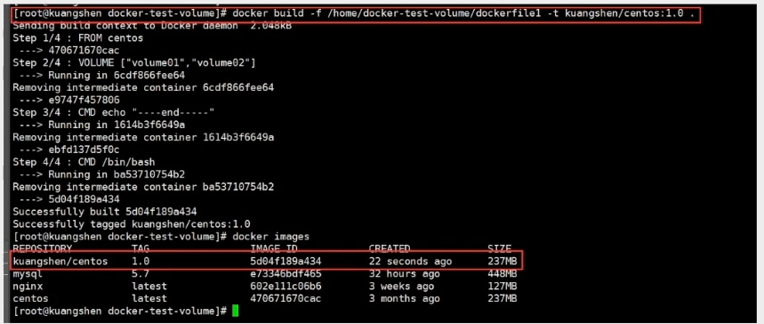

> 启动自己写的容器镜像

```shell
$ docker run -it f4a6b0d4d948 /bin/bash	# 运行自己写的镜像
$ ls -l 								# 查看目录
12
```

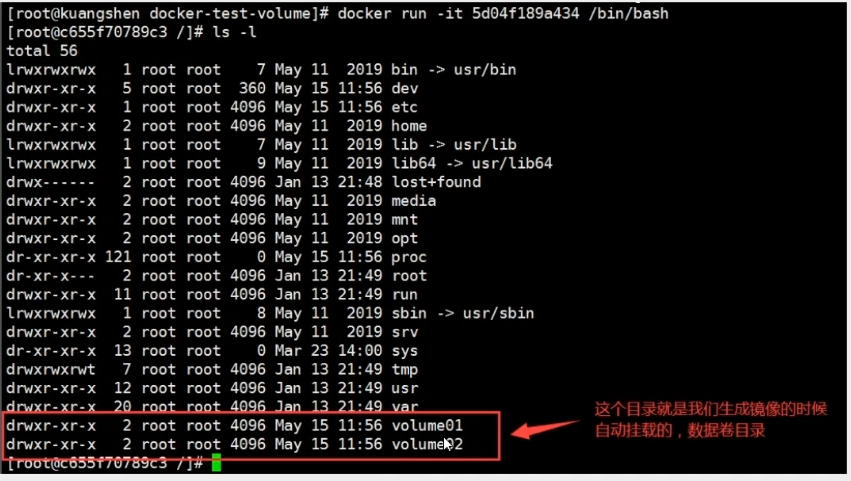

这个卷和外部一定有一个同步的目录


查看一下卷挂载

```shell
# docker inspect 容器id
$ docker inspect ca3b45913df5
12
```


测试一下刚才的文件是否同步出去了！

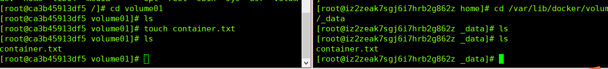

这种方式使用的十分多，因为我们通常会构建自己的镜像！

假设构建镜像时候没有挂载卷，要手动镜像挂载 -v 卷名：容器内路径！

## **多个MySQL同步数据**

数据卷容器

命名的容器挂载数据卷！

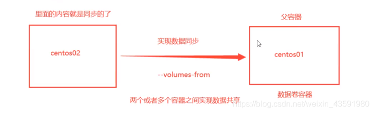

```shell
# 测试 启动3个容器，通过刚才自己写的镜像启动
# 创建docker01
$ docker run -it --name docker01 kuangshen/centos:1.0

# 查看容器docekr01内容
$ ls
bin  home   lost+found	opt   run   sys  var
dev  lib    media	proc  sbin  tmp  volume01
etc  lib64  mnt		root  srv   usr  volume02

# 不关闭该容器退出
CTRL + Q + P  

# 创建docker02: 并且让docker02 继承 docker01
$ docker run -it --name docker02 --volumes-from docker01 kuangshen/centos:1.0

# 查看容器docker02内容
$ ls
bin  home   lost+found	opt   run   sys  var
dev  lib    media	proc  sbin  tmp  volume01
etc  lib64  mnt		root  srv   usr  volume02
```

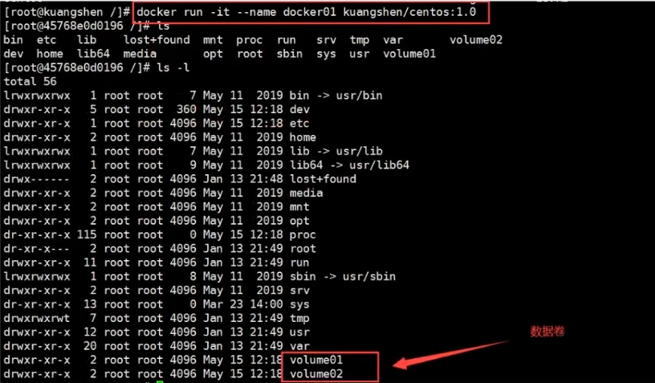

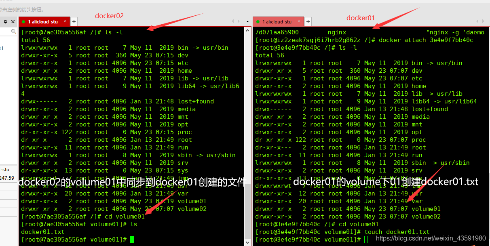

```shell
# 再新建一个docker03同样继承docker01
$ docker run -it --name docker03 --volumes-from docker01 kuangshen/centos:1.0
$ cd volume01	#进入volume01 查看是否也同步docker01的数据
$ ls 
docker01.txt

# 测试：可以删除docker01，查看一下docker02和docker03是否可以访问这个文件
# 测试发现：数据依旧保留在docker02和docker03中没有被删除
```

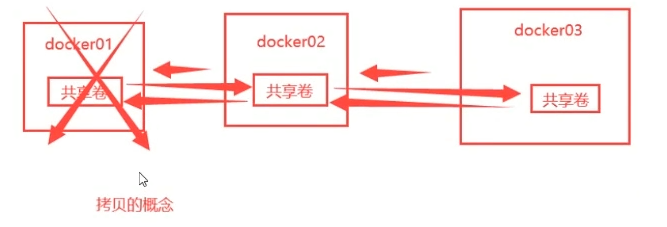

**多个mysql实现数据共享**

```shell
$ docker run -d -p 3306:3306 -v /home/mysql/conf:/etc/mysql/conf.d -v /home/mysql/data:/var/lib/mysql -e MYSQL_ROOT_PASSWORD=123456 --name mysql01 mysql:5.7

$ docker run -d -p 3310:3306 -e MYSQL_ROOT_PASSWORD=123456 --name mysql02 --volumes-from mysql01  mysql:5.7

# 这个时候，可以实现两个容器数据同步！
12345
```

结论：

**容器之间的配置信息的传递，数据卷容器的生命周期一直持续到没有容器使用为止**。

**但是一旦你持久化到了本地，这个时候，本地的数据是不会删除的**！

## DockerFile

#### DockerFile介绍

`dockerfile`是用来构建docker镜像的文件！命令参数脚本！

构建步骤：

1、 编写一个dockerfile文件

2、 docker build 构建称为一个镜像

3、 docker run运行镜像

4、 docker push发布镜像（DockerHub 、阿里云仓库)


点击后跳到一个Dockerfile

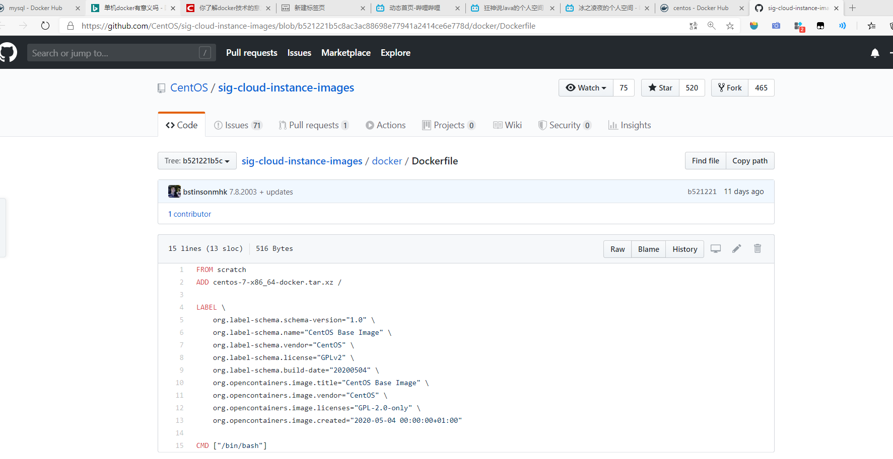

很多官方镜像都是基础包，很多功能没有，我们通常会自己搭建自己的镜像！

官方既然可以制作镜像，那我们也可以！

#### DockerFile构建过程

**基础知识**：

1、每个保留关键字(指令）都是必须是大写字母

2、执行从上到下顺序

3、#表示注释

4、每一个指令都会创建提交一个新的镜像曾，并提交！


Dockerfile是面向开发的，我们以后要发布项目，做镜像，就需要编写dockerfile文件，这个文件十分简单！

Docker镜像逐渐成企业交付的标准，必须要掌握！

DockerFile：构建文件，定义了一切的步骤，源代码

DockerImages：通过DockerFile构建生成的镜像，最终发布和运行产品。

Docker容器：容器就是镜像运行起来提供服务。

#### DockerFile的指令

```shell
FROM				# from:基础镜像，一切从这里开始构建
MAINTAINER			# maintainer:镜像是谁写的， 姓名+邮箱
RUN					# run:镜像构建的时候需要运行的命令
ADD					# add:步骤，tomcat镜像，这个tomcat压缩包！添加内容 添加同目录
WORKDIR				# workdir:镜像的工作目录
VOLUME				# volume:挂载的目录
EXPOSE				# expose:保留端口配置
CMD					# cmd:指定这个容器启动的时候要运行的命令，只有最后一个会生效，可被替代
ENTRYPOINT			# entrypoint:指定这个容器启动的时候要运行的命令，可以追加命令
ONBUILD				# onbuild:当构建一个被继承DockerFile这个时候就会运行onbuild的指令，触发指令
COPY				# copy:类似ADD，将我们文件拷贝到镜像中
ENV					# env:构建的时候设置环境变量！
```

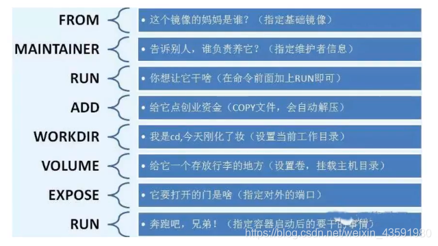

#### 实战测试

scratch 镜像

```shell
FROM scratch
ADD centos-7-x86_64-docker.tar.xz /

LABEL \
    org.label-schema.schema-version="1.0" \
    org.label-schema.name="CentOS Base Image" \
    org.label-schema.vendor="CentOS" \
    org.label-schema.license="GPLv2" \
    org.label-schema.build-date="20200504" \
    org.opencontainers.image.title="CentOS Base Image" \
    org.opencontainers.image.vendor="CentOS" \
    org.opencontainers.image.licenses="GPL-2.0-only" \
    org.opencontainers.image.created="2020-05-04 00:00:00+01:00"

CMD ["/bin/bash"]
```

**Docker Hub 中 99%的镜像都是从这个基础镜像过来的 FROM scratch**，然后配置需要的软件和配置来进行构建。

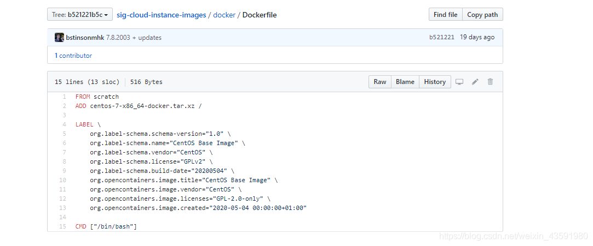

> 创建一个自己的centos

```shell
# 1./home下新建dockerfile目录
$ mkdir dockerfile

# 2. dockerfile目录下新建mydockerfile-centos文件
$ vim mydockerfile-centos

# 3.编写Dockerfile配置文件
FROM centos							# 基础镜像是官方原生的centos
MAINTAINER cao<1165680007@qq.com> 	# 作者

ENV MYPATH /usr/local				# 配置环境变量的目录 
WORKDIR $MYPATH						# 将工作目录设置为 MYPATH

RUN yum -y install vim				# 给官方原生的centos 增加 vim指令
RUN yum -y install net-tools		# 给官方原生的centos 增加 ifconfig命令

EXPOSE 80							# 暴露端口号为80

CMD echo $MYPATH					# 输出下 MYPATH 路径
CMD echo "-----end----"				
CMD /bin/bash						# 启动后进入 /bin/bash

# 4.通过这个文件构建镜像
# 命令： docker build -f 文件路径 -t 镜像名:[tag] .
$ docker build -f mydockerfile-centos -t mycentos:0.1 .

# 5.出现下图后则构建成功
```

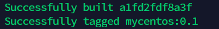

```shell
$ docker images
REPOSITORY          TAG                 IMAGE ID            CREATED             SIZE
mycentos            0.1                 cbf5110a646d        2 minutes ago       311MB

# 6.测试运行
$ docker run -it mycentos:0.1 		# 注意带上版本号，否则每次都回去找最新版latest

$ pwd	
/usr/local							# 与Dockerfile文件中 WORKDIR 设置的 MYPATH 一致
$ vim								# vim 指令可以使用
$ ifconfig     						# ifconfig 指令可以使用

# docker history 镜像id 查看镜像构建历史步骤
$ docker history 镜像id
```

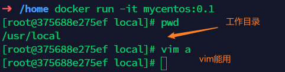

我们可以列出本地进行的变更历史

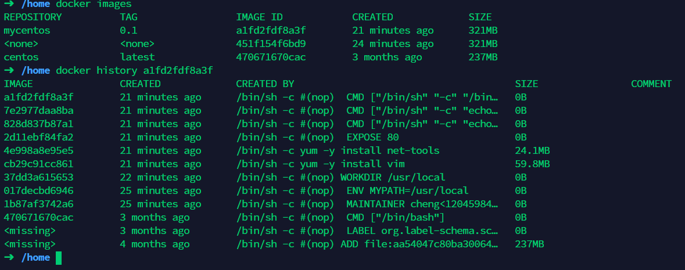

我们平时拿到一个镜像，可以用 “docker history 镜像id” 研究一下是什么做的

> CMD 和 ENTRYPOINT区别

```shell
CMD					# 指定这个容器启动的时候要运行的命令，只有最后一个会生效，可被替代。
ENTRYPOINT			# 指定这个容器启动的时候要运行的命令，可以追加命令
```

**测试cmd**

```shell
# 编写dockerfile文件
$ vim dockerfile-test-cmd
FROM centos
CMD ["ls","-a"]					# 启动后执行 ls -a 命令

# 构建镜像
$ docker build  -f dockerfile-test-cmd -t cmd-test:0.1 .

# 运行镜像
$ docker run cmd-test:0.1		# 由结果可得，运行后就执行了 ls -a 命令
.
..
.dockerenv
bin
dev
etc
home

# 想追加一个命令  -l 成为ls -al：展示列表详细数据
$ docker run cmd-test:0.1 -l
docker: Error response from daemon: OCI runtime create failed: container_linux.go:349: starting container process caused "exec: \"-l\":
executable file not found in $PATH": unknown.
ERRO[0000] error waiting for container: context canceled 

# cmd的情况下 -l 替换了CMD["ls","-l"] 而 -l  不是命令所以报错
12345678910111213141516171819202122232425
```

**测试ENTRYPOINT**

```shell
# 编写dockerfile文件
$ vim dockerfile-test-entrypoint
FROM centos
ENTRYPOINT ["ls","-a"]

# 构建镜像
$ docker build  -f dockerfile-test-entrypoint -t cmd-test:0.1 .

# 运行镜像
$ docker run entrypoint-test:0.1
.
..
.dockerenv
bin
dev
etc
home
lib
lib64
lost+found ...

# 我们的命令，是直接拼接在我们得ENTRYPOINT命令后面的
$ docker run entrypoint-test:0.1 -l
total 56
drwxr-xr-x   1 root root 4096 May 16 06:32 .
drwxr-xr-x   1 root root 4096 May 16 06:32 ..
-rwxr-xr-x   1 root root    0 May 16 06:32 .dockerenv
lrwxrwxrwx   1 root root    7 May 11  2019 bin -> usr/bin
drwxr-xr-x   5 root root  340 May 16 06:32 dev
drwxr-xr-x   1 root root 4096 May 16 06:32 etc
drwxr-xr-x   2 root root 4096 May 11  2019 home
lrwxrwxrwx   1 root root    7 May 11  2019 lib -> usr/lib
lrwxrwxrwx   1 root root    9 May 11  2019 lib64 -> usr/lib64 ....
```

Dockerfile中很多命令都十分的相似，我们需要了解它们的区别，我们最好的学习就是对比他们然后测试效果！

## 实战：Tomcat镜像

##### 1、准备镜像文件

```
准备tomcat 和 jdk 到当前目录，编写好README
```

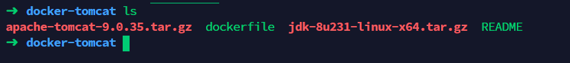

##### 2、编写dokerfile

```shell
$ vim dockerfile
FROM centos 										# 基础镜像centos
MAINTAINER wangchenyang<980885033@qq.com>			# 作者
COPY README /usr/local/README 						# 复制README文件
ADD jdk-8u231-linux-x64.tar.gz /usr/local/ 			# 添加jdk，ADD 命令会自动解压
ADD apache-tomcat-9.0.35.tar.gz /usr/local/ 		# 添加tomcat，ADD 命令会自动解压
RUN yum -y install vim								# 安装 vim 命令
ENV MYPATH /usr/local 								# 环境变量设置 工作目录
WORKDIR $MYPATH

ENV JAVA_HOME /usr/local/jdk1.8.0_231 				# 环境变量： JAVA_HOME环境变量
ENV CLASSPATH $JAVA_HOME/lib/dt.jar:$JAVA_HOME/lib/tools.jar

ENV CATALINA_HOME /usr/local/apache-tomcat-9.0.35 	# 环境变量： tomcat环境变量
ENV CATALINA_BASH /usr/local/apache-tomcat-9.0.35

# 设置环境变量 分隔符是：
ENV PATH $PATH:$JAVA_HOME/bin:$CATALINA_HOME/lib:$CATALINA_HOME/bin 	
	
EXPOSE 8080 										# 设置暴露的端口

CMD /usr/local/apache-tomcat-9.0.35/bin/startup.sh && tail -F /usr/local/apache-tomcat-9.0.35/logs/catalina.out 					# 设置默认命令
```

##### 3、构建镜像

```shell
# 因为dockerfile命名使用默认命名 因此不用使用-f 指定文件
$ docker build -t diytomcat .
```

##### 4、run镜像

```shell
# -d:后台运行 -p:暴露端口 --name:别名 -v:绑定路径 
$ docker run -d -p 9090:8080 --name tomcat01 
-v /home/wangchenyang/build/tomcat/test:/usr/local/apache-tomcat-9.0.37/webapps/test 
-v /home/wangchenyang/build/tomcat/tomcatlogs/:/usr/local/apache-tomcat-9.0.37/logs mytomcat:0.1
```

##### 5、访问测试

```shell
$ docker exec -it 自定义容器的id /bin/bash

$ curl localhost:8080
```

##### 6、发布项目

(由于做了卷挂载，我们直接在本地编写项目就可以发布了！)

发现：项目部署成功，可以直接访问！

我们以后开发的步骤：需要掌握Dockerfile的编写！我们之后的一切都是使用docker镜像来发布运行！

## 发布镜像

> 发布到 Docker Hub

1、地址 https://hub.docker.com/

2、确定这个账号可以登录

3、登录

```shell
$ docker login --help
Usage:  docker login [OPTIONS] [SERVER]

Log in to a Docker registry.
If no server is specified, the default is defined by the daemon.

Options:
  -p, --password string   Password
      --password-stdin    Take the password from stdin
  -u, --username string   Username

$ docker login -u 你的用户名 -p 你的密码
```

4、提交 push镜像

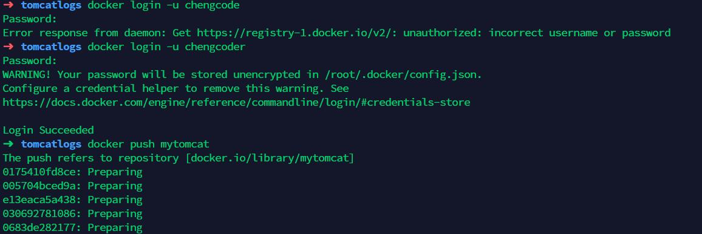

```shell
# 会发现push不上去，因为如果没有前缀的话默认是push到 官方的library
# 解决方法：
# 第一种 build的时候添加你的dockerhub用户名，然后在push就可以放到自己的仓库了
$ docker build -t kuangshen/mytomcat:0.1 .

# 第二种 使用docker tag #然后再次push
$ docker tag 容器id kuangshen/mytomcat:1.0 #然后再次push
$ docker push kuangshen/mytomcat:1.0
```

> 发布到 阿里云镜像服务上

看官网 很详细https://cr.console.aliyun.com/repository/

```shell
$ sudo docker login --username=zchengx registry.cn-shenzhen.aliyuncs.com
$ sudo docker tag [ImageId] registry.cn-shenzhen.aliyuncs.com/dsadxzc/cheng:[镜像版本号]

# 修改id 和 版本
sudo docker tag a5ef1f32aaae registry.cn-shenzhen.aliyuncs.com/dsadxzc/cheng:1.0
# 修改版本
$ sudo docker push registry.cn-shenzhen.aliyuncs.com/dsadxzc/cheng:[镜像版本号]
1234567
```

## 小结

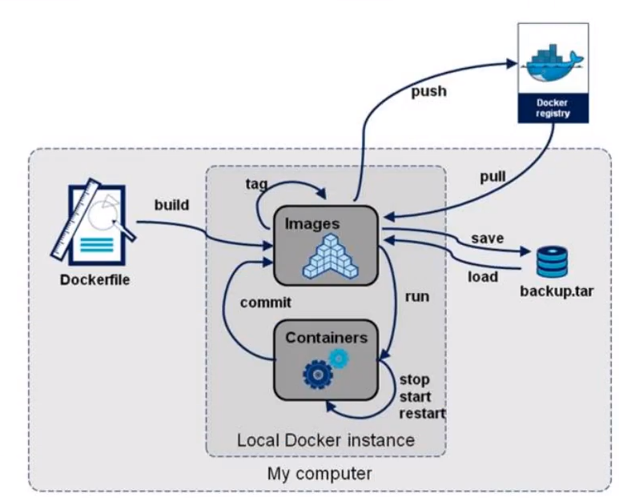

# Docker 网络

学习之前**清空下前面的docker 镜像、容器**

```shell
# 删除全部容器
$ docker rm -f $(docker ps -aq)

# 删除全部镜像
$ docker rmi -f $(docker images -aq)
12345
```

> 测试

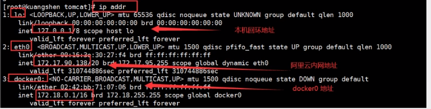

**三个网络**

> 问题： docker 是如果处理容器网络访问的？


```shell
# 测试  运行一个tomcat
$ docker run -d -P --name tomcat01 tomcat

# 查看容器内部网络地址
$ docker exec -it 容器id ip addr

# 发现容器启动的时候会得到一个 eth0@if91 ip地址，docker分配！
$ ip addr
1: lo: <LOOPBACK,UP,LOWER_UP> mtu 65536 qdisc noqueue state UNKNOWN group default qlen 1
    link/loopback 00:00:00:00:00:00 brd 00:00:00:00:00:00
    inet 127.0.0.1/8 scope host lo
       valid_lft forever preferred_lft forever
261: eth0@if91: <BROADCAST,MULTICAST,UP,LOWER_UP> mtu 1500 qdisc noqueue state UP group default 
    link/ether 02:42:ac:12:00:02 brd ff:ff:ff:ff:ff:ff link-netnsid 0
    inet 172.18.0.2/16 brd 172.18.255.255 scope global eth0
       valid_lft forever preferred_lft forever

       
# 思考？ linux能不能ping通容器内部！ 可以 容器内部可以ping通外界吗？ 可以！
$ ping 172.18.0.2
PING 172.18.0.2 (172.18.0.2) 56(84) bytes of data.
64 bytes from 172.18.0.2: icmp_seq=1 ttl=64 time=0.069 ms
64 bytes from 172.18.0.2: icmp_seq=2 ttl=64 time=0.074 ms
1234567891011121314151617181920212223
```

> 原理

1、我们每启动一个docker容器，docker就会给docker容器分配一个ip，我们只要按照了docker，就会有一个docker0桥接模式，使用的技术是veth-pair技术！

https://www.cnblogs.com/bakari/p/10613710.html

再次测试 ip addr

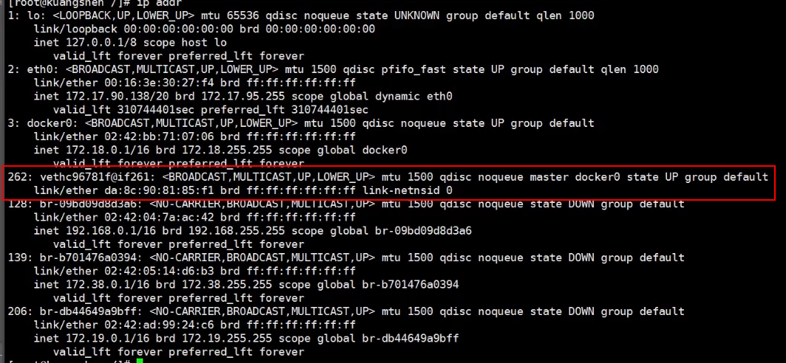

2 、再启动一个容器测试，发现又多了一对网络

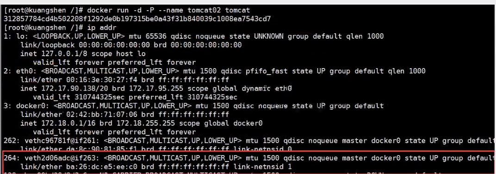

```shell
# 我们发现这个容器带来网卡，都是一对对的
# veth-pair 就是一对的虚拟设备接口，他们都是成对出现的，一端连着协议，一端彼此相连
# 正因为有这个特性 veth-pair 充当一个桥梁，连接各种虚拟网络设备的
# OpenStac,Docker容器之间的连接，OVS的连接，都是使用evth-pair技术
1234
```

3、我们来测试下tomcat01和tomcat02是否可以ping通

```shell
# 获取tomcat01的ip 172.17.0.2
$ docker-tomcat docker exec -it tomcat01 ip addr  
550: eth0@if551: <BROADCAST,MULTICAST,UP,LOWER_UP> mtu 1500 qdisc noqueue state UP group default 
    link/ether 02:42:ac:11:00:02 brd ff:ff:ff:ff:ff:ff link-netnsid 0
    inet 172.17.0.2/16 brd 172.17.255.255 scope global eth0
       valid_lft forever preferred_lft forever
       
# 让tomcat02 ping tomcat01       
$ docker-tomcat docker exec -it tomcat02 ping 172.17.0.2
PING 172.17.0.2 (172.17.0.2) 56(84) bytes of data.
64 bytes from 172.17.0.2: icmp_seq=1 ttl=64 time=0.098 ms
64 bytes from 172.17.0.2: icmp_seq=2 ttl=64 time=0.071 ms

# 结论：容器和容器之间是可以互相ping通
1234567891011121314
```

**网络模型图**

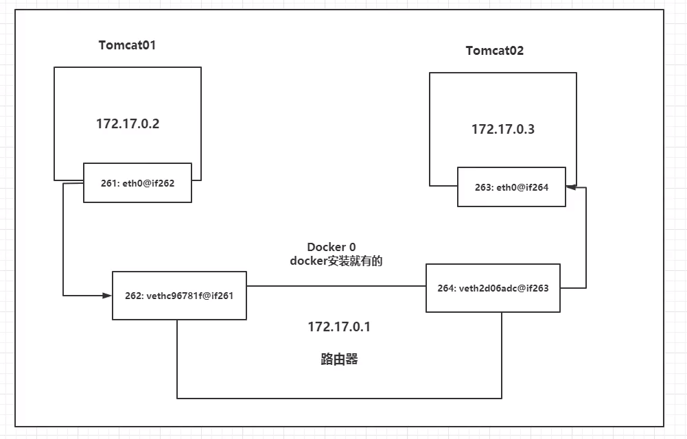

结论：tomcat01和tomcat02公用一个路由器，docker0。

所有的容器不指定网络的情况下，都是docker0路由的，docker会给我们的容器分配一个默认的可用ip。

> 小结

Docker使用的是Linux的桥接，宿主机是一个Docker容器的网桥 docker0

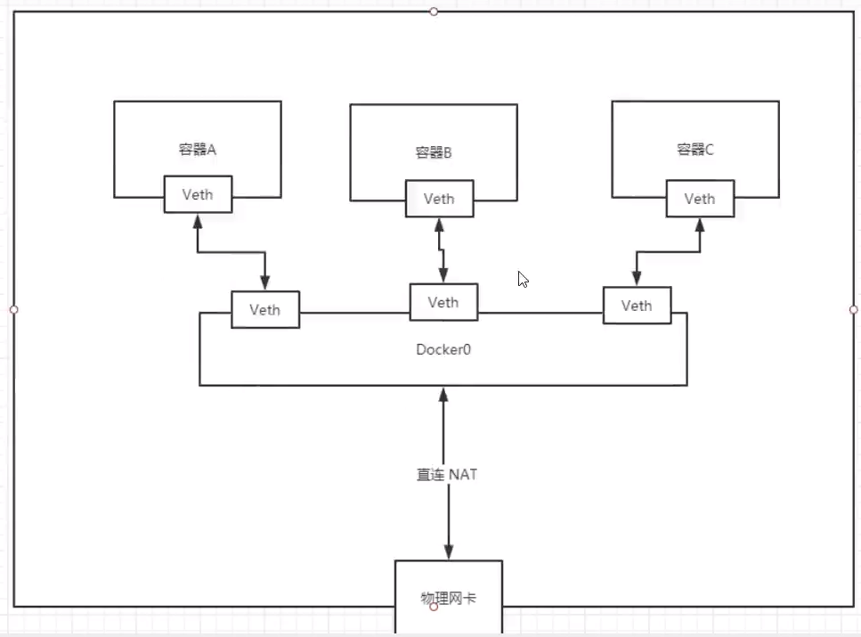

Docker中所有网络接口都是虚拟的，虚拟的转发效率高（内网传递文件）

只要容器删除，对应的网桥一对就没了！

**思考一个场景：我们编写了一个微服务，database url=ip: 项目不重启，数据ip换了，我们希望可以处理这个问题，可以通过名字来进行访问容器**？

## –-link

```shell
$ docker exec -it tomcat02 ping tomca01   # ping不通
ping: tomca01: Name or service not known

# 运行一个tomcat03 --link tomcat02 
$ docker run -d -P --name tomcat03 --link tomcat02 tomcat
5f9331566980a9e92bc54681caaac14e9fc993f14ad13d98534026c08c0a9aef

# 3连接2
# 用tomcat03 ping tomcat02 可以ping通
$ docker exec -it tomcat03 ping tomcat02
PING tomcat02 (172.17.0.3) 56(84) bytes of data.
64 bytes from tomcat02 (172.17.0.3): icmp_seq=1 ttl=64 time=0.115 ms
64 bytes from tomcat02 (172.17.0.3): icmp_seq=2 ttl=64 time=0.080 ms

# 2连接3
# 用tomcat02 ping tomcat03 ping不通
12345678910111213141516
```

**探究：**

docker network inspect 网络id 网段相同

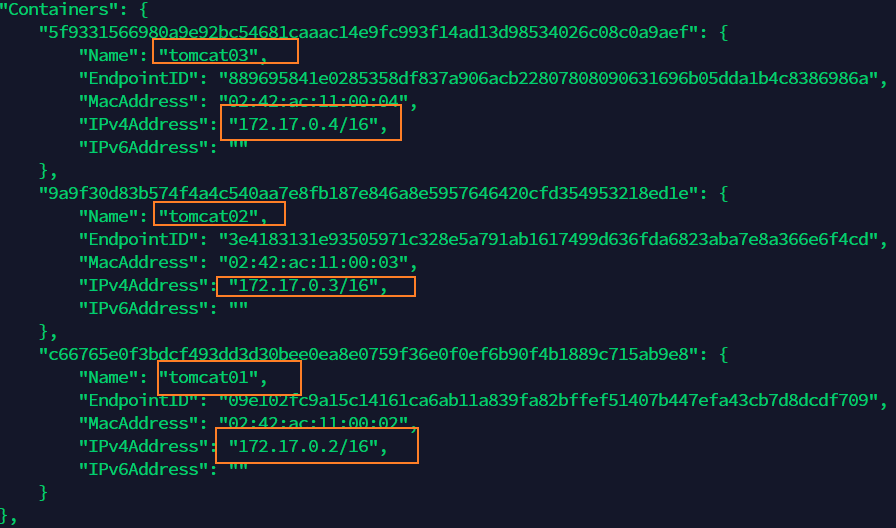

docker inspect tomcat03

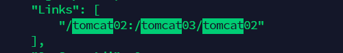

查看tomcat03里面的/etc/hosts发现有tomcat02的配置

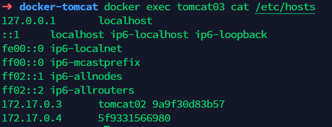

–link 本质就是在hosts配置中添加映射

现在使用Docker已经不建议使用–link了！

自定义网络，不适用docker0！

docker0问题：不支持容器名连接访问！

## 自定义网络

```shell
docker network
connect     -- Connect a container to a network
create      -- Creates a new network with a name specified by the
disconnect  -- Disconnects a container from a network
inspect     -- Displays detailed information on a network
ls          -- Lists all the networks created by the user
prune       -- Remove all unused networks
rm          -- Deletes one or more networks
12345678
```

> 查看所有的docker网络

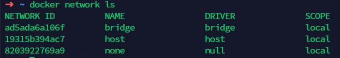

**网络模式**

bridge ：桥接 docker（默认，自己创建也是用bridge模式）

none ：不配置网络，一般不用

host ：和所主机共享网络

container ：容器网络连通（用得少！局限很大）

测试

```shell
# 我们直接启动的命令 --net bridge,而这个就是我们得docker0
# bridge就是docker0
$ docker run -d -P --name tomcat01 tomcat
等价于 => docker run -d -P --name tomcat01 --net bridge tomcat

# docker0，特点：默认，域名不能访问。 --link可以打通连接，但是很麻烦！
# 我们可以 自定义一个网络
$ docker network create --driver bridge --subnet 192.168.0.0/16 --gateway 192.168.0.1 mynet
12345678
```

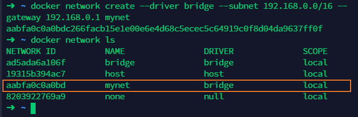

```shell
$ docker network inspect mynet;
1
```

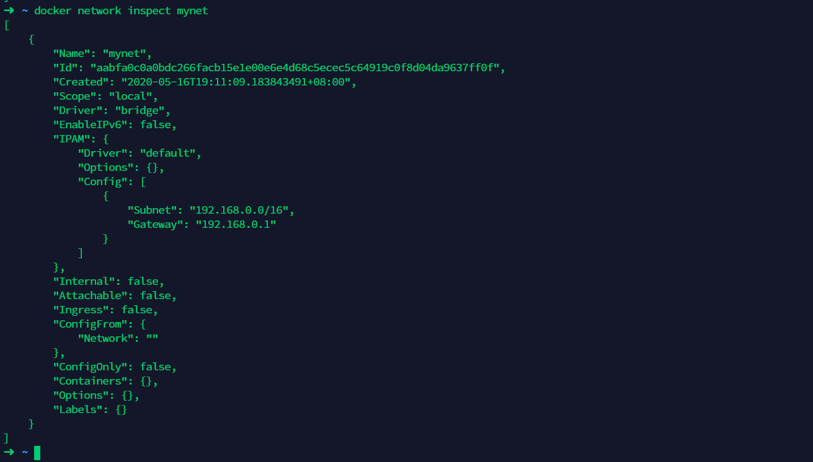

启动两个tomcat,再次查看网络情况

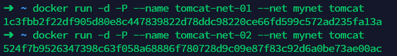

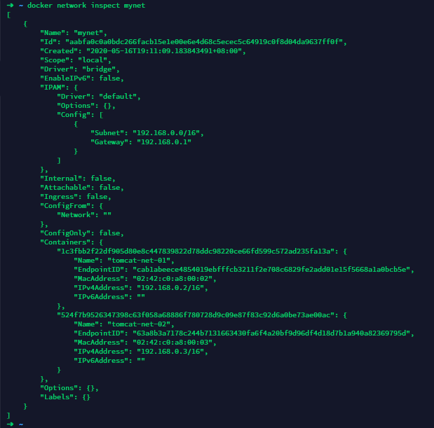

在自定义的网络下，服务可以互相ping通，不用使用–link

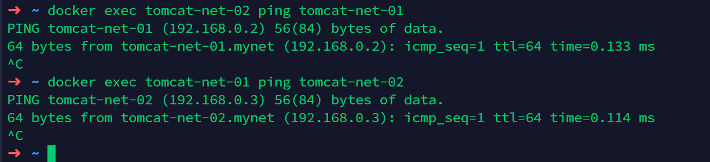

我们自定义的网络docker当我们维护好了对应的关系，推荐我们平时这样使用网络！

好处：

redis -不同的集群使用不同的网络，保证集群是安全和健康的

mysql-不同的集群使用不同的网络，保证集群是安全和健康的

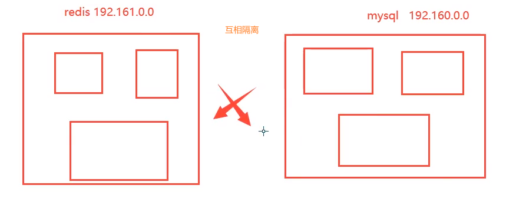

## 网络连通

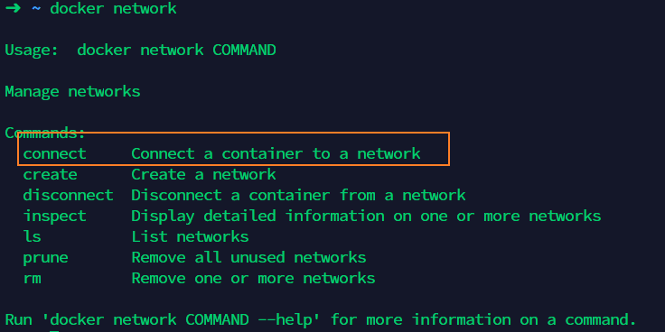

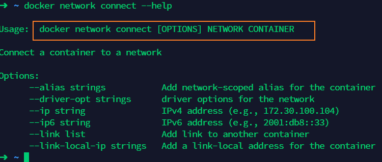

```shell
# 测试两个不同的网络连通  再启动两个tomcat 使用默认网络，即docker0
$ docker run -d -P --name tomcat01 tomcat
$ docker run -d -P --name tomcat02 tomcat
# 此时ping不通
1234
```

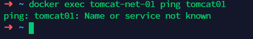

```shell
# 要将tomcat01 连通 tomcat—net-01 ，连通就是将 tomcat01加到 mynet网络
# 一个容器两个ip（tomcat01）
12
```

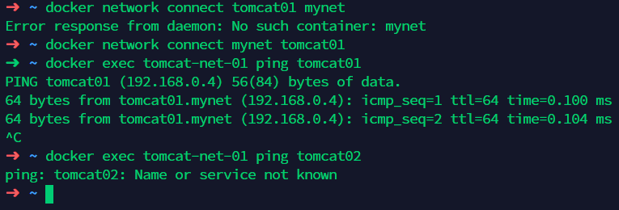

```shell
# 01连通 ，加入后此时，已经可以tomcat01 和 tomcat-01-net ping通了
# 02是依旧不通的
12
```

结论：假设要跨网络操作别人，就需要使用docker network connect 连通！

## 实战：部署Redis集群

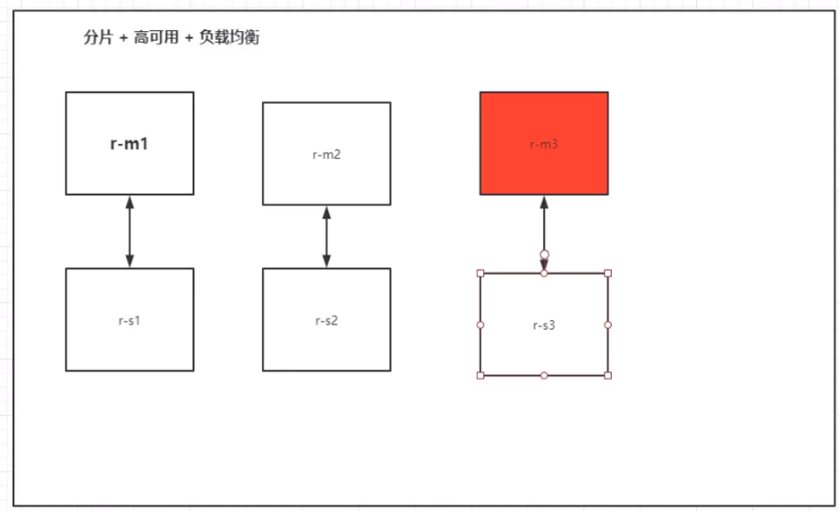

```shell
# 创建网卡
docker network create redis --subnet 172.38.0.0/16
# 通过脚本创建六个redis配置
for port in $(seq 1 6);\
do \
mkdir -p /mydata/redis/node-${port}/conf
touch /mydata/redis/node-${port}/conf/redis.conf
cat << EOF >> /mydata/redis/node-${port}/conf/redis.conf
port 6379
bind 0.0.0.0
cluster-enabled yes
cluster-config-file nodes.conf
cluster-node-timeout 5000
cluster-announce-ip 172.38.0.1${port}
cluster-announce-port 6379
cluster-announce-bus-port 16379
appendonly yes
EOF
done

# 通过脚本运行六个redis
for port in $(seq 1 6);\
docker run -p 637${port}:6379 -p 1667${port}:16379 --name redis-${port} \
-v /mydata/redis/node-${port}/data:/data \
-v /mydata/redis/node-${port}/conf/redis.conf:/etc/redis/redis.conf \
-d --net redis --ip 172.38.0.1${port} redis:5.0.9-alpine3.11 redis-server /etc/redis/redis.conf
docker exec -it redis-1 /bin/sh #redis默认没有bash
redis-cli --cluster create 172.38.0.11:6379 172.38.0.12:6379 172.38.0.13:6379 172.38.0.14:6379 172.38.0.15:6379 172.38.0.16:6379  --cluster-replicas 1

1234567891011121314151617181920212223242526272829
```

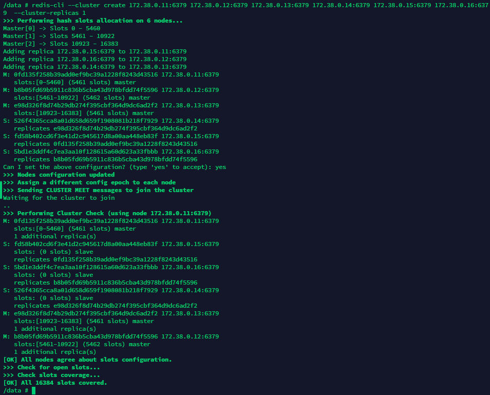

docker搭建redis集群完成！

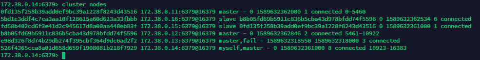

我们使用docker之后，所有的技术都会慢慢变得简单起来！

## SpringBoot微服务打包Docker镜像

1、构建SpringBoot项目

2、打包运行

```
mvn package
1
```

3、编写dockerfile

```shell
FROM java:8
COPY *.jar /app.jar
CMD ["--server.port=8080"]
EXPOSE 8080
ENTRYPOINT ["java","-jar","app.jar"]
12345
```

4、构建镜像

```shell
# 1.复制jar和DockerFIle到服务器
# 2.构建镜像
$ docker build -t xxxxx:xx  .
123
```

5、发布运行

以后我们使用了Docker之后，给别人交付就是一个镜像即可！