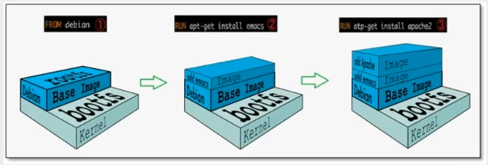
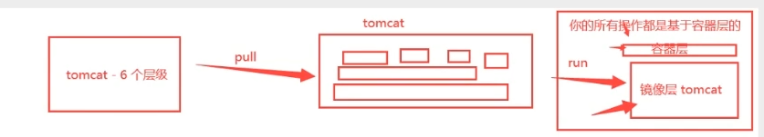
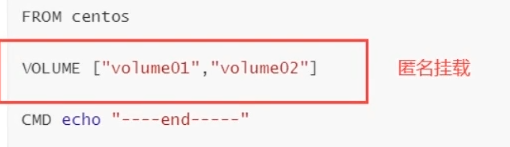
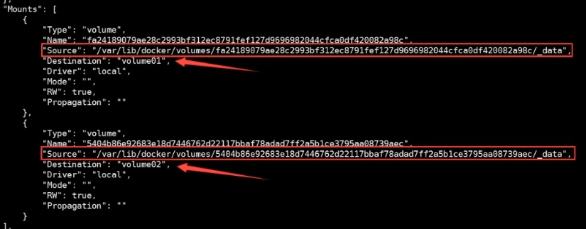
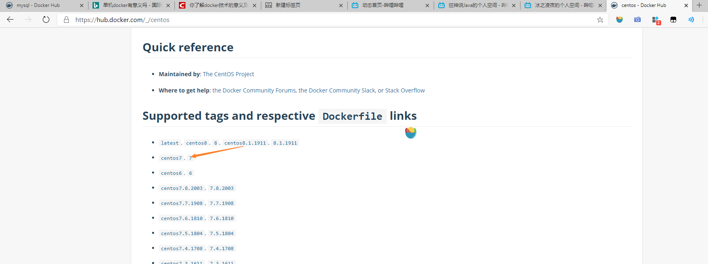
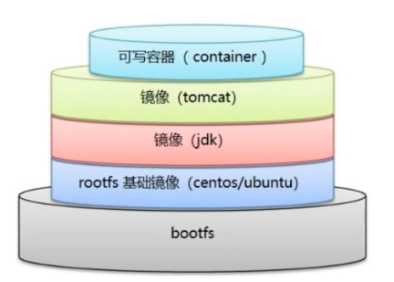

# 一、安装docker

## 环境查看

> ```shell
> #系统内核是3.10及以上的
> [root@localhost /]# uname -r
> 3.10.0-1127.19.1.el7.x86_64
> 
> 
> #系统版本
> [root@localhost /]# cat /etc/os-release 
> NAME="CentOS Linux"
> VERSION="7 (Core)"
> ID="centos"
> ID_LIKE="rhel fedora"
> VERSION_ID="7"
> PRETTY_NAME="CentOS Linux 7 (Core)"
> ANSI_COLOR="0;31"
> CPE_NAME="cpe:/o:centos:centos:7"
> HOME_URL="https://www.centos.org/"
> BUG_REPORT_URL="https://bugs.centos.org/"
> 
> CENTOS_MANTISBT_PROJECT="CentOS-7"
> CENTOS_MANTISBT_PROJECT_VERSION="7"
> REDHAT_SUPPORT_PRODUCT="centos"
> REDHAT_SUPPORT_PRODUCT_VERSION="7"
> ```

## 帮助文档

https://docs.docker.com/engine/install/centos/

## 安装步骤

> ```shell
> #1.卸载旧版本docker
> yum remove docker \
>                   docker-client \
>                   docker-client-latest \
>                   docker-common \
>                   docker-latest \
>                   docker-latest-logrotate \
>                   docker-logrotate \
>                   docker-selinux \
>                   docker-engine-selinux \
>                   docker-engine
>                   
> #2.安装必要软件包
> yum install -y yum-utils
> 
> #3.设置镜像的仓库
> yum-config-manager \
>     --add-repo \
>     https://download.docker.com/linux/centos/docker-ce.repo #默认是国外的
>     
> yum-config-manager \
>     --add-repo \
>     http://mirrors.aliyun.com/docker-ce/linux/centos/docker-ce.repo #阿里云镜像地址
>     
> #4.更新yum软件包索引
> yum makecache fast
> 
> #5.安装dockcer
> yum install docker-ce docker-ce-cli containerd.io
> 
> #6.启动docker
> systemctl start docker
> 
> #7.查看否安装成功
> docker version
> 
> #8.设置开机自动启动
> systemctl enable docker
> ```

## 卸载步骤

>```shell
>#1.卸载docker
>yum remove docker-ce docker-ce-cli containerd.io
>
>#2.删除资源
>rm -rf /var/lib/docker  #是其工作路径
>
>#3.双重保险
>yum remove docker \
>                  docker-client \
>                  docker-client-latest \
>                  docker-common \
>                  docker-latest \
>                  docker-latest-logrotate \
>                  docker-logrotate \
>                  docker-selinux \
>                  docker-engine-selinux \
>                  docker-engine
>```

## 配置ustc镜像

编辑该文件：

```
vim /etc/docker/daemon.json
```

输入以下内容：

```
{
"registry-mirrors":["https://docker.mirrors.ustc.edu.cn"]
}
```

重启docker

```
systemctl restart docker
```

查看docker状态

```
systemctl status docker
```


设置开机自动启动

# 二、docker常用命令

## 帮助命令

```shell
docker version    #显示docker的版本信息。
docker info       #显示docker的系统信息，包括镜像和容器的数量
docker 命令 --help #帮助命
```

## 镜像命令

**基本命令**

```shell
docker images #查看所有本地主机上的镜像 

docker search #搜索镜像

docker pull #下载镜像 

docker rmi #删除镜像 
```

---


> docker images查看所有本地的主机上的镜像

```shell
[root@iz2zeak7sgj6i7hrb2g862z ~]# docker images
REPOSITORY            TAG                 IMAGE ID            CREATED           SIZE
hello-world           latest              bf756fb1ae65        4 months ago     13.3kB
mysql                 5.7                 b84d68d0a7db        6 days ago       448MB

# 解释
#REPOSITORY			# 镜像的仓库源
#TAG				# 镜像的标签(版本)		---lastest 表示最新版本
#IMAGE ID			# 镜像的id
#CREATED			# 镜像的创建时间
#SIZE				# 镜像的大小

# 可选项
Options:
  -a, --all         Show all images (default hides intermediate images) #列出所有镜像
  -q, --quiet       Only show numeric IDs # 只显示镜像的id
  
[root@iz2zeak7sgj6i7hrb2g862z ~]# docker images -a  #列出所有镜像详细信息
[root@iz2zeak7sgj6i7hrb2g862z ~]# docker images -aq #列出所有镜像的id
d5f28a0bb0d0
f19c56ce92a8
1b6b1fe7261e
1b6b1fe7261e

```

> ##### docker search 搜索镜像


```shell
[root@iz2zeak7sgj6i7hrb2g862z ~]# docker search mysql

# --filter=STARS=3000 #过滤，搜索出来的镜像收藏STARS数量大于3000的
Options:
  -f, --filter filter   Filter output based on conditions provided
      --format string   Pretty-print search using a Go template
      --limit int       Max number of search results (default 25)
      --no-trunc        Don't truncate output
      
[root@iz2zeak7sgj6i7hrb2g862z ~]# docker search mysql --filter=STARS=3000
NAME        DESCRIPTION         STARS            OFFICIAL        AUTOMATED
mysql       MySQL IS ...        9520             [OK]                
mariadb     MariaDB IS ...      3456             [OK]   

```

> ##### docker pull 下载镜像
>
> ```shell
> [root@localhost ~]# docker pull mysql
> Using default tag: latest
> latest: Pulling from library/mysql
> d121f8d1c412: Downloading 
> f3cebc0b4691: Download complete 
> 1862755a0b37: Download complete 
> 489b44f3dbb4: Download complete 
> 690874f836db: Download complete 
> baa8be383ffb: Download complete 
> 55356608b4ac: Download complete 
> dd35ceccb6eb: Download complete 
> 429b35712b19: Download complete 
> 162d8291095c: Download complete 
> 5e500ef7181b: Download complete 
> af7528e958b6: Download complete 
> latest: Pulling from library/mysql
> d121f8d1c412: Pull complete 
> f3cebc0b4691: Pull complete 
> 1862755a0b37: Pull complete 
> 489b44f3dbb4: Pull complete 
> 690874f836db: Pull complete 
> baa8be383ffb: Pull complete 
> 55356608b4ac: Pull complete 
> dd35ceccb6eb: Pull complete 
> 429b35712b19: Pull complete 
> 162d8291095c: Pull complete 
> 5e500ef7181b: Pull complete 
> af7528e958b6: Pull complete 
> Digest: sha256:e1bfe11693ed2052cb3b4e5fa356c65381129e87e38551c6cd6ec532ebe0e808
> Status: Downloaded newer image for mysql:latest
> docker.io/library/mysql:latest
> 
> ```
>
> 
>
> ```sh
> # 下载镜像 docker pull 镜像名[:tag]
> [root@iz2zeak7sgj6i7hrb2g862z ~]# docker pull tomcat:8
> 8: Pulling from library/tomcat #如果不写tag，默认就是latest
> 90fe46dd8199: Already exists   #分层下载： docker image 的核心 联合文件系统
> 35a4f1977689: Already exists 
> bbc37f14aded: Already exists 
> 74e27dc593d4: Already exists 
> 93a01fbfad7f: Already exists 
> 1478df405869: Pull complete 
> 64f0dd11682b: Pull complete 
> 68ff4e050d11: Pull complete 
> f576086003cf: Pull complete 
> 3b72593ce10e: Pull complete 
> Digest: sha256:0c6234e7ec9d10ab32c06423ab829b32e3183ba5bf2620ee66de866df # 签名防伪
> Status: Downloaded newer image for tomcat:8
> docker.io/library/tomcat:8 #真实地址
> 
> #等价于
> docker pull tomcat:8
> docker pull docker.io/library/tomcat:8
> 
> ```

> ##### docker rmi 删除镜像

```shell
docker rmi -f 镜像id #删除指定id的镜像
[root@iz2zeak7sgj6i7hrb2g862z ~]# docker rmi -f f19c56ce92a8

docker rmi -f $(docker images -aq) #删除全部的镜像
[root@iz2zeak7sgj6i7hrb2g862z ~]# docker stop $(docker ps -a -q)

```

> ##### docker rmi 删除镜像

```shell
docker rmi -f 镜像id #删除指定id的镜像
[root@iz2zeak7sgj6i7hrb2g862z ~]# docker rmi -f f19c56ce92a8

docker rmi -f $(docker images -aq) #删除全部的镜像
[root@iz2zeak7sgj6i7hrb2g862z ~]# docker stop $(docker ps -a -q)
```

## 容器命令

> **常用命令**
>
> ```sh
> docker run 镜像id #新建容器
> 
> docker ps #列出所有运行的容器 
> 
> docker rm 容器id #删除指定容器
> docker rm $(docker ps -aq) #删除所有容器
> 
> docker start 容器id	#启动容器
> docker restart 容器id	#重启容器
> docker attach 容器id #进入容器
> 容器内部Ctrl+q+p #退出容器
> docker stop 容器id	#停止当前正在运行的容器
> docker kill 容器id	#强制停止当前容器
> ```

> **新建容器并启动**
>
> ```sh
> docker run [可选参数] image 
> #参书说明
> --name="Name"		#容器名字 tomcat01 tomcat02 用来区分容器
> -d					#后台方式运行
> -it 				#使用交互方式运行，进入容器查看内容
> -p					#指定容器的端口 -p 8080(宿主机):8080(容器)
> 		-p ip:主机端口:容器端口
> 		-p 主机端口:容器端口(常用)
> 		-p 容器端口
> 		容器端口
> -P(大写) 				随机指定端口
> 
> # 测试、启动并进入容器
> [root@iz2zeak7sgj6i7hrb2g
> [root@iz2zeak7sgj6i7hrb2g862z ~]# docker run -it centos /bin/bash
> [root@241b5abce65e /]# ls
> bin  dev  etc  home  lib  lib64  lost+found  media  mnt  opt  proc  root  run  sbin  srv  sys  tmp  usr  var
> [root@241b5abce65e /]# exit #从容器退回主机
> exit
> ```
>
> **进入、退出容器**
>
> ```sh
> # 方式一
> docker exec -it 容器id bashshell
> # 方式二
> docker attach 容器id
> 
> #区别
> #docker exec #进入当前容器后开启一个新的终端，可以在里面操作。（常用）
> #docker attach # 进入容器正在执行的终端
> 
> exit #退出容器但不会停止容器
> ```
>
> **从容器内拷贝到主机上**
>
> ```sh
> docker cp 容器id:容器内路径  主机目的路径
> 
> #将容器内的hello.java拷贝到home文件加下
> [root@iz2zeak7sgj6i7hrb2g862z /]# docker cp 56a5583b25b4:/hello.java /home 
> [root@iz2zeak7sgj6i7hrb2g862z /]# cd /home
> [root@iz2zeak7sgj6i7hrb2g862z home]# ls -l	#可以看见hello.java存在
> total 8
> -rw-r--r-- 1 root root    0 May 19 22:09 haust.java
> -rw-r--r-- 1 root root    6 May 22 11:12 java.java
> drwx------ 3 www  www  4096 May  8 12:14 www
> ```
>
> ##### 查看容器中进程信息ps
>
> ```sh
> # 命令 docker top 容器id
> ```
>
> **列出所有运行容器**
>
> ```sh
> docker ps 命令  		#列出当前正在运行的容器
>   -a, --all     	 #列出当前正在运行的容器 + 带出历史运行过的容器
>   -n=?, --last int   #列出最近创建的?个容器 ?为1则只列出最近创建的一个容器,为2则列出2个
>   -q, --quiet        #只列出容器的编号
> ```
>
> **退出容器**
>
> ```sh
> exit 		#容器直接退出
> ctrl +P +Q  #容器不停止退出 	---注意：这个很有用的操作
> ```
>
> **删除容器**
>
> ```sh
> docker rm 容器id   				#删除指定的容器，不能删除正在运行的容器，如果要强制删除 rm -rf
> docker rm -f $(docker ps -aq)  	 #删除所有的容器
> docker ps -a -q|xargs docker rm  #删除所有的容器
> ```

## 其他命令

> 后台启动命令
>
> ```sh
> # 命令 docker run -d 镜像名
> [root@iz2zeak7sgj6i7hrb2g862z ~]# docker run -d centos
> a8f922c255859622ac45ce3a535b7a0e8253329be4756ed6e32265d2dd2fac6c
> 
> [root@iz2zeak7sgj6i7hrb2g862z ~]# docker ps    
> CONTAINER ID      IMAGE       COMMAND    CREATED     STATUS   PORTS    NAMES
> # 问题docker ps. 发现centos 停止了
> # 常见的坑，docker容器使用后台运行，就必须要有要一个前台进程，docker发现没有应用，就会自动停止
> # nginx，容器启动后，发现自己没有提供服务，就会立刻停止，就是没有程序了
> ```
>
> **查看日志**
>
> ```sh
> docker logs --help
> Options:
>       --details        Show extra details provided to logs 
> *  -f, --follow         Follow log output
>       --since string   Show logs since timestamp (e.g. 2013-01-02T13:23:37) or relative (e.g. 42m for 42 minutes)
> *      --tail string    Number of lines to show from the end of the logs (default "all")
> *  -t, --timestamps     Show timestamps
>       --until string   Show logs before a timestamp (e.g. 2013-01-02T13:23:37) or relative (e.g. 42m for 42 minutes)
> ➜  ~ docker run -d centos /bin/sh -c "while true;do echo 6666;sleep 1;done" #模拟日志      
> #显示日志
> -tf		#显示日志信息（一直更新）
> --tail number #需要显示日志条数
> docker logs -t --tail n 容器id #查看n行日志
> docker logs -ft 容器id #跟着日志
> 
> ```
>
> **查看镜像元数据**
>
> ```sh
> # 命令
> docker inspect 容器id
> ```

# 三、实际操作

## ddocker安装nginx

```sh
#1. 搜索镜像 search 建议大家去docker搜索，可以看到帮助文档
[root@iz2zeak7sgj6i7hrb2g862z ~]# docker search nginx

#2. 拉取下载镜像 pull
[root@iz2zeak7sgj6i7hrb2g862z ~]# docker pull nginx

#3. 查看是否下载成功镜像
[root@iz2zeak7sgj6i7hrb2g862z ~]# docker images

#3. 运行测试
# -d 后台运行
# --name 给容器命名
# -p 宿主机端口：容器内部端口
[root@iz2zeak7sgj6i7hrb2g862z ~]# docker run -d --name nginx01 -p 3344:80 nginx
aa664b0c8ed98f532453ce1c599be823bcc1f3c9209e5078615af416ccb454c2

#4. 查看正在启动的镜像
[root@iz2zeak7sgj6i7hrb2g862z ~]# docker ps
CONTAINER ID        IMAGE               COMMAND                  CREATED             STATUS              PORTS                NAMES
75943663c116        nginx               "nginx -g 'daemon of…"   41 seconds ago      Up 40 seconds       0.0.0.0:82->80/tcp   nginx00

#5. 进入容器
[root@iz2zeak7sgj6i7hrb2g862z ~]# docker exec -it nginx01 /bin/bash #进入
root@aa664b0c8ed9:/# whereis nginx	#找到nginx位置
nginx: /usr/sbin/nginx /usr/lib/nginx /etc/nginx /usr/share/nginx
root@aa664b0c8ed9:/# cd /etc/nginx/
root@aa664b0c8ed9:/etc/nginx# ls
conf.d	fastcgi_params	koi-utf  koi-win  mime.types  modules  nginx.conf  scgi_params	uwsgi_params  win-utf

#6. 退出容器
root@aa664b0c8ed9:/etc/nginx# exit
exit

#7. 停止容器
[root@iz2zeak7sgj6i7hrb2g862z ~]# docker ps
CONTAINER ID        IMAGE               COMMAND                  CREATED             STATUS              PORTS                  NAMES
aa664b0c8ed9        nginx               "nginx -g 'daemon of…"   10 minutes ago      Up 10 minutes       0.0.0.0:3344->80/tcp   nginx01
[root@iz2zeak7sgj6i7hrb2g862z ~]# docker stop aa664b0c8ed9
```

**宿主机端口** 和 **容器内部端口** 以及端口暴露：


## docker安装tomcat

```sh
# 下载 tomcat9.0
# 之前的启动都是后台，停止了容器，容器还是可以查到， docker run -it --rm 镜像名 一般是用来测试，用完就删除
[root@iz2zeak7sgj6i7hrb2g862z ~]# docker run -it --rm tomcat:9.0

--rm       Automatically remove the container when it exits 用完即删

#下载 最新版
[root@iz2zeak7sgj6i7hrb2g862z ~]# docker pull tomcat

#查看下载的镜像
[root@iz2zeak7sgj6i7hrb2g862z ~]# docker images

#以后台方式，暴露端口方式，启动运行
[root@iz2zeak7sgj6i7hrb2g862z ~]# docker run -d -p 8080:8080 --name tomcat01 tomcat

#测试访问有没有问题
curl localhost:8080

#根据容器id进入tomcat容器
[root@iz2zeak7sgj6i7hrb2g862z ~]# docker exec -it 645596565d3f /bin/bash
root@645596565d3f:/usr/local/tomcat# 
#查看tomcat容器内部内容：
root@645596565d3f:/usr/local/tomcat# ls -l
total 152
-rw-r--r-- 1 root root 18982 May  5 20:40 BUILDING.txt
-rw-r--r-- 1 root root  5409 May  5 20:40 CONTRIBUTING.md
-rw-r--r-- 1 root root 57092 May  5 20:40 LICENSE
-rw-r--r-- 1 root root  2333 May  5 20:40 NOTICE
-rw-r--r-- 1 root root  3255 May  5 20:40 README.md
-rw-r--r-- 1 root root  6898 May  5 20:40 RELEASE-NOTES
-rw-r--r-- 1 root root 16262 May  5 20:40 RUNNING.txt
drwxr-xr-x 2 root root  4096 May 16 12:05 bin
drwxr-xr-x 1 root root  4096 May 21 11:04 conf
drwxr-xr-x 2 root root  4096 May 16 12:05 lib
drwxrwxrwx 1 root root  4096 May 21 11:04 logs
drwxr-xr-x 2 root root  4096 May 16 12:05 native-jni-lib
drwxrwxrwx 2 root root  4096 May 16 12:05 temp
drwxr-xr-x 2 root root  4096 May 16 12:05 webapps
drwxr-xr-x 7 root root  4096 May  5 20:37 webapps.dist
drwxrwxrwx 2 root root  4096 May  5 20:36 work
root@645596565d3f:/usr/local/tomcat# 
#进入webapps目录
root@645596565d3f:/usr/local/tomcat# cd webapps
root@645596565d3f:/usr/local/tomcat/webapps# ls
root@645596565d3f:/usr/local/tomcat/webapps# 

# 发现问题：1、linux命令少了。 2.webapps目录为空 
# 原因：阿里云镜像的原因，阿里云默认是最小的镜像，所以不必要的都剔除掉
# 保证最小可运行的环境！
# 解决方案：
# 将webapps.dist下的文件都拷贝到webapps下即可
root@645596565d3f:/usr/local/tomcat# ls 找到webapps.dist
BUILDING.txt	 LICENSE  README.md	 RUNNING.txt  conf  logs  temp     webapps.dist
CONTRIBUTING.md  NOTICE   RELEASE-NOTES  bin   lib   native-jni-lib  webapps  work

root@645596565d3f:/usr/local/tomcat# cd webapps.dist/ # 进入webapps.dist 
root@645596565d3f:/usr/local/tomcat/webapps.dist# ls # 查看内容
ROOT  docs  examples  host-manager  manager

root@645596565d3f:/usr/local/tomcat/webapps.dist# cd ..
root@645596565d3f:/usr/local/tomcat# cp -r webapps.dist/* webapps # 拷贝webapps.dist 内容给webapps
root@645596565d3f:/usr/local/tomcat# cd webapps #进入webapps
root@645596565d3f:/usr/local/tomcat/webapps# ls #查看拷贝结果
ROOT  docs  examples  host-manager  manager
```

这样docker部署tomcat就可以访问了。

## docker安装elasticsearch+kibana

```sh
# es 暴露的端口很多！
# es 十分耗内存
# es 的数据一般需要放置到安全目录！挂载
# --net somenetwork ? 网络配置

# 启动elasticsearch
[root@iz2zeak7sgj6i7hrb2g862z ~]# docker run -d --name elasticsearch -p 9200:9200 -p 9300:9300 -e "discovery.type=single-node" elasticsearch:7.6.2

# 测试一下es是否成功启动
➜  ~ curl localhost:9200
{
  "name" : "d73ad2f22dd3",
  "cluster_name" : "docker-cluster",
  "cluster_uuid" : "atFKgANxS8CzgIyCB8PGxA",
  "version" : {
    "number" : "7.6.2",
    "build_flavor" : "default",
    "build_type" : "docker",
    "build_hash" : "ef48eb35cf30adf4db14086e8aabd07ef6fb113f",
    "build_date" : "2020-03-26T06:34:37.794943Z",
    "build_snapshot" : false,
    "lucene_version" : "8.4.0",
    "minimum_wire_compatibility_version" : "6.8.0",
    "minimum_index_compatibility_version" : "6.0.0-beta1"
  },
  "tagline" : "You Know, for Search"
}

#测试成功就关掉elasticSearch，防止耗内存
[root@iz2zeak7sgj6i7hrb2g862z ~]# docker stop d834ce2bd306
d834ce2bd306

[root@iz2zeak7sgj6i7hrb2g862z ~]# docker stats  # 查看docker容器使用内存情况
```


```sh
#测试成功就关掉elasticSearch，可以添加内存的限制，修改配置文件 -e 环境配置修改
docker rm -f d73ad2f22dd3            # stop命令也行                               
docker run -d --name elasticsearch -p 9200:9200 -p 9300:9300 -e "discovery.type=single-node" -e ES_JAVA_OPTS="-Xms64m -Xmx512m" elasticsearch:7.6.2
```


```sh
➜  ~ curl localhost:9200
{
  "name" : "b72c9847ec48",
  "cluster_name" : "docker-cluster",
  "cluster_uuid" : "yNAK0EORSvq3Wtaqe2QqAg",
  "version" : {
    "number" : "7.6.2",
    "build_flavor" : "default",
    "build_type" : "docker",
    "build_hash" : "ef48eb35cf30adf4db14086e8aabd07ef6fb113f",
    "build_date" : "2020-03-26T06:34:37.794943Z",
    "build_snapshot" : false,
    "lucene_version" : "8.4.0",
    "minimum_wire_compatibility_version" : "6.8.0",
    "minimum_index_compatibility_version" : "6.0.0-beta1"
  },
  "tagline" : "You Know, for Search"
}
```

> 使用kibana连接es (elasticSearch)？思考网络如何才能连接


## docker安装Portainer

- **什么是portainer？**

Docker图形化界面管理工具！提供一个后台面板供我们操作！

```sh
# 安装命令
[root@iz2zeak7sgj6i7hrb2g862z ~]# docker run -d -p 8088:9000 \
> --restart=always -v /var/run/docker.sock:/var/run/docker.sock --privileged=true portainer/portainer

Unable to find image 'portainer/portainer:latest' locally
latest: Pulling from portainer/portainer
d1e017099d17: Pull complete 
a7dca5b5a9e8: Pull complete 
Digest: sha256:4ae7f14330b56ffc8728e63d355bc4bc7381417fa45ba0597e5dd32682901080
Status: Downloaded newer image for portainer/portainer:latest
81753869c4fd438cec0e31659cbed0d112ad22bbcfcb9605483b126ee8ff306d
```


# 四、镜像原理

## **镜像是什么**

镜像是一种轻量级、可执行的独立软件保，用来打包软件运行环境和基于运行环境开发的软件，他包含运行某个软件所需的所有内容，包括代码、运行时库、环境变量和配置文件。

所有应用，直接打包docker镜像，就可以直接跑起来！

**如何得到镜像**

- 从远程仓库下载
- 别人拷贝给你
- 自己制作一个镜像 DockerFile

## **镜像加载原理**

> UnionFs （联合文件系统）

UnionFs（联合文件系统）：Union文件系统（UnionFs）是一种分层、轻量级并且高性能的文件系统，他支持对文件系统的修改作为一次提交来一层层的叠加，同时可以将不同目录挂载到同一个虚拟文件系统下（ unite several directories into a single virtual filesystem)。Union文件系统是 Docker镜像的基础。镜像可以通过分层来进行继承，基于基础镜像（没有父镜像），可以制作各种具体的应用镜像
特性：一次同时加载多个文件系统，但从外面看起来，只能看到一个文件系统，联合加载会把各层文件系统叠加起来，这样最终的文件系统会包含所有底层的文件和目录。

> Docker镜像加载原理

docker的镜像实际上由一层一层的文件系统组成，这种层级的文件系统UnionFS。
boots(boot file system）主要包含 bootloader和 Kernel, bootloader主要是引导加 kernel, Linux刚启动时会加bootfs文件系统，在 Docker镜像的最底层是 boots。这一层与我们典型的Linux/Unix系统是一样的，包含boot加載器和内核。当boot加载完成之后整个内核就都在内存中了，此时内存的使用权已由 bootfs转交给内核，此时系统也会卸载bootfs。
rootfs（root file system),在 bootfs之上。包含的就是典型 Linux系统中的/dev,/proc,/bin,/etc等标准目录和文件。 rootfs就是各种不同的操作系统发行版，比如 Ubuntu, Centos等等。



平时我们安装进虚拟机的CentOS都是好几个G，为什么Docker这里才200M？


对于个精简的OS,rootfs可以很小，只需要包合最基本的命令，工具和程序库就可以了，因为底层直接用Host的kernel，自己只需要提供rootfs就可以了。由此可见对于不同的Linux发行版， boots基本是一致的， rootfs会有差別，因此不同的发行版可以公用bootfs.

虚拟机是分钟级别，容器是秒级！

## 分层理解

> 分层的镜像

我们可以去下载一个镜像，注意观察下载的日志输出，可以看到是一层层的在下载


**思考：为什么Docker镜像要采用这种分层的结构呢？**

最大的好处，我觉得莫过于资源共享了！比如有多个镜像都从相同的Base镜像构建而来，那么宿主机只需在磁盘上保留一份base镜像，同时内存中也只需要加载一份base镜像，这样就可以为所有的容器服务了，而且镜像的每一层都可以被共享。

查看镜像分层的方式可以通过docker image inspect 命令

**理解：**

所有的 Docker镜像都起始于一个基础镜像层，当进行修改或培加新的内容时，就会在当前镜像层之上，创建新的镜像层。

举一个简单的例子，假如基于 Ubuntu Linux16.04创建一个新的镜像，这就是新镜像的第一层；如果在该镜像中添加 Python包，
就会在基础镜像层之上创建第二个镜像层；如果继续添加一个安全补丁，就会创健第三个镜像层该像当前已经包含3个镜像层，如下图所示（这只是一个用于演示的很简单的例子）。

在添加额外的镜像层的同时，镜像始终保持是当前所有镜像的组合，理解这一点.


在添加额外的镜像层的同时，镜像始终保持是当前所有镜像的组合，理解这一点非常重要。下图中举了一个简单的例子，每个镜像层包含3个文件，而镜像包含了来自两个镜像层的6个文件。


上图中的镜像层跟之前图中的略有区別，主要目的是便于展示文件
下图中展示了一个稍微复杂的三层镜像，在外部看来整个镜像只有6个文件，这是因为最上层中的文件7是文件5的一个更新版。


文种情況下，上层镜像层中的文件覆盖了底层镜像层中的文件。这样就使得文件的更新版本作为一个新镜像层添加到镜像当中

Docker通过存储引擎（新版本采用快照机制）的方式来实现镜像层堆栈，并保证多镜像层对外展示为统一的文件系统

Linux上可用的存储引撃有AUFS、 Overlay2、 Device Mapper、Btrfs以及ZFS。顾名思义，每种存储引擎都基于 Linux中对应的
件系统或者块设备技术，井且每种存储引擎都有其独有的性能特点。

Docker在 Windows上仅支持 windowsfilter 一种存储引擎，该引擎基于NTFS文件系统之上实现了分层和CoW [1]。

下图展示了与系统显示相同的三层镜像。所有镜像层堆并合井，对外提供统一的视图。


> 特点

Docker 镜像都是只读的，当容器启动时，一个新的可写层加载到镜像的顶部！

这一层就是我们通常说的容器层，容器之下的都叫镜像层！



## commit镜像

```sh
docker commit 提交容器成为一个新的副本

# 命令和git原理类似
docker commit -m="描述信息" -a="作者" 容器id 目标镜像名:[版本TAG]
docker commit -m="changeTheTomcat" -a="wangchenyang" d4a3cfb7bc90 tomcat_v0.1
```

测试：

```sh
# 1、启动一个默认的tomcat
[root@iz2zeak7sgj6i7hrb2g862z ~]# docker run -d -p 8080:8080 tomcat
de57d0ace5716d27d0e3a7341503d07ed4695ffc266aef78e0a855b270c4064e

# 2、发现这个默认的tomcat 是没有webapps应用，官方的镜像默认webapps下面是没有文件的！
#docker exec -it 容器id /bin/bash
[root@iz2zeak7sgj6i7hrb2g862z ~]# docker exec -it de57d0ace571 /bin/bash
root@de57d0ace571:/usr/local/tomcat# 

# 3、从webapps.dist拷贝文件进去webapp
root@de57d0ace571:/usr/local/tomcat# cp -r webapps.dist/* webapps
root@de57d0ace571:/usr/local/tomcat# cd webapps
root@de57d0ace571:/usr/local/tomcat/webapps# ls
ROOT  docs  examples  host-manager  manager

# 4、将操作过的容器通过commit调教为一个镜像！我们以后就使用我们修改过的镜像即可，而不需要每次都重新拷贝webapps.dist下的文件到webapps了，这就是我们自己的一个修改的镜像。
docker commit -m="描述信息" -a="作者" 容器id 目标镜像名:[TAG]
docker commit -m="changeTheTomcat" -a="wangchenyang" d4a3cfb7bc90 tomcat_V0.1

[root@localhost ~]# docker commit -m="changeTheTomcat" -a="wangchenyang" d4a3cfb7bc90 tomcat_v0.1
sha256:a7b8233fa48936786e0fcc4a2e1adce7cec045c867a2cd157da34850f562f66e

[root@localhost ~]# docker images
REPOSITORY            TAG                 IMAGE ID            CREATED              SIZE
tomcat_v0.1           latest              a7b8233fa489        About a minute ago   652MB
tomcat                latest              f796d3d2c195        32 hours ago         647MB
centos                latest              0d120b6ccaa8        5 weeks ago          215MB
portainer/portainer   latest              62771b0b9b09        8 weeks ago          79.1MB

```

如果你想要保存当前容器的状态，就可以通过commit来提交，获得一个镜像。

# 五、容器数据卷

## 挂载卷概念

容器数据卷是将应用和环境打包成一个镜像！

数据如果数据都在容器中，那么我们容器删除，数据就会丢失！需求：**数据可以持久化**

容器之间可以有一个数据共享的技术！Docker容器中产生的数据，同步到本地！

这就是卷技术！目录的挂载，将我们容器内的目录，挂载到Linux上面！


**总结一句话：容器的持久化和同步操作！容器间也是可以数据共享的！**

>  方式一 ：直接使用命令挂载 -v

```sh
-v, --volume list                    Bind mount a volume

#docker run -it -v 主机目录:容器内目录  -p 主机端口:容器内端口
docker run -it -v /home/ceshi:/home centos /bin/bash

#这时候主机的/home/ceshi文件夹就和容器的/home文件夹关联了,二者可以实现文件或数据同步了

#通过 docker inspect 容器id 查看
[root@iz2zeak7sgj6i7hrb2g862z home]# docker inspect 6064c490c371
```


好处：我们以后修改只需要在本地修改即可，容器内会自动同步！

## MySQL挂载

```sh
# 获取mysql镜像
[root@iz2zeak7sgj6i7hrb2g862z home]# docker pull mysql:5.7

# 运行容器,需要做数据挂载 #安装启动mysql，需要配置密码的，这是要注意点！
# 参考官网hub 
docker run --name some-mysql -e MYSQL_ROOT_PASSWORD=my-secret-pw -d mysql:tag

#启动我们得
-d 后台运行
-p 端口映射
-v 卷挂载
-e 环境配置
-- name 容器名字
$ docker run -d -p 3310:3306 -v /home/mysql/conf:/etc/mysql/conf.d -v /home/mysql/data:/var/lib/mysql -e MYSQL_ROOT_PASSWORD=123456 --name mysql03 mysql:5.7

# 启动成功之后，我们在本地使用sqlyog来测试一下
# sqlyog-连接到服务器的3306--和容器内的3306映射 

# 在本地测试创建一个数据库，查看一下我们映射的路径是否ok！
```


> 当我们在本地用SQLyog新建名称为test的数据库时候，容器容器也会创建
>
> 假设我们将包含mysql的容器删除时，发现**我们挂载到本地的数据卷依旧没有丢失，这就实现了容器数据持久化功能**。


## 具名挂载和匿名挂载

```sh
# 匿名挂载
-v 容器内路径!
$ docker run -d -P --name nginx01 -v /etc/nginx nginx

# 查看所有的volume(卷)的情况
$ docker volume ls    
DRIVER              VOLUME NAME # 容器内的卷名(匿名卷挂载)
local               21159a8518abd468728cdbe8594a75b204a10c26be6c36090cde1ee88965f0d0
local               b17f52d38f528893dd5720899f555caf22b31bf50b0680e7c6d5431dbda2802c
         
# 这里发现，这种就是匿名挂载，我们在 -v只写了容器内的路径，没有写容器外的路径！

# 具名挂载 -P:表示随机映射端口
$ docker run -d -P --name nginx02 -v juming-nginx:/etc/nginx nginx
9663cfcb1e5a9a1548867481bfddab9fd7824a6dc4c778bf438a040fe891f0ee

# 查看所有的volume(卷)的情况
$ docker volume ls                  
DRIVER              VOLUME NAME
local               21159a8518abd468728cdbe8594a75b204a10c26be6c36090cde1ee88965f0d0
local               b17f52d38f528893dd5720899f555caf22b31bf50b0680e7c6d5431dbda2802c
local               juming-nginx #多了一个名字


# 通过 -v 卷名：查看容器内路径
# 查看一下这个卷
$ docker volume inspect juming-nginx
[
    {
        "CreatedAt": "2020-05-23T13:55:34+08:00",
        "Driver": "local",
        "Labels": null,
        "Mountpoint": "/var/lib/docker/volumes/juming-nginx/_data", #默认目录
        "Name": "juming-nginx",
        "Options": null,
        "Scope": "local"
    }
]
```


所有的docker容器内的卷，没有指定目录的情况下都是在**/var/lib/docker/volumes/自定义的卷名/_data**下，
**如果指定了目录，docker volume ls 是查看不到的**。


**区分三种挂载方式**

```sh
# 三种挂载： 匿名挂载、具名挂载、指定路径挂载
-v 容器内路径			#匿名挂载
-v 卷名：容器内路径		  #具名挂载
-v /宿主机路径：容器内路径 #指定路径挂载 docker volume ls 是查看不到的
```

```sh
# 通过 -v 容器内路径： ro rw 改变读写权限
ro #readonly 只读
rw #readwrite 可读可写
$ docker run -d -P --name nginx05 -v juming:/etc/nginx:ro nginx
$ docker run -d -P --name nginx05 -v juming:/etc/nginx:rw nginx

# ro 只要看到ro就说明这个路径只能通过宿主机来操作，容器内部是无法操作！
```

# 六、Dockerfile

## 初识Dockerfile

**Dockerfile 就是用来构建docker镜像的构建文件**！命令脚本！先体验一下！

通过这个**脚本可以生成镜像**，镜像是一层一层的，脚本是一个个的命令，每个命令都是一层！

```shell
# 创建一个dockerfile文件，名字可以随便 建议Dockerfile
# 文件中的内容： 指令(大写) + 参数
$ vim dockerfile1
    FROM centos 					# 当前这个镜像是以centos为基础的

    VOLUME ["volume01","volume02"] 	# 挂载卷的卷目录列表(多个目录)

    CMD echo "-----end-----"		# 输出一下用于测试
    CMD /bin/bash					# 默认走bash控制台

# 这里的每个命令，就是镜像的一层！
# 构建出这个镜像 
-f dockerfile1 			# f代表file，指这个当前文件的地址(这里是当前目录下的dockerfile1)
-t caoshipeng/centos 	# t就代表target，指目标目录(注意caoshipeng镜像名前不能加斜杠‘/’)
. 						# 表示生成在当前目录下
$ docker build -f dockerfile1 -t caoshipeng/centos .
Sending build context to Docker daemon   2.56kB
Step 1/4 : FROM centos
latest: Pulling from library/centos
8a29a15cefae: Already exists 
Digest: sha256:fe8d824220415eed5477b63addf40fb06c3b049404242b31982106ac204f6700
Status: Downloaded newer image for centos:latest
 ---> 470671670cac
Step 2/4 : VOLUME ["volume01","volume02"] 			# 卷名列表
 ---> Running in c18eefc2c233
Removing intermediate container c18eefc2c233
 ---> 623ae1d40fb8
Step 3/4 : CMD echo "-----end-----"					# 输出 脚本命令
 ---> Running in 70e403669f3c
Removing intermediate container 70e403669f3c
 ---> 0eba1989c4e6
Step 4/4 : CMD /bin/bash
 ---> Running in 4342feb3a05b
Removing intermediate container 4342feb3a05b
 ---> f4a6b0d4d948
Successfully built f4a6b0d4d948
Successfully tagged caoshipeng/centos:latest

# 查看自己构建的镜像
$ docker images
REPOSITORY          TAG          IMAGE ID            CREATED              SIZE
caoshipeng/centos   latest       f4a6b0d4d948        About a minute ago   237MB
```


> 启动自己写的容器镜像

```shell
$ docker run -it f4a6b0d4d948 /bin/bash	# 运行自己写的镜像
$ ls -l 								# 查看目录
12
```


这个卷和外部一定有一个同步的目录



查看一下卷挂载

```shell
# docker inspect 容器id
$ docker inspect ca3b45913df5
12
```



测试一下刚才的文件是否同步出去了！


这种方式使用的十分多，因为我们通常会构建自己的镜像！

假设构建镜像时候没有挂载卷，要手动镜像挂载 -v 卷名：容器内路径！

## **多个MySQL同步数据**

数据卷容器

命名的容器挂载数据卷！


```shell
# 测试 启动3个容器，通过刚才自己写的镜像启动
# 创建docker01
$ docker run -it --name docker01 kuangshen/centos:1.0

# 查看容器docekr01内容
$ ls
bin  home   lost+found	opt   run   sys  var
dev  lib    media	proc  sbin  tmp  volume01
etc  lib64  mnt		root  srv   usr  volume02

# 不关闭该容器退出
CTRL + Q + P  

# 创建docker02: 并且让docker02 继承 docker01
$ docker run -it --name docker02 --volumes-from docker01 kuangshen/centos:1.0

# 查看容器docker02内容
$ ls
bin  home   lost+found	opt   run   sys  var
dev  lib    media	proc  sbin  tmp  volume01
etc  lib64  mnt		root  srv   usr  volume02
```


```shell
# 再新建一个docker03同样继承docker01
$ docker run -it --name docker03 --volumes-from docker01 kuangshen/centos:1.0
$ cd volume01	#进入volume01 查看是否也同步docker01的数据
$ ls 
docker01.txt

# 测试：可以删除docker01，查看一下docker02和docker03是否可以访问这个文件
# 测试发现：数据依旧保留在docker02和docker03中没有被删除
```


**多个mysql实现数据共享**

```shell
$ docker run -d -p 3306:3306 -v /home/mysql/conf:/etc/mysql/conf.d -v /home/mysql/data:/var/lib/mysql -e MYSQL_ROOT_PASSWORD=123456 --name mysql01 mysql:5.7

$ docker run -d -p 3310:3306 -e MYSQL_ROOT_PASSWORD=123456 --name mysql02 --volumes-from mysql01  mysql:5.7

# 这个时候，可以实现两个容器数据同步！
12345
```

结论：

**容器之间的配置信息的传递，数据卷容器的生命周期一直持续到没有容器使用为止**。

**但是一旦你持久化到了本地，这个时候，本地的数据是不会删除的**！

## DockerFile

#### DockerFile介绍

`dockerfile`是用来构建docker镜像的文件！命令参数脚本！

构建步骤：

1、 编写一个dockerfile文件

2、 docker build 构建称为一个镜像

3、 docker run运行镜像

4、 docker push发布镜像（DockerHub 、阿里云仓库)



点击后跳到一个Dockerfile


很多官方镜像都是基础包，很多功能没有，我们通常会自己搭建自己的镜像！

官方既然可以制作镜像，那我们也可以！

#### DockerFile构建过程

**基础知识**：

1、每个保留关键字(指令）都是必须是大写字母

2、执行从上到下顺序

3、#表示注释

4、每一个指令都会创建提交一个新的镜像曾，并提交！



Dockerfile是面向开发的，我们以后要发布项目，做镜像，就需要编写dockerfile文件，这个文件十分简单！

Docker镜像逐渐成企业交付的标准，必须要掌握！

DockerFile：构建文件，定义了一切的步骤，源代码

DockerImages：通过DockerFile构建生成的镜像，最终发布和运行产品。

Docker容器：容器就是镜像运行起来提供服务。

#### DockerFile的指令

```shell
FROM				# from:基础镜像，一切从这里开始构建
MAINTAINER			# maintainer:镜像是谁写的， 姓名+邮箱
RUN					# run:镜像构建的时候需要运行的命令
ADD					# add:步骤，tomcat镜像，这个tomcat压缩包！添加内容 添加同目录
WORKDIR				# workdir:镜像的工作目录
VOLUME				# volume:挂载的目录
EXPOSE				# expose:保留端口配置
CMD					# cmd:指定这个容器启动的时候要运行的命令，只有最后一个会生效，可被替代
ENTRYPOINT			# entrypoint:指定这个容器启动的时候要运行的命令，可以追加命令
ONBUILD				# onbuild:当构建一个被继承DockerFile这个时候就会运行onbuild的指令，触发指令
COPY				# copy:类似ADD，将我们文件拷贝到镜像中
ENV					# env:构建的时候设置环境变量！
```


#### 实战测试

scratch 镜像

```shell
FROM scratch
ADD centos-7-x86_64-docker.tar.xz /

LABEL \
    org.label-schema.schema-version="1.0" \
    org.label-schema.name="CentOS Base Image" \
    org.label-schema.vendor="CentOS" \
    org.label-schema.license="GPLv2" \
    org.label-schema.build-date="20200504" \
    org.opencontainers.image.title="CentOS Base Image" \
    org.opencontainers.image.vendor="CentOS" \
    org.opencontainers.image.licenses="GPL-2.0-only" \
    org.opencontainers.image.created="2020-05-04 00:00:00+01:00"

CMD ["/bin/bash"]
```

**Docker Hub 中 99%的镜像都是从这个基础镜像过来的 FROM scratch**，然后配置需要的软件和配置来进行构建。


> 创建一个自己的centos

```shell
# 1./home下新建dockerfile目录
$ mkdir dockerfile

# 2. dockerfile目录下新建mydockerfile-centos文件
$ vim mydockerfile-centos

# 3.编写Dockerfile配置文件
FROM centos							# 基础镜像是官方原生的centos
MAINTAINER cao<1165680007@qq.com> 	# 作者

ENV MYPATH /usr/local				# 配置环境变量的目录 
WORKDIR $MYPATH						# 将工作目录设置为 MYPATH

RUN yum -y install vim				# 给官方原生的centos 增加 vim指令
RUN yum -y install net-tools		# 给官方原生的centos 增加 ifconfig命令

EXPOSE 80							# 暴露端口号为80

CMD echo $MYPATH					# 输出下 MYPATH 路径
CMD echo "-----end----"				
CMD /bin/bash						# 启动后进入 /bin/bash

# 4.通过这个文件构建镜像
# 命令： docker build -f 文件路径 -t 镜像名:[tag] .
$ docker build -f mydockerfile-centos -t mycentos:0.1 .

# 5.出现下图后则构建成功
```


```shell
$ docker images
REPOSITORY          TAG                 IMAGE ID            CREATED             SIZE
mycentos            0.1                 cbf5110a646d        2 minutes ago       311MB

# 6.测试运行
$ docker run -it mycentos:0.1 		# 注意带上版本号，否则每次都回去找最新版latest

$ pwd	
/usr/local							# 与Dockerfile文件中 WORKDIR 设置的 MYPATH 一致
$ vim								# vim 指令可以使用
$ ifconfig     						# ifconfig 指令可以使用

# docker history 镜像id 查看镜像构建历史步骤
$ docker history 镜像id
```


我们可以列出本地进行的变更历史


我们平时拿到一个镜像，可以用 “docker history 镜像id” 研究一下是什么做的

> CMD 和 ENTRYPOINT区别

```shell
CMD					# 指定这个容器启动的时候要运行的命令，只有最后一个会生效，可被替代。
ENTRYPOINT			# 指定这个容器启动的时候要运行的命令，可以追加命令
```

**测试cmd**

```shell
# 编写dockerfile文件
$ vim dockerfile-test-cmd
FROM centos
CMD ["ls","-a"]					# 启动后执行 ls -a 命令

# 构建镜像
$ docker build  -f dockerfile-test-cmd -t cmd-test:0.1 .

# 运行镜像
$ docker run cmd-test:0.1		# 由结果可得，运行后就执行了 ls -a 命令
.
..
.dockerenv
bin
dev
etc
home

# 想追加一个命令  -l 成为ls -al：展示列表详细数据
$ docker run cmd-test:0.1 -l
docker: Error response from daemon: OCI runtime create failed: container_linux.go:349: starting container process caused "exec: \"-l\":
executable file not found in $PATH": unknown.
ERRO[0000] error waiting for container: context canceled 

# cmd的情况下 -l 替换了CMD["ls","-l"] 而 -l  不是命令所以报错
12345678910111213141516171819202122232425
```

**测试ENTRYPOINT**

```shell
# 编写dockerfile文件
$ vim dockerfile-test-entrypoint
FROM centos
ENTRYPOINT ["ls","-a"]

# 构建镜像
$ docker build  -f dockerfile-test-entrypoint -t cmd-test:0.1 .

# 运行镜像
$ docker run entrypoint-test:0.1
.
..
.dockerenv
bin
dev
etc
home
lib
lib64
lost+found ...

# 我们的命令，是直接拼接在我们得ENTRYPOINT命令后面的
$ docker run entrypoint-test:0.1 -l
total 56
drwxr-xr-x   1 root root 4096 May 16 06:32 .
drwxr-xr-x   1 root root 4096 May 16 06:32 ..
-rwxr-xr-x   1 root root    0 May 16 06:32 .dockerenv
lrwxrwxrwx   1 root root    7 May 11  2019 bin -> usr/bin
drwxr-xr-x   5 root root  340 May 16 06:32 dev
drwxr-xr-x   1 root root 4096 May 16 06:32 etc
drwxr-xr-x   2 root root 4096 May 11  2019 home
lrwxrwxrwx   1 root root    7 May 11  2019 lib -> usr/lib
lrwxrwxrwx   1 root root    9 May 11  2019 lib64 -> usr/lib64 ....
```

Dockerfile中很多命令都十分的相似，我们需要了解它们的区别，我们最好的学习就是对比他们然后测试效果！

## 实战：Tomcat镜像

##### 1、准备镜像文件

```
准备tomcat 和 jdk 到当前目录，编写好README
```


##### 2、编写dokerfile

```shell
$ vim dockerfile
FROM centos 										# 基础镜像centos
MAINTAINER wangchenyang<980885033@qq.com>			# 作者
COPY README /usr/local/README 						# 复制README文件
ADD jdk-8u231-linux-x64.tar.gz /usr/local/ 			# 添加jdk，ADD 命令会自动解压
ADD apache-tomcat-9.0.35.tar.gz /usr/local/ 		# 添加tomcat，ADD 命令会自动解压
RUN yum -y install vim								# 安装 vim 命令
ENV MYPATH /usr/local 								# 环境变量设置 工作目录
WORKDIR $MYPATH

ENV JAVA_HOME /usr/local/jdk1.8.0_231 				# 环境变量： JAVA_HOME环境变量
ENV CLASSPATH $JAVA_HOME/lib/dt.jar:$JAVA_HOME/lib/tools.jar

ENV CATALINA_HOME /usr/local/apache-tomcat-9.0.35 	# 环境变量： tomcat环境变量
ENV CATALINA_BASH /usr/local/apache-tomcat-9.0.35

# 设置环境变量 分隔符是：
ENV PATH $PATH:$JAVA_HOME/bin:$CATALINA_HOME/lib:$CATALINA_HOME/bin 	
	
EXPOSE 8080 										# 设置暴露的端口

CMD /usr/local/apache-tomcat-9.0.35/bin/startup.sh && tail -F /usr/local/apache-tomcat-9.0.35/logs/catalina.out 					# 设置默认命令
```

##### 3、构建镜像

```shell
# 因为dockerfile命名使用默认命名 因此不用使用-f 指定文件
$ docker build -t diytomcat .
```

##### 4、run镜像

```shell
# -d:后台运行 -p:暴露端口 --name:别名 -v:绑定路径 
$ docker run -d -p 9090:8080 --name tomcat01 
-v /home/wangchenyang/build/tomcat/test:/usr/local/apache-tomcat-9.0.37/webapps/test 
-v /home/wangchenyang/build/tomcat/tomcatlogs/:/usr/local/apache-tomcat-9.0.37/logs mytomcat:0.1
```

##### 5、访问测试

```shell
$ docker exec -it 自定义容器的id /bin/bash

$ curl localhost:8080
```

##### 6、发布项目

(由于做了卷挂载，我们直接在本地编写项目就可以发布了！)

发现：项目部署成功，可以直接访问！

我们以后开发的步骤：需要掌握Dockerfile的编写！我们之后的一切都是使用docker镜像来发布运行！

## 发布镜像

> 发布到 Docker Hub

1、地址 https://hub.docker.com/

2、确定这个账号可以登录

3、登录

```shell
$ docker login --help
Usage:  docker login [OPTIONS] [SERVER]

Log in to a Docker registry.
If no server is specified, the default is defined by the daemon.

Options:
  -p, --password string   Password
      --password-stdin    Take the password from stdin
  -u, --username string   Username

$ docker login -u 你的用户名 -p 你的密码
```

4、提交 push镜像


```shell
# 会发现push不上去，因为如果没有前缀的话默认是push到 官方的library
# 解决方法：
# 第一种 build的时候添加你的dockerhub用户名，然后在push就可以放到自己的仓库了
$ docker build -t kuangshen/mytomcat:0.1 .

# 第二种 使用docker tag #然后再次push
$ docker tag 容器id kuangshen/mytomcat:1.0 #然后再次push
$ docker push kuangshen/mytomcat:1.0
```

> 发布到 阿里云镜像服务上

看官网 很详细https://cr.console.aliyun.com/repository/

```shell
$ sudo docker login --username=zchengx registry.cn-shenzhen.aliyuncs.com
$ sudo docker tag [ImageId] registry.cn-shenzhen.aliyuncs.com/dsadxzc/cheng:[镜像版本号]

# 修改id 和 版本
sudo docker tag a5ef1f32aaae registry.cn-shenzhen.aliyuncs.com/dsadxzc/cheng:1.0
# 修改版本
$ sudo docker push registry.cn-shenzhen.aliyuncs.com/dsadxzc/cheng:[镜像版本号]
1234567
```

## 小结


# 七、Docker 网络

学习之前**清空下前面的docker 镜像、容器**

```shell
# 删除全部容器
$ docker rm -f $(docker ps -aq)

# 删除全部镜像
$ docker rmi -f $(docker images -aq)
12345
```

> 测试


**三个网络**

> 问题： docker 是如果处理容器网络访问的？


```shell
# 测试  运行一个tomcat
$ docker run -d -P --name tomcat01 tomcat

# 查看容器内部网络地址
$ docker exec -it 容器id ip addr

# 发现容器启动的时候会得到一个 eth0@if91 ip地址，docker分配！
$ ip addr
1: lo: <LOOPBACK,UP,LOWER_UP> mtu 65536 qdisc noqueue state UNKNOWN group default qlen 1
    link/loopback 00:00:00:00:00:00 brd 00:00:00:00:00:00
    inet 127.0.0.1/8 scope host lo
       valid_lft forever preferred_lft forever
261: eth0@if91: <BROADCAST,MULTICAST,UP,LOWER_UP> mtu 1500 qdisc noqueue state UP group default 
    link/ether 02:42:ac:12:00:02 brd ff:ff:ff:ff:ff:ff link-netnsid 0
    inet 172.18.0.2/16 brd 172.18.255.255 scope global eth0
       valid_lft forever preferred_lft forever

       
# 思考？ linux能不能ping通容器内部！ 可以 容器内部可以ping通外界吗？ 可以！
$ ping 172.18.0.2
PING 172.18.0.2 (172.18.0.2) 56(84) bytes of data.
64 bytes from 172.18.0.2: icmp_seq=1 ttl=64 time=0.069 ms
64 bytes from 172.18.0.2: icmp_seq=2 ttl=64 time=0.074 ms
1234567891011121314151617181920212223
```

> 原理

1、我们每启动一个docker容器，docker就会给docker容器分配一个ip，我们只要按照了docker，就会有一个docker0桥接模式，使用的技术是veth-pair技术！

https://www.cnblogs.com/bakari/p/10613710.html

再次测试 ip addr


2 、再启动一个容器测试，发现又多了一对网络


```shell
# 我们发现这个容器带来网卡，都是一对对的
# veth-pair 就是一对的虚拟设备接口，他们都是成对出现的，一端连着协议，一端彼此相连
# 正因为有这个特性 veth-pair 充当一个桥梁，连接各种虚拟网络设备的
# OpenStac,Docker容器之间的连接，OVS的连接，都是使用evth-pair技术
1234
```

3、我们来测试下tomcat01和tomcat02是否可以ping通

```shell
# 获取tomcat01的ip 172.17.0.2
$ docker-tomcat docker exec -it tomcat01 ip addr  
550: eth0@if551: <BROADCAST,MULTICAST,UP,LOWER_UP> mtu 1500 qdisc noqueue state UP group default 
    link/ether 02:42:ac:11:00:02 brd ff:ff:ff:ff:ff:ff link-netnsid 0
    inet 172.17.0.2/16 brd 172.17.255.255 scope global eth0
       valid_lft forever preferred_lft forever
       
# 让tomcat02 ping tomcat01       
$ docker-tomcat docker exec -it tomcat02 ping 172.17.0.2
PING 172.17.0.2 (172.17.0.2) 56(84) bytes of data.
64 bytes from 172.17.0.2: icmp_seq=1 ttl=64 time=0.098 ms
64 bytes from 172.17.0.2: icmp_seq=2 ttl=64 time=0.071 ms

# 结论：容器和容器之间是可以互相ping通
1234567891011121314
```

**网络模型图**


结论：tomcat01和tomcat02公用一个路由器，docker0。

所有的容器不指定网络的情况下，都是docker0路由的，docker会给我们的容器分配一个默认的可用ip。

> 小结

Docker使用的是Linux的桥接，宿主机是一个Docker容器的网桥 docker0


Docker中所有网络接口都是虚拟的，虚拟的转发效率高（内网传递文件）

只要容器删除，对应的网桥一对就没了！

**思考一个场景：我们编写了一个微服务，database url=ip: 项目不重启，数据ip换了，我们希望可以处理这个问题，可以通过名字来进行访问容器**？

## –-link

```shell
$ docker exec -it tomcat02 ping tomca01   # ping不通
ping: tomca01: Name or service not known

# 运行一个tomcat03 --link tomcat02 
$ docker run -d -P --name tomcat03 --link tomcat02 tomcat
5f9331566980a9e92bc54681caaac14e9fc993f14ad13d98534026c08c0a9aef

# 3连接2
# 用tomcat03 ping tomcat02 可以ping通
$ docker exec -it tomcat03 ping tomcat02
PING tomcat02 (172.17.0.3) 56(84) bytes of data.
64 bytes from tomcat02 (172.17.0.3): icmp_seq=1 ttl=64 time=0.115 ms
64 bytes from tomcat02 (172.17.0.3): icmp_seq=2 ttl=64 time=0.080 ms

# 2连接3
# 用tomcat02 ping tomcat03 ping不通
12345678910111213141516
```

**探究：**

docker network inspect 网络id 网段相同


docker inspect tomcat03


查看tomcat03里面的/etc/hosts发现有tomcat02的配置


–link 本质就是在hosts配置中添加映射

现在使用Docker已经不建议使用–link了！

自定义网络，不适用docker0！

docker0问题：不支持容器名连接访问！

## 自定义网络

```shell
docker network
connect     -- Connect a container to a network
create      -- Creates a new network with a name specified by the
disconnect  -- Disconnects a container from a network
inspect     -- Displays detailed information on a network
ls          -- Lists all the networks created by the user
prune       -- Remove all unused networks
rm          -- Deletes one or more networks
12345678
```

> 查看所有的docker网络


**网络模式**

bridge ：桥接 docker（默认，自己创建也是用bridge模式）

none ：不配置网络，一般不用

host ：和所主机共享网络

container ：容器网络连通（用得少！局限很大）

测试

```shell
# 我们直接启动的命令 --net bridge,而这个就是我们得docker0
# bridge就是docker0
$ docker run -d -P --name tomcat01 tomcat
等价于 => docker run -d -P --name tomcat01 --net bridge tomcat

# docker0，特点：默认，域名不能访问。 --link可以打通连接，但是很麻烦！
# 我们可以 自定义一个网络
$ docker network create --driver bridge --subnet 192.168.0.0/16 --gateway 192.168.0.1 mynet
12345678
```


```shell
$ docker network inspect mynet;
1
```


启动两个tomcat,再次查看网络情况


在自定义的网络下，服务可以互相ping通，不用使用–link


我们自定义的网络docker当我们维护好了对应的关系，推荐我们平时这样使用网络！

好处：

redis -不同的集群使用不同的网络，保证集群是安全和健康的

mysql-不同的集群使用不同的网络，保证集群是安全和健康的


## 网络连通


```shell
# 测试两个不同的网络连通  再启动两个tomcat 使用默认网络，即docker0
$ docker run -d -P --name tomcat01 tomcat
$ docker run -d -P --name tomcat02 tomcat
# 此时ping不通
1234
```


```shell
# 要将tomcat01 连通 tomcat—net-01 ，连通就是将 tomcat01加到 mynet网络
# 一个容器两个ip（tomcat01）
12
```


```shell
# 01连通 ，加入后此时，已经可以tomcat01 和 tomcat-01-net ping通了
# 02是依旧不通的
12
```

结论：假设要跨网络操作别人，就需要使用docker network connect 连通！

## 实战：部署Redis集群


```shell
# 创建网卡
docker network create redis --subnet 172.38.0.0/16
# 通过脚本创建六个redis配置
for port in $(seq 1 6);\
do \
mkdir -p /mydata/redis/node-${port}/conf
touch /mydata/redis/node-${port}/conf/redis.conf
cat << EOF >> /mydata/redis/node-${port}/conf/redis.conf
port 6379
bind 0.0.0.0
cluster-enabled yes
cluster-config-file nodes.conf
cluster-node-timeout 5000
cluster-announce-ip 172.38.0.1${port}
cluster-announce-port 6379
cluster-announce-bus-port 16379
appendonly yes
EOF
done

# 通过脚本运行六个redis
for port in $(seq 1 6);\
docker run -p 637${port}:6379 -p 1667${port}:16379 --name redis-${port} \
-v /mydata/redis/node-${port}/data:/data \
-v /mydata/redis/node-${port}/conf/redis.conf:/etc/redis/redis.conf \
-d --net redis --ip 172.38.0.1${port} redis:5.0.9-alpine3.11 redis-server /etc/redis/redis.conf
docker exec -it redis-1 /bin/sh #redis默认没有bash
redis-cli --cluster create 172.38.0.11:6379 172.38.0.12:6379 172.38.0.13:6379 172.38.0.14:6379 172.38.0.15:6379 172.38.0.16:6379  --cluster-replicas 1

1234567891011121314151617181920212223242526272829
```


docker搭建redis集群完成！


我们使用docker之后，所有的技术都会慢慢变得简单起来！

## SpringBoot微服务打包Docker镜像

1、构建SpringBoot项目

2、打包运行

```
mvn package
1
```

3、编写dockerfile

```shell
FROM java:8
COPY *.jar /app.jar
CMD ["--server.port=8080"]
EXPOSE 8080
ENTRYPOINT ["java","-jar","app.jar"]
12345
```

4、构建镜像

```shell
# 1.复制jar和DockerFIle到服务器
# 2.构建镜像
$ docker build -t xxxxx:xx  .
123
```

5、发布运行

以后我们使用了Docker之后，给别人交付就是一个镜像即可！

# 八、案例

## 1.tomcat+jdk

Dockerfile

```shell
FROM centos
MAINTAINER wangchenyang<980885033@qq.com>

COPY readme.txt /usr/local/readme.txt

ADD apache-tomcat-9.0.37.tar.gz /usr/local
ADD jdk-8u261-linux-x64.tar.gz /usr/local

RUN yum -y install vim
RUN yum -y install net-tools
RUN yum -y install curl

ENV MYPATH /usr/local
WORKDIR $MYPATH

ENV JAVA_HOME /usr/local/jdk1.8.0_261
ENV CLASSPATH $JAVA_HOME/lib/dt.jar:$JAVA_HOME/lib/tools.jar

ENV CATALINA_HOME /usr/local/apache-tomcat-9.0.37
ENV CATALINA_BASE /usr/local/apache-tomcat-9.0.37
ENV PATH $PATH:$JAVA_HOME/bin:$CATALINE_HOME/lib:$CATALINE_HOME/bin

EXPOSE 8080
ENTRYPOINT  /usr/local/apache-tomcat-9.0.37/bin/startup.sh && tail -F /usr/local/apache-tomcat-9.0.37/bin/logs/catalina.out
```

## 2.jdk+tomcat+redis+nginx


### Dockerfile

```sh
FROM centos
MAINTAINER wangchenyang<980885033@qq.com>

ENV TIME_ZOME Asia/Shanghai

ARG WJ="redis-3.2.9"

ADD apache-tomcat-9.0.37.tar.gz /usr/local
ADD jdk-8u261-linux-x64.tar.gz /usr/local
ADD $WJ.tar.gz /usr/local/

COPY readme.txt /usr/local/readme.txt

#配置redis
RUN yum -y install gcc gcc-c++ make \
        && mkdir -p /usr/local/$WJ/etc \
        && mkdir /usr/local/$WJ/data \
        && cd /usr/local/$WJ \
        && make MALLOC=libc  \
        && mv /usr/local/$WJ/redis.conf /usr/local/$WJ/etc \
        && sed -i -e 's@protected-mode yes@protected-mode no@g' /usr/local/$WJ/etc/redis.conf \
        && echo "requirepass kU08#y" >> /usr/local/$WJ/etc/redis.conf \
        && sed -i 's/dir \.\//dir \/usr\/local\/redis-3.2.9\/data/'  /usr/local/$WJ/etc/redis.conf  \
 
        && echo "${TIME_ZOME}" > /etc/timezone \
        && ln -sf /usr/share/zoneinfo/${TIME_ZOME} /etc/localtime \
        && yum clean all \
        && yum -y remove gcc gcc-c++ make

#配置nginx
RUN yum install -y gcc gcc-c++ make \
    openssl-devel pcre-devel gd-devel \
    iproute net-tools telnet wget curl && \
    yum clean all && \
    rm -rf /var/cache/yum/*
RUN wget http://nginx.org/download/nginx-1.15.5.tar.gz && \
    tar zxf nginx-1.15.5.tar.gz && \
    cd nginx-1.15.5 &&\
    ./configure --prefix=/usr/local/nginx \
    --with-http_ssl_module \
    --with-http_stub_status_module && \
    make -j 4 && make install && \
    rm -rf /usr/local/nginx/html/* && \
    echo "ok" >> /usr/local/nginx/html/status.html && \
    cd / && rm -rf nginx-1.15.5* && \
    ln -sf /usr/share/zoneinfo/Asia/Shanghai /etc/localtime

RUN yum -y install vim \
    && yum -y install net-tools \
    && yum -y install curl

RUN cp /usr/local/redis-3.2.9/etc/redis.conf /usr/local/redis-3.2.9/data 
COPY nginx.conf /usr/local/nginx/conf/nginx.conf

ENV JAVA_HOME /usr/local/jdk1.8.0_261
ENV CLASSPATH $JAVA_HOME/lib/dt.jar:$JAVA_HOME/lib/tools.jar

ENV CATALINA_HOME /usr/local/apache-tomcat-9.0.37
ENV CATALINA_BASE /usr/local/apache-tomcat-9.0.37
ENV PATH $PATH:$JAVA_HOME/bin:$CATALINE_HOME/lib:$CATALINE_HOME/bin:/usr/local/nginx/sbin

ENV MYPATH /usr/local
WORKDIR $MYPATH

EXPOSE 6379 8080 80

#启动
ENTRYPOINT  /usr/local/redis-3.2.9/src/redis-server /usr/local/redis-3.2.9/etc/redis.conf

```

### readme.txt

```
新建容器:
	docker run --restart=always -itd -h web001  -p 16379:6379 -p 9090:8080 -p 8889:80 -v /data/redis/data/:/usr/local/redis-3.2.9/data --name environment JDK-Nginx-Redis-Tomcat
容器内：
	Tomcat启动：/usr/local/apache-tomcat-9.0.37/bin/startup.sh
	Tomcat目录：/usr/local/apache-tomcat-9.0.37

	JDK目录：/usr/local/jdk1.8.0_261

	Nginx目录：/usr/local/nginx
	Nginx启动：Nginx

	Redis密码：KU08#y
	Redis启动：/usr/local/redis-3.2.9/src/redis-cli -h 127.0.0.1 -p 6379 -a kU08#y
	Redis目录：/usr/local/redis-3.2.9
```


### redis.conf

```sh
# Redis configuration file example.
#
# Note that in order to read the configuration file, Redis must be
# started with the file path as first argument:
#
# ./redis-server /path/to/redis.conf

# Note on units: when memory size is needed, it is possible to specify
# it in the usual form of 1k 5GB 4M and so forth:
#
# 1k => 1000 bytes
# 1kb => 1024 bytes
# 1m => 1000000 bytes
# 1mb => 1024*1024 bytes
# 1g => 1000000000 bytes
# 1gb => 1024*1024*1024 bytes
#
# units are case insensitive so 1GB 1Gb 1gB are all the same.

################################## INCLUDES ###################################

# Include one or more other config files here.  This is useful if you
# have a standard template that goes to all Redis servers but also need
# to customize a few per-server settings.  Include files can include
# other files, so use this wisely.
#
# Notice option "include" won't be rewritten by command "CONFIG REWRITE"
# from admin or Redis Sentinel. Since Redis always uses the last processed
# line as value of a configuration directive, you'd better put includes
# at the beginning of this file to avoid overwriting config change at runtime.
#
# If instead you are interested in using includes to override configuration
# options, it is better to use include as the last line.
#
# include /path/to/local.conf
# include /path/to/other.conf

################################## NETWORK #####################################

# By default, if no "bind" configuration directive is specified, Redis listens
# for connections from all the network interfaces available on the server.
# It is possible to listen to just one or multiple selected interfaces using
# the "bind" configuration directive, followed by one or more IP addresses.
#
# Examples:
#
# bind 192.168.1.100 10.0.0.1
# bind 127.0.0.1 ::1
#
# ~~~ WARNING ~~~ If the computer running Redis is directly exposed to the
# internet, binding to all the interfaces is dangerous and will expose the
# instance to everybody on the internet. So by default we uncomment the
# following bind directive, that will force Redis to listen only into
# the IPv4 lookback interface address (this means Redis will be able to
# accept connections only from clients running into the same computer it
# is running).
#
# IF YOU ARE SURE YOU WANT YOUR INSTANCE TO LISTEN TO ALL THE INTERFACES
# JUST COMMENT THE FOLLOWING LINE.
# ~~~~~~~~~~~~~~~~~~~~~~~~~~~~~~~~~~~~~~~~~~~~~~~~~~~~~~~~~~~~~~~~~~~~~~~~
bind 127.0.0.1

# Protected mode is a layer of security protection, in order to avoid that
# Redis instances left open on the internet are accessed and exploited.
#
# When protected mode is on and if:
#
# 1) The server is not binding explicitly to a set of addresses using the
#    "bind" directive.
# 2) No password is configured.
#
# The server only accepts connections from clients connecting from the
# IPv4 and IPv6 loopback addresses 127.0.0.1 and ::1, and from Unix domain
# sockets.
#
# By default protected mode is enabled. You should disable it only if
# you are sure you want clients from other hosts to connect to Redis
# even if no authentication is configured, nor a specific set of interfaces
# are explicitly listed using the "bind" directive.
protected-mode no

# Accept connections on the specified port, default is 6379 (IANA #815344).
# If port 0 is specified Redis will not listen on a TCP socket.
port 6379

# TCP listen() backlog.
#
# In high requests-per-second environments you need an high backlog in order
# to avoid slow clients connections issues. Note that the Linux kernel
# will silently truncate it to the value of /proc/sys/net/core/somaxconn so
# make sure to raise both the value of somaxconn and tcp_max_syn_backlog
# in order to get the desired effect.
tcp-backlog 511

# Unix socket.
#
# Specify the path for the Unix socket that will be used to listen for
# incoming connections. There is no default, so Redis will not listen
# on a unix socket when not specified.
#
# unixsocket /tmp/redis.sock
# unixsocketperm 700

# Close the connection after a client is idle for N seconds (0 to disable)
timeout 0

# TCP keepalive.
#
# If non-zero, use SO_KEEPALIVE to send TCP ACKs to clients in absence
# of communication. This is useful for two reasons:
#
# 1) Detect dead peers.
# 2) Take the connection alive from the point of view of network
#    equipment in the middle.
#
# On Linux, the specified value (in seconds) is the period used to send ACKs.
# Note that to close the connection the double of the time is needed.
# On other kernels the period depends on the kernel configuration.
#
# A reasonable value for this option is 300 seconds, which is the new
# Redis default starting with Redis 3.2.1.
tcp-keepalive 300

################################# GENERAL #####################################

# By default Redis does not run as a daemon. Use 'yes' if you need it.
# Note that Redis will write a pid file in /var/run/redis.pid when daemonized.
daemonize no

# If you run Redis from upstart or systemd, Redis can interact with your
# supervision tree. Options:
#   supervised no      - no supervision interaction
#   supervised upstart - signal upstart by putting Redis into SIGSTOP mode
#   supervised systemd - signal systemd by writing READY=1 to $NOTIFY_SOCKET
#   supervised auto    - detect upstart or systemd method based on
#                        UPSTART_JOB or NOTIFY_SOCKET environment variables
# Note: these supervision methods only signal "process is ready."
#       They do not enable continuous liveness pings back to your supervisor.
supervised no

# If a pid file is specified, Redis writes it where specified at startup
# and removes it at exit.
#
# When the server runs non daemonized, no pid file is created if none is
# specified in the configuration. When the server is daemonized, the pid file
# is used even if not specified, defaulting to "/var/run/redis.pid".
#
# Creating a pid file is best effort: if Redis is not able to create it
# nothing bad happens, the server will start and run normally.
pidfile /var/run/redis_6379.pid

# Specify the server verbosity level.
# This can be one of:
# debug (a lot of information, useful for development/testing)
# verbose (many rarely useful info, but not a mess like the debug level)
# notice (moderately verbose, what you want in production probably)
# warning (only very important / critical messages are logged)
loglevel notice

# Specify the log file name. Also the empty string can be used to force
# Redis to log on the standard output. Note that if you use standard
# output for logging but daemonize, logs will be sent to /dev/null
logfile ""

# To enable logging to the system logger, just set 'syslog-enabled' to yes,
# and optionally update the other syslog parameters to suit your needs.
# syslog-enabled no

# Specify the syslog identity.
# syslog-ident redis

# Specify the syslog facility. Must be USER or between LOCAL0-LOCAL7.
# syslog-facility local0

# Set the number of databases. The default database is DB 0, you can select
# a different one on a per-connection basis using SELECT <dbid> where
# dbid is a number between 0 and 'databases'-1
databases 16

################################ SNAPSHOTTING  ################################
#
# Save the DB on disk:
#
#   save <seconds> <changes>
#
#   Will save the DB if both the given number of seconds and the given
#   number of write operations against the DB occurred.
#
#   In the example below the behaviour will be to save:
#   after 900 sec (15 min) if at least 1 key changed
#   after 300 sec (5 min) if at least 10 keys changed
#   after 60 sec if at least 10000 keys changed
#
#   Note: you can disable saving completely by commenting out all "save" lines.
#
#   It is also possible to remove all the previously configured save
#   points by adding a save directive with a single empty string argument
#   like in the following example:
#
#   save ""

save 900 1
save 300 10
save 60 10000

# By default Redis will stop accepting writes if RDB snapshots are enabled
# (at least one save point) and the latest background save failed.
# This will make the user aware (in a hard way) that data is not persisting
# on disk properly, otherwise chances are that no one will notice and some
# disaster will happen.
#
# If the background saving process will start working again Redis will
# automatically allow writes again.
#
# However if you have setup your proper monitoring of the Redis server
# and persistence, you may want to disable this feature so that Redis will
# continue to work as usual even if there are problems with disk,
# permissions, and so forth.
stop-writes-on-bgsave-error yes

# Compress string objects using LZF when dump .rdb databases?
# For default that's set to 'yes' as it's almost always a win.
# If you want to save some CPU in the saving child set it to 'no' but
# the dataset will likely be bigger if you have compressible values or keys.
rdbcompression yes

# Since version 5 of RDB a CRC64 checksum is placed at the end of the file.
# This makes the format more resistant to corruption but there is a performance
# hit to pay (around 10%) when saving and loading RDB files, so you can disable it
# for maximum performances.
#
# RDB files created with checksum disabled have a checksum of zero that will
# tell the loading code to skip the check.
rdbchecksum yes

# The filename where to dump the DB
dbfilename dump.rdb

# The working directory.
#
# The DB will be written inside this directory, with the filename specified
# above using the 'dbfilename' configuration directive.
#
# The Append Only File will also be created inside this directory.
#
# Note that you must specify a directory here, not a file name.
dir /usr/local/redis-3.2.9/data

################################# REPLICATION #################################

# Master-Slave replication. Use slaveof to make a Redis instance a copy of
# another Redis server. A few things to understand ASAP about Redis replication.
#
# 1) Redis replication is asynchronous, but you can configure a master to
#    stop accepting writes if it appears to be not connected with at least
#    a given number of slaves.
# 2) Redis slaves are able to perform a partial resynchronization with the
#    master if the replication link is lost for a relatively small amount of
#    time. You may want to configure the replication backlog size (see the next
#    sections of this file) with a sensible value depending on your needs.
# 3) Replication is automatic and does not need user intervention. After a
#    network partition slaves automatically try to reconnect to masters
#    and resynchronize with them.
#
# slaveof <masterip> <masterport>

# If the master is password protected (using the "requirepass" configuration
# directive below) it is possible to tell the slave to authenticate before
# starting the replication synchronization process, otherwise the master will
# refuse the slave request.
#
# masterauth <master-password>

# When a slave loses its connection with the master, or when the replication
# is still in progress, the slave can act in two different ways:
#
# 1) if slave-serve-stale-data is set to 'yes' (the default) the slave will
#    still reply to client requests, possibly with out of date data, or the
#    data set may just be empty if this is the first synchronization.
#
# 2) if slave-serve-stale-data is set to 'no' the slave will reply with
#    an error "SYNC with master in progress" to all the kind of commands
#    but to INFO and SLAVEOF.
#
slave-serve-stale-data yes

# You can configure a slave instance to accept writes or not. Writing against
# a slave instance may be useful to store some ephemeral data (because data
# written on a slave will be easily deleted after resync with the master) but
# may also cause problems if clients are writing to it because of a
# misconfiguration.
#
# Since Redis 2.6 by default slaves are read-only.
#
# Note: read only slaves are not designed to be exposed to untrusted clients
# on the internet. It's just a protection layer against misuse of the instance.
# Still a read only slave exports by default all the administrative commands
# such as CONFIG, DEBUG, and so forth. To a limited extent you can improve
# security of read only slaves using 'rename-command' to shadow all the
# administrative / dangerous commands.
slave-read-only yes

# Replication SYNC strategy: disk or socket.
#
# -------------------------------------------------------
# WARNING: DISKLESS REPLICATION IS EXPERIMENTAL CURRENTLY
# -------------------------------------------------------
#
# New slaves and reconnecting slaves that are not able to continue the replication
# process just receiving differences, need to do what is called a "full
# synchronization". An RDB file is transmitted from the master to the slaves.
# The transmission can happen in two different ways:
#
# 1) Disk-backed: The Redis master creates a new process that writes the RDB
#                 file on disk. Later the file is transferred by the parent
#                 process to the slaves incrementally.
# 2) Diskless: The Redis master creates a new process that directly writes the
#              RDB file to slave sockets, without touching the disk at all.
#
# With disk-backed replication, while the RDB file is generated, more slaves
# can be queued and served with the RDB file as soon as the current child producing
# the RDB file finishes its work. With diskless replication instead once
# the transfer starts, new slaves arriving will be queued and a new transfer
# will start when the current one terminates.
#
# When diskless replication is used, the master waits a configurable amount of
# time (in seconds) before starting the transfer in the hope that multiple slaves
# will arrive and the transfer can be parallelized.
#
# With slow disks and fast (large bandwidth) networks, diskless replication
# works better.
repl-diskless-sync no

# When diskless replication is enabled, it is possible to configure the delay
# the server waits in order to spawn the child that transfers the RDB via socket
# to the slaves.
#
# This is important since once the transfer starts, it is not possible to serve
# new slaves arriving, that will be queued for the next RDB transfer, so the server
# waits a delay in order to let more slaves arrive.
#
# The delay is specified in seconds, and by default is 5 seconds. To disable
# it entirely just set it to 0 seconds and the transfer will start ASAP.
repl-diskless-sync-delay 5

# Slaves send PINGs to server in a predefined interval. It's possible to change
# this interval with the repl_ping_slave_period option. The default value is 10
# seconds.
#
# repl-ping-slave-period 10

# The following option sets the replication timeout for:
#
# 1) Bulk transfer I/O during SYNC, from the point of view of slave.
# 2) Master timeout from the point of view of slaves (data, pings).
# 3) Slave timeout from the point of view of masters (REPLCONF ACK pings).
#
# It is important to make sure that this value is greater than the value
# specified for repl-ping-slave-period otherwise a timeout will be detected
# every time there is low traffic between the master and the slave.
#
# repl-timeout 60

# Disable TCP_NODELAY on the slave socket after SYNC?
#
# If you select "yes" Redis will use a smaller number of TCP packets and
# less bandwidth to send data to slaves. But this can add a delay for
# the data to appear on the slave side, up to 40 milliseconds with
# Linux kernels using a default configuration.
#
# If you select "no" the delay for data to appear on the slave side will
# be reduced but more bandwidth will be used for replication.
#
# By default we optimize for low latency, but in very high traffic conditions
# or when the master and slaves are many hops away, turning this to "yes" may
# be a good idea.
repl-disable-tcp-nodelay no

# Set the replication backlog size. The backlog is a buffer that accumulates
# slave data when slaves are disconnected for some time, so that when a slave
# wants to reconnect again, often a full resync is not needed, but a partial
# resync is enough, just passing the portion of data the slave missed while
# disconnected.
#
# The bigger the replication backlog, the longer the time the slave can be
# disconnected and later be able to perform a partial resynchronization.
#
# The backlog is only allocated once there is at least a slave connected.
#
# repl-backlog-size 1mb

# After a master has no longer connected slaves for some time, the backlog
# will be freed. The following option configures the amount of seconds that
# need to elapse, starting from the time the last slave disconnected, for
# the backlog buffer to be freed.
#
# A value of 0 means to never release the backlog.
#
# repl-backlog-ttl 3600

# The slave priority is an integer number published by Redis in the INFO output.
# It is used by Redis Sentinel in order to select a slave to promote into a
# master if the master is no longer working correctly.
#
# A slave with a low priority number is considered better for promotion, so
# for instance if there are three slaves with priority 10, 100, 25 Sentinel will
# pick the one with priority 10, that is the lowest.
#
# However a special priority of 0 marks the slave as not able to perform the
# role of master, so a slave with priority of 0 will never be selected by
# Redis Sentinel for promotion.
#
# By default the priority is 100.
slave-priority 100

# It is possible for a master to stop accepting writes if there are less than
# N slaves connected, having a lag less or equal than M seconds.
#
# The N slaves need to be in "online" state.
#
# The lag in seconds, that must be <= the specified value, is calculated from
# the last ping received from the slave, that is usually sent every second.
#
# This option does not GUARANTEE that N replicas will accept the write, but
# will limit the window of exposure for lost writes in case not enough slaves
# are available, to the specified number of seconds.
#
# For example to require at least 3 slaves with a lag <= 10 seconds use:
#
# min-slaves-to-write 3
# min-slaves-max-lag 10
#
# Setting one or the other to 0 disables the feature.
#
# By default min-slaves-to-write is set to 0 (feature disabled) and
# min-slaves-max-lag is set to 10.

# A Redis master is able to list the address and port of the attached
# slaves in different ways. For example the "INFO replication" section
# offers this information, which is used, among other tools, by
# Redis Sentinel in order to discover slave instances.
# Another place where this info is available is in the output of the
# "ROLE" command of a masteer.
#
# The listed IP and address normally reported by a slave is obtained
# in the following way:
#
#   IP: The address is auto detected by checking the peer address
#   of the socket used by the slave to connect with the master.
#
#   Port: The port is communicated by the slave during the replication
#   handshake, and is normally the port that the slave is using to
#   list for connections.
#
# However when port forwarding or Network Address Translation (NAT) is
# used, the slave may be actually reachable via different IP and port
# pairs. The following two options can be used by a slave in order to
# report to its master a specific set of IP and port, so that both INFO
# and ROLE will report those values.
#
# There is no need to use both the options if you need to override just
# the port or the IP address.
#
# slave-announce-ip 5.5.5.5
# slave-announce-port 1234

################################## SECURITY ###################################

# Require clients to issue AUTH <PASSWORD> before processing any other
# commands.  This might be useful in environments in which you do not trust
# others with access to the host running redis-server.
#
# This should stay commented out for backward compatibility and because most
# people do not need auth (e.g. they run their own servers).
#
# Warning: since Redis is pretty fast an outside user can try up to
# 150k passwords per second against a good box. This means that you should
# use a very strong password otherwise it will be very easy to break.
#
# requirepass foobared

# Command renaming.
#
# It is possible to change the name of dangerous commands in a shared
# environment. For instance the CONFIG command may be renamed into something
# hard to guess so that it will still be available for internal-use tools
# but not available for general clients.
#
# Example:
#
# rename-command CONFIG b840fc02d524045429941cc15f59e41cb7be6c52
#
# It is also possible to completely kill a command by renaming it into
# an empty string:
#
# rename-command CONFIG ""
#
# Please note that changing the name of commands that are logged into the
# AOF file or transmitted to slaves may cause problems.

################################### LIMITS ####################################

# Set the max number of connected clients at the same time. By default
# this limit is set to 10000 clients, however if the Redis server is not
# able to configure the process file limit to allow for the specified limit
# the max number of allowed clients is set to the current file limit
# minus 32 (as Redis reserves a few file descriptors for internal uses).
#
# Once the limit is reached Redis will close all the new connections sending
# an error 'max number of clients reached'.
#
# maxclients 10000

# Don't use more memory than the specified amount of bytes.
# When the memory limit is reached Redis will try to remove keys
# according to the eviction policy selected (see maxmemory-policy).
#
# If Redis can't remove keys according to the policy, or if the policy is
# set to 'noeviction', Redis will start to reply with errors to commands
# that would use more memory, like SET, LPUSH, and so on, and will continue
# to reply to read-only commands like GET.
#
# This option is usually useful when using Redis as an LRU cache, or to set
# a hard memory limit for an instance (using the 'noeviction' policy).
#
# WARNING: If you have slaves attached to an instance with maxmemory on,
# the size of the output buffers needed to feed the slaves are subtracted
# from the used memory count, so that network problems / resyncs will
# not trigger a loop where keys are evicted, and in turn the output
# buffer of slaves is full with DELs of keys evicted triggering the deletion
# of more keys, and so forth until the database is completely emptied.
#
# In short... if you have slaves attached it is suggested that you set a lower
# limit for maxmemory so that there is some free RAM on the system for slave
# output buffers (but this is not needed if the policy is 'noeviction').
#
# maxmemory <bytes>

# MAXMEMORY POLICY: how Redis will select what to remove when maxmemory
# is reached. You can select among five behaviors:
#
# volatile-lru -> remove the key with an expire set using an LRU algorithm
# allkeys-lru -> remove any key according to the LRU algorithm
# volatile-random -> remove a random key with an expire set
# allkeys-random -> remove a random key, any key
# volatile-ttl -> remove the key with the nearest expire time (minor TTL)
# noeviction -> don't expire at all, just return an error on write operations
#
# Note: with any of the above policies, Redis will return an error on write
#       operations, when there are no suitable keys for eviction.
#
#       At the date of writing these commands are: set setnx setex append
#       incr decr rpush lpush rpushx lpushx linsert lset rpoplpush sadd
#       sinter sinterstore sunion sunionstore sdiff sdiffstore zadd zincrby
#       zunionstore zinterstore hset hsetnx hmset hincrby incrby decrby
#       getset mset msetnx exec sort
#
# The default is:
#
# maxmemory-policy noeviction

# LRU and minimal TTL algorithms are not precise algorithms but approximated
# algorithms (in order to save memory), so you can tune it for speed or
# accuracy. For default Redis will check five keys and pick the one that was
# used less recently, you can change the sample size using the following
# configuration directive.
#
# The default of 5 produces good enough results. 10 Approximates very closely
# true LRU but costs a bit more CPU. 3 is very fast but not very accurate.
#
# maxmemory-samples 5

############################## APPEND ONLY MODE ###############################

# By default Redis asynchronously dumps the dataset on disk. This mode is
# good enough in many applications, but an issue with the Redis process or
# a power outage may result into a few minutes of writes lost (depending on
# the configured save points).
#
# The Append Only File is an alternative persistence mode that provides
# much better durability. For instance using the default data fsync policy
# (see later in the config file) Redis can lose just one second of writes in a
# dramatic event like a server power outage, or a single write if something
# wrong with the Redis process itself happens, but the operating system is
# still running correctly.
#
# AOF and RDB persistence can be enabled at the same time without problems.
# If the AOF is enabled on startup Redis will load the AOF, that is the file
# with the better durability guarantees.
#
# Please check http://redis.io/topics/persistence for more information.

appendonly no

# The name of the append only file (default: "appendonly.aof")

appendfilename "appendonly.aof"

# The fsync() call tells the Operating System to actually write data on disk
# instead of waiting for more data in the output buffer. Some OS will really flush
# data on disk, some other OS will just try to do it ASAP.
#
# Redis supports three different modes:
#
# no: don't fsync, just let the OS flush the data when it wants. Faster.
# always: fsync after every write to the append only log. Slow, Safest.
# everysec: fsync only one time every second. Compromise.
#
# The default is "everysec", as that's usually the right compromise between
# speed and data safety. It's up to you to understand if you can relax this to
# "no" that will let the operating system flush the output buffer when
# it wants, for better performances (but if you can live with the idea of
# some data loss consider the default persistence mode that's snapshotting),
# or on the contrary, use "always" that's very slow but a bit safer than
# everysec.
#
# More details please check the following article:
# http://antirez.com/post/redis-persistence-demystified.html
#
# If unsure, use "everysec".

# appendfsync always
appendfsync everysec
# appendfsync no

# When the AOF fsync policy is set to always or everysec, and a background
# saving process (a background save or AOF log background rewriting) is
# performing a lot of I/O against the disk, in some Linux configurations
# Redis may block too long on the fsync() call. Note that there is no fix for
# this currently, as even performing fsync in a different thread will block
# our synchronous write(2) call.
#
# In order to mitigate this problem it's possible to use the following option
# that will prevent fsync() from being called in the main process while a
# BGSAVE or BGREWRITEAOF is in progress.
#
# This means that while another child is saving, the durability of Redis is
# the same as "appendfsync none". In practical terms, this means that it is
# possible to lose up to 30 seconds of log in the worst scenario (with the
# default Linux settings).
#
# If you have latency problems turn this to "yes". Otherwise leave it as
# "no" that is the safest pick from the point of view of durability.

no-appendfsync-on-rewrite no

# Automatic rewrite of the append only file.
# Redis is able to automatically rewrite the log file implicitly calling
# BGREWRITEAOF when the AOF log size grows by the specified percentage.
#
# This is how it works: Redis remembers the size of the AOF file after the
# latest rewrite (if no rewrite has happened since the restart, the size of
# the AOF at startup is used).
#
# This base size is compared to the current size. If the current size is
# bigger than the specified percentage, the rewrite is triggered. Also
# you need to specify a minimal size for the AOF file to be rewritten, this
# is useful to avoid rewriting the AOF file even if the percentage increase
# is reached but it is still pretty small.
#
# Specify a percentage of zero in order to disable the automatic AOF
# rewrite feature.

auto-aof-rewrite-percentage 100
auto-aof-rewrite-min-size 64mb

# An AOF file may be found to be truncated at the end during the Redis
# startup process, when the AOF data gets loaded back into memory.
# This may happen when the system where Redis is running
# crashes, especially when an ext4 filesystem is mounted without the
# data=ordered option (however this can't happen when Redis itself
# crashes or aborts but the operating system still works correctly).
#
# Redis can either exit with an error when this happens, or load as much
# data as possible (the default now) and start if the AOF file is found
# to be truncated at the end. The following option controls this behavior.
#
# If aof-load-truncated is set to yes, a truncated AOF file is loaded and
# the Redis server starts emitting a log to inform the user of the event.
# Otherwise if the option is set to no, the server aborts with an error
# and refuses to start. When the option is set to no, the user requires
# to fix the AOF file using the "redis-check-aof" utility before to restart
# the server.
#
# Note that if the AOF file will be found to be corrupted in the middle
# the server will still exit with an error. This option only applies when
# Redis will try to read more data from the AOF file but not enough bytes
# will be found.
aof-load-truncated yes

################################ LUA SCRIPTING  ###############################

# Max execution time of a Lua script in milliseconds.
#
# If the maximum execution time is reached Redis will log that a script is
# still in execution after the maximum allowed time and will start to
# reply to queries with an error.
#
# When a long running script exceeds the maximum execution time only the
# SCRIPT KILL and SHUTDOWN NOSAVE commands are available. The first can be
# used to stop a script that did not yet called write commands. The second
# is the only way to shut down the server in the case a write command was
# already issued by the script but the user doesn't want to wait for the natural
# termination of the script.
#
# Set it to 0 or a negative value for unlimited execution without warnings.
lua-time-limit 5000

################################ REDIS CLUSTER  ###############################
#
# ++++++++++++++++++++++++++++++++++++++++++++++++++++++++++++++++++++++++++++
# WARNING EXPERIMENTAL: Redis Cluster is considered to be stable code, however
# in order to mark it as "mature" we need to wait for a non trivial percentage
# of users to deploy it in production.
# ++++++++++++++++++++++++++++++++++++++++++++++++++++++++++++++++++++++++++++
#
# Normal Redis instances can't be part of a Redis Cluster; only nodes that are
# started as cluster nodes can. In order to start a Redis instance as a
# cluster node enable the cluster support uncommenting the following:
#
# cluster-enabled yes

# Every cluster node has a cluster configuration file. This file is not
# intended to be edited by hand. It is created and updated by Redis nodes.
# Every Redis Cluster node requires a different cluster configuration file.
# Make sure that instances running in the same system do not have
# overlapping cluster configuration file names.
#
# cluster-config-file nodes-6379.conf

# Cluster node timeout is the amount of milliseconds a node must be unreachable
# for it to be considered in failure state.
# Most other internal time limits are multiple of the node timeout.
#
# cluster-node-timeout 15000

# A slave of a failing master will avoid to start a failover if its data
# looks too old.
#
# There is no simple way for a slave to actually have a exact measure of
# its "data age", so the following two checks are performed:
#
# 1) If there are multiple slaves able to failover, they exchange messages
#    in order to try to give an advantage to the slave with the best
#    replication offset (more data from the master processed).
#    Slaves will try to get their rank by offset, and apply to the start
#    of the failover a delay proportional to their rank.
#
# 2) Every single slave computes the time of the last interaction with
#    its master. This can be the last ping or command received (if the master
#    is still in the "connected" state), or the time that elapsed since the
#    disconnection with the master (if the replication link is currently down).
#    If the last interaction is too old, the slave will not try to failover
#    at all.
#
# The point "2" can be tuned by user. Specifically a slave will not perform
# the failover if, since the last interaction with the master, the time
# elapsed is greater than:
#
#   (node-timeout * slave-validity-factor) + repl-ping-slave-period
#
# So for example if node-timeout is 30 seconds, and the slave-validity-factor
# is 10, and assuming a default repl-ping-slave-period of 10 seconds, the
# slave will not try to failover if it was not able to talk with the master
# for longer than 310 seconds.
#
# A large slave-validity-factor may allow slaves with too old data to failover
# a master, while a too small value may prevent the cluster from being able to
# elect a slave at all.
#
# For maximum availability, it is possible to set the slave-validity-factor
# to a value of 0, which means, that slaves will always try to failover the
# master regardless of the last time they interacted with the master.
# (However they'll always try to apply a delay proportional to their
# offset rank).
#
# Zero is the only value able to guarantee that when all the partitions heal
# the cluster will always be able to continue.
#
# cluster-slave-validity-factor 10

# Cluster slaves are able to migrate to orphaned masters, that are masters
# that are left without working slaves. This improves the cluster ability
# to resist to failures as otherwise an orphaned master can't be failed over
# in case of failure if it has no working slaves.
#
# Slaves migrate to orphaned masters only if there are still at least a
# given number of other working slaves for their old master. This number
# is the "migration barrier". A migration barrier of 1 means that a slave
# will migrate only if there is at least 1 other working slave for its master
# and so forth. It usually reflects the number of slaves you want for every
# master in your cluster.
#
# Default is 1 (slaves migrate only if their masters remain with at least
# one slave). To disable migration just set it to a very large value.
# A value of 0 can be set but is useful only for debugging and dangerous
# in production.
#
# cluster-migration-barrier 1

# By default Redis Cluster nodes stop accepting queries if they detect there
# is at least an hash slot uncovered (no available node is serving it).
# This way if the cluster is partially down (for example a range of hash slots
# are no longer covered) all the cluster becomes, eventually, unavailable.
# It automatically returns available as soon as all the slots are covered again.
#
# However sometimes you want the subset of the cluster which is working,
# to continue to accept queries for the part of the key space that is still
# covered. In order to do so, just set the cluster-require-full-coverage
# option to no.
#
# cluster-require-full-coverage yes

# In order to setup your cluster make sure to read the documentation
# available at http://redis.io web site.

################################## SLOW LOG ###################################

# The Redis Slow Log is a system to log queries that exceeded a specified
# execution time. The execution time does not include the I/O operations
# like talking with the client, sending the reply and so forth,
# but just the time needed to actually execute the command (this is the only
# stage of command execution where the thread is blocked and can not serve
# other requests in the meantime).
#
# You can configure the slow log with two parameters: one tells Redis
# what is the execution time, in microseconds, to exceed in order for the
# command to get logged, and the other parameter is the length of the
# slow log. When a new command is logged the oldest one is removed from the
# queue of logged commands.

# The following time is expressed in microseconds, so 1000000 is equivalent
# to one second. Note that a negative number disables the slow log, while
# a value of zero forces the logging of every command.
slowlog-log-slower-than 10000

# There is no limit to this length. Just be aware that it will consume memory.
# You can reclaim memory used by the slow log with SLOWLOG RESET.
slowlog-max-len 128

################################ LATENCY MONITOR ##############################

# The Redis latency monitoring subsystem samples different operations
# at runtime in order to collect data related to possible sources of
# latency of a Redis instance.
#
# Via the LATENCY command this information is available to the user that can
# print graphs and obtain reports.
#
# The system only logs operations that were performed in a time equal or
# greater than the amount of milliseconds specified via the
# latency-monitor-threshold configuration directive. When its value is set
# to zero, the latency monitor is turned off.
#
# By default latency monitoring is disabled since it is mostly not needed
# if you don't have latency issues, and collecting data has a performance
# impact, that while very small, can be measured under big load. Latency
# monitoring can easily be enabled at runtime using the command
# "CONFIG SET latency-monitor-threshold <milliseconds>" if needed.
latency-monitor-threshold 0

############################# EVENT NOTIFICATION ##############################

# Redis can notify Pub/Sub clients about events happening in the key space.
# This feature is documented at http://redis.io/topics/notifications
#
# For instance if keyspace events notification is enabled, and a client
# performs a DEL operation on key "foo" stored in the Database 0, two
# messages will be published via Pub/Sub:
#
# PUBLISH __keyspace@0__:foo del
# PUBLISH __keyevent@0__:del foo
#
# It is possible to select the events that Redis will notify among a set
# of classes. Every class is identified by a single character:
#
#  K     Keyspace events, published with __keyspace@<db>__ prefix.
#  E     Keyevent events, published with __keyevent@<db>__ prefix.
#  g     Generic commands (non-type specific) like DEL, EXPIRE, RENAME, ...
#  $     String commands
#  l     List commands
#  s     Set commands
#  h     Hash commands
#  z     Sorted set commands
#  x     Expired events (events generated every time a key expires)
#  e     Evicted events (events generated when a key is evicted for maxmemory)
#  A     Alias for g$lshzxe, so that the "AKE" string means all the events.
#
#  The "notify-keyspace-events" takes as argument a string that is composed
#  of zero or multiple characters. The empty string means that notifications
#  are disabled.
#
#  Example: to enable list and generic events, from the point of view of the
#           event name, use:
#
#  notify-keyspace-events Elg
#
#  Example 2: to get the stream of the expired keys subscribing to channel
#             name __keyevent@0__:expired use:
#
#  notify-keyspace-events Ex
#
#  By default all notifications are disabled because most users don't need
#  this feature and the feature has some overhead. Note that if you don't
#  specify at least one of K or E, no events will be delivered.
notify-keyspace-events ""

############################### ADVANCED CONFIG ###############################

# Hashes are encoded using a memory efficient data structure when they have a
# small number of entries, and the biggest entry does not exceed a given
# threshold. These thresholds can be configured using the following directives.
hash-max-ziplist-entries 512
hash-max-ziplist-value 64

# Lists are also encoded in a special way to save a lot of space.
# The number of entries allowed per internal list node can be specified
# as a fixed maximum size or a maximum number of elements.
# For a fixed maximum size, use -5 through -1, meaning:
# -5: max size: 64 Kb  <-- not recommended for normal workloads
# -4: max size: 32 Kb  <-- not recommended
# -3: max size: 16 Kb  <-- probably not recommended
# -2: max size: 8 Kb   <-- good
# -1: max size: 4 Kb   <-- good
# Positive numbers mean store up to _exactly_ that number of elements
# per list node.
# The highest performing option is usually -2 (8 Kb size) or -1 (4 Kb size),
# but if your use case is unique, adjust the settings as necessary.
list-max-ziplist-size -2

# Lists may also be compressed.
# Compress depth is the number of quicklist ziplist nodes from *each* side of
# the list to *exclude* from compression.  The head and tail of the list
# are always uncompressed for fast push/pop operations.  Settings are:
# 0: disable all list compression
# 1: depth 1 means "don't start compressing until after 1 node into the list,
#    going from either the head or tail"
#    So: [head]->node->node->...->node->[tail]
#    [head], [tail] will always be uncompressed; inner nodes will compress.
# 2: [head]->[next]->node->node->...->node->[prev]->[tail]
#    2 here means: don't compress head or head->next or tail->prev or tail,
#    but compress all nodes between them.
# 3: [head]->[next]->[next]->node->node->...->node->[prev]->[prev]->[tail]
# etc.
list-compress-depth 0

# Sets have a special encoding in just one case: when a set is composed
# of just strings that happen to be integers in radix 10 in the range
# of 64 bit signed integers.
# The following configuration setting sets the limit in the size of the
# set in order to use this special memory saving encoding.
set-max-intset-entries 512

# Similarly to hashes and lists, sorted sets are also specially encoded in
# order to save a lot of space. This encoding is only used when the length and
# elements of a sorted set are below the following limits:
zset-max-ziplist-entries 128
zset-max-ziplist-value 64

# HyperLogLog sparse representation bytes limit. The limit includes the
# 16 bytes header. When an HyperLogLog using the sparse representation crosses
# this limit, it is converted into the dense representation.
#
# A value greater than 16000 is totally useless, since at that point the
# dense representation is more memory efficient.
#
# The suggested value is ~ 3000 in order to have the benefits of
# the space efficient encoding without slowing down too much PFADD,
# which is O(N) with the sparse encoding. The value can be raised to
# ~ 10000 when CPU is not a concern, but space is, and the data set is
# composed of many HyperLogLogs with cardinality in the 0 - 15000 range.
hll-sparse-max-bytes 3000

# Active rehashing uses 1 millisecond every 100 milliseconds of CPU time in
# order to help rehashing the main Redis hash table (the one mapping top-level
# keys to values). The hash table implementation Redis uses (see dict.c)
# performs a lazy rehashing: the more operation you run into a hash table
# that is rehashing, the more rehashing "steps" are performed, so if the
# server is idle the rehashing is never complete and some more memory is used
# by the hash table.
#
# The default is to use this millisecond 10 times every second in order to
# actively rehash the main dictionaries, freeing memory when possible.
#
# If unsure:
# use "activerehashing no" if you have hard latency requirements and it is
# not a good thing in your environment that Redis can reply from time to time
# to queries with 2 milliseconds delay.
#
# use "activerehashing yes" if you don't have such hard requirements but
# want to free memory asap when possible.
activerehashing yes

# The client output buffer limits can be used to force disconnection of clients
# that are not reading data from the server fast enough for some reason (a
# common reason is that a Pub/Sub client can't consume messages as fast as the
# publisher can produce them).
#
# The limit can be set differently for the three different classes of clients:
#
# normal -> normal clients including MONITOR clients
# slave  -> slave clients
# pubsub -> clients subscribed to at least one pubsub channel or pattern
#
# The syntax of every client-output-buffer-limit directive is the following:
#
# client-output-buffer-limit <class> <hard limit> <soft limit> <soft seconds>
#
# A client is immediately disconnected once the hard limit is reached, or if
# the soft limit is reached and remains reached for the specified number of
# seconds (continuously).
# So for instance if the hard limit is 32 megabytes and the soft limit is
# 16 megabytes / 10 seconds, the client will get disconnected immediately
# if the size of the output buffers reach 32 megabytes, but will also get
# disconnected if the client reaches 16 megabytes and continuously overcomes
# the limit for 10 seconds.
#
# By default normal clients are not limited because they don't receive data
# without asking (in a push way), but just after a request, so only
# asynchronous clients may create a scenario where data is requested faster
# than it can read.
#
# Instead there is a default limit for pubsub and slave clients, since
# subscribers and slaves receive data in a push fashion.
#
# Both the hard or the soft limit can be disabled by setting them to zero.
client-output-buffer-limit normal 0 0 0
client-output-buffer-limit slave 256mb 64mb 60
client-output-buffer-limit pubsub 32mb 8mb 60

# Redis calls an internal function to perform many background tasks, like
# closing connections of clients in timeout, purging expired keys that are
# never requested, and so forth.
#
# Not all tasks are performed with the same frequency, but Redis checks for
# tasks to perform according to the specified "hz" value.
#
# By default "hz" is set to 10. Raising the value will use more CPU when
# Redis is idle, but at the same time will make Redis more responsive when
# there are many keys expiring at the same time, and timeouts may be
# handled with more precision.
#
# The range is between 1 and 500, however a value over 100 is usually not
# a good idea. Most users should use the default of 10 and raise this up to
# 100 only in environments where very low latency is required.
hz 10

# When a child rewrites the AOF file, if the following option is enabled
# the file will be fsync-ed every 32 MB of data generated. This is useful
# in order to commit the file to the disk more incrementally and avoid
# big latency spikes.
aof-rewrite-incremental-fsync yes
requirepass kU08#y
```

### redis.conf

```sh
#user  nobody;
worker_processes  1;

#error_log  logs/error.log;
#error_log  logs/error.log  notice;
#error_log  logs/error.log  info;

#pid        logs/nginx.pid;


events {
    worker_connections  1024;
}


http {
    include       mime.types;
    default_type  application/octet-stream;

    #log_format  main  '$remote_addr - $remote_user [$time_local] "$request" '
    #                  '$status $body_bytes_sent "$http_referer" '
    #                  '"$http_user_agent" "$http_x_forwarded_for"';

    #access_log  logs/access.log  main;

    sendfile        on;
    #tcp_nopush     on;

    #keepalive_timeout  0;
    keepalive_timeout  65;

    #gzip  on;

    server {
        listen       80;
        server_name  localhost;

        #charset koi8-r;

        #access_log  logs/host.access.log  main;

        location / {
            root   html;
            index  index.html index.htm;
        }

        #error_page  404              /404.html;

        # redirect server error pages to the static page /50x.html
        #
        error_page   500 502 503 504  /50x.html;
        location = /50x.html {
            root   html;
        }

        # proxy the PHP scripts to Apache listening on 127.0.0.1:80
        #
        #location ~ \.php$ {
        #    proxy_pass   http://127.0.0.1;
        #}

        # pass the PHP scripts to FastCGI server listening on 127.0.0.1:9000
        #
        #location ~ \.php$ {
        #    root           html;
        #    fastcgi_pass   127.0.0.1:9000;
        #    fastcgi_index  index.php;
        #    fastcgi_param  SCRIPT_FILENAME  /scripts$fastcgi_script_name;
        #    include        fastcgi_params;
        #}

        # deny access to .htaccess files, if Apache's document root
        # concurs with nginx's one
        #
        #location ~ /\.ht {
        #    deny  all;
        #}
    }


    # another virtual host using mix of IP-, name-, and port-based configuration
    #
    #server {
    #    listen       8000;
    #    listen       somename:8080;
    #    server_name  somename  alias  another.alias;

    #    location / {
    #        root   html;
    #        index  index.html index.htm;
    #    }
    #}


    # HTTPS server
    #
    #server {
    #    listen       443 ssl;
    #    server_name  localhost;

    #    ssl_certificate      cert.pem;
    #    ssl_certificate_key  cert.key;

    #    ssl_session_cache    shared:SSL:1m;
    #    ssl_session_timeout  5m;

    #    ssl_ciphers  HIGH:!aNULL:!MD5;
    #    ssl_prefer_server_ciphers  on;

    #    location / {
    #        root   html;
    #        index  index.html index.htm;
    #    }
    #}
}
```

