# 一、安装各种环境

## 1.下载需要软件

使用华为镜像:

​	ElasticSearch: https://mirrors.huaweicloud.com/elasticsearch/?C=N&O=D
​	logstash: https://mirrors.huaweicloud.com/logstash/?C=N&O=D
​	kibana: https://mirrors.huaweicloud.com/kibana/?C=N&O=D

​	elasticsearch-head-master：https://github.com/mobz/elasticsearch-head

​	ik：https://github.com/medcl/elasticsearch-analysis-ik/releases

​	nodejs:http://nodejs.cn/download/

## 2.安装步骤

### 2.1 elasticSearch的安装

1. 下载完成后解压到指定目录，我的安装目录为：D:\Elasticsearch\elasticsearch-7.6.1\

2. 打开D:\Elasticsearch\elasticsearch-7.6.1\config\jvm.options，为了节约空间可以将本来的1g配置成256m（计算机内存大可忽略）

   

3. 双击D:\Elasticsearch\elasticsearch-7.6.1\bin\elasticsearch.bat启动ElasticSearch，浏览器地址输入http://127.0.0.1:9200/，可以看到下面，说明安装成功。

   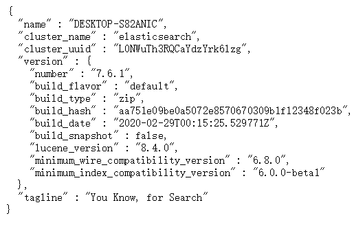

4. 点击/bin下的elasticsearch.bat就可以直接运行

### 2.2 nodejs的安装

​	安装nodejs是为了给elasticsearch-head-master提供环境，elasticsearch-head-master是ElasticSearch的可视化界面。

1. 下载完成后解压到指定目录，我的安装目录为：D:\nodejs安装完毕后在命令行输入

   ```
   npm -v
   ```

   下命令测试是否安装成功，正确会出现版本号。

2. 改变环境变量，在D:\nodejs下建立"node_global"及"node_cache"两个文件夹，输入以下命令改变npm配置

   ```
   npm config set prefix "D:\nodejs\node_global"
   npm config set cache "D:\nodejs\node_cache"
   ```

   添加环境变量NODE_PATH，输入路径D:\nodejs\node_global\node_modules，此后所安装的模块都会安装到改路径下

   (不用按照也express行)在命令行输入以下命令试着安装express

   ```
   npm install express -g
   ```

3. 安装cnpm，输入以下命令

   ```
   npm install -g cnpm --registry=https://registry.npm.taobao.org
   ```

   之后添加环境变量，因为cnpm会被安装到D:\nodejs\node_global下，而系统变量path并未包含该路径。在系统变量path下添加该路径即可正常使用cnpm;

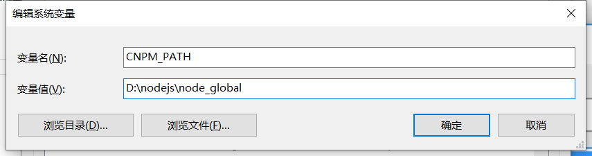

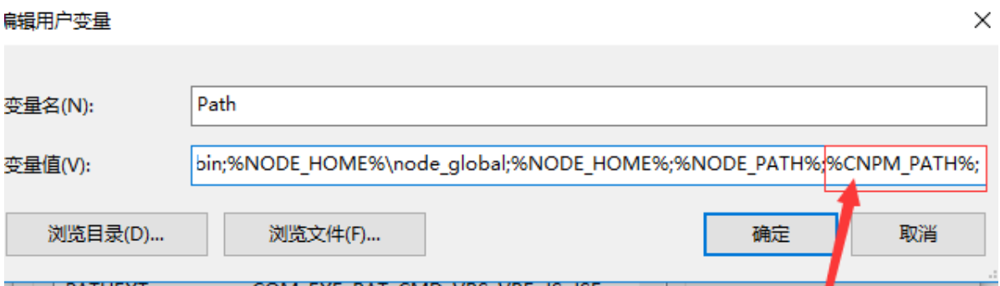

### 2.3 elasticsearch-head-master的安装

​	我解压到了D:\Elasticsearch\elasticsearch-head-master，然后在此目录下打开cmd，执行命令

```
cnpm install
```

​	安装完之后启动，启动elasticsearch-head-master的方法就是在其目录下执行如下命令

```
npm run start
```

​	之后打开 http://localhost:9100可以看到


​	再点击连接按钮没有反应，这里是因为跨域问题，只需要在elasticsearch配置一下

 1. 打开D:\Elasticsearch\elasticsearch-7.6.1\config\elasticsearch.yml

 2. 添加

    ```
    http.cors.enabled: true
    http.cors.allow-origin: "*"
    ```

    重启即可成功

    

### 2.4 kibana的安装

​	我的安装目录为D:\Elasticsearch\kibana-7.6.1-windows-x86_64\，点击\bin下的Kibana.bat按钮就可以启动

​	访问http://localhost:5601可以看到安装成功页面


### 2.5 ik分词器的安装

​	ik分词器要和elasticsearch的版本对应，将其解压到elasticsearch的plugins下自己创建的ik文件夹里

# 二、ik分词器的使用

1. ik_max_word

   会将文本做最细粒度的拆分，比如“中华人民共和国人民大会堂”拆分为“中华人民共和国、中华人民、中华、华人、人民共和国、人民、共和国、大会堂、大会、会堂"等词语。

   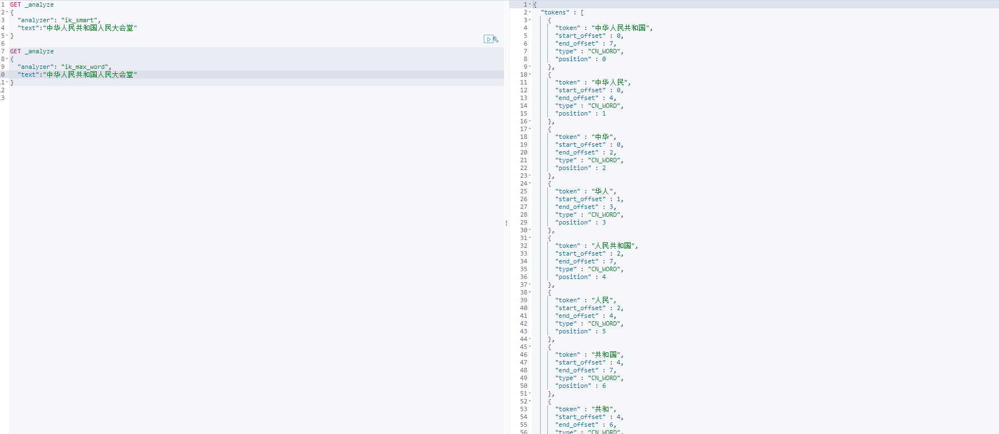

2. ik_smart
   会做最粗粒度的拆分，比如“中华人民共和国人民大会堂”拆分为"中华人民共和国、人民大会堂"。

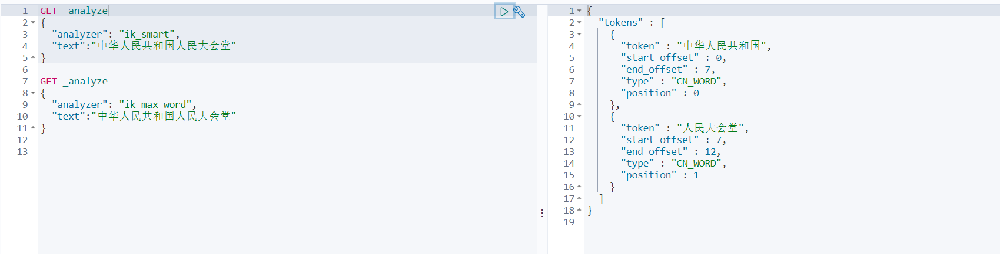

3. 自定义词语

   打开D:\Elasticsearch\elasticsearch-7.6.1\plugins\ik\config，创建wangchenyang.dic，里面填写“王晨阳”

   再将IKAnalyzer.cfg.xml中配置，重启es

   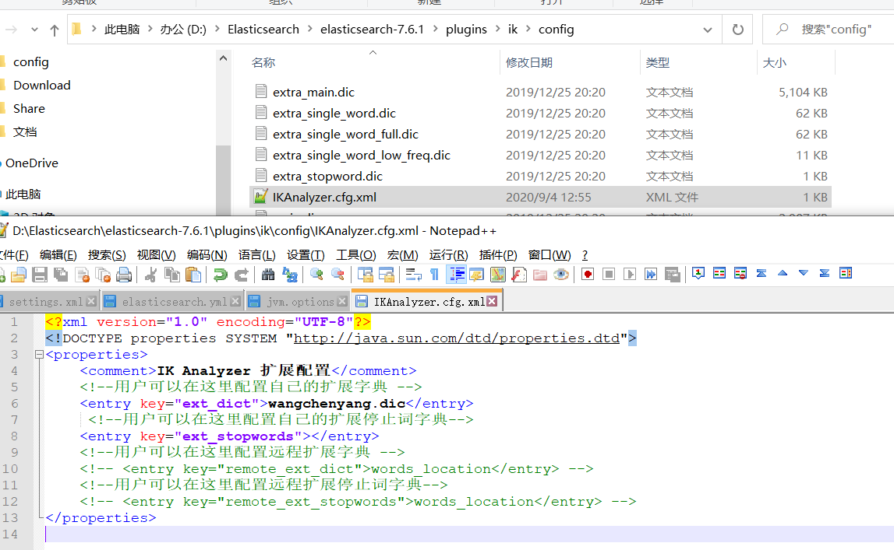

- keyword不会 背分词器拆分
- standar会被分词器拆分

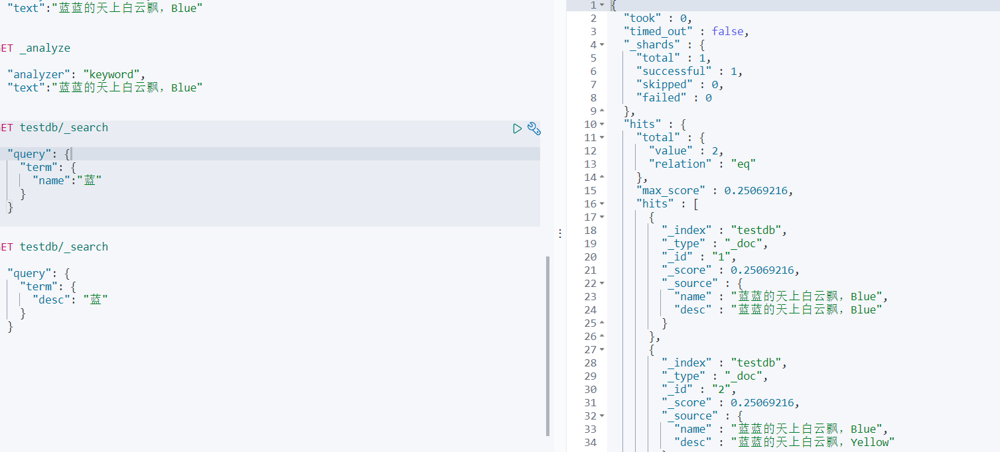

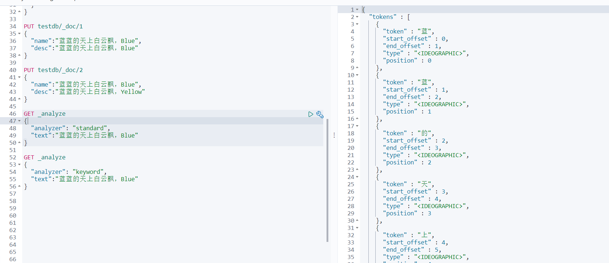


# 三、文档的基本操作

## 1.索引基本操作

### 1.1 添加文档

```
PUT /wang/user/1
{
  "name":"wangchenyang",
  "age":23,
  "desc":"一顿操作猛如虎，一看工资二百五",
  "tag":["技术宅","温暖","直男"]
}
```


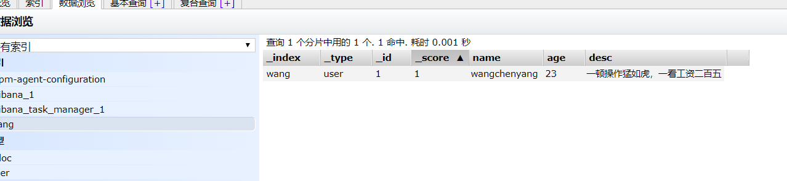

### 1.2 查询文档

默认是模糊查询

```
GET /wang/user/1

GET wang/user/_search?q=name:王晨阳

GET wang/user/_search?q=name:王晨阳Java
```

### 1.3 修改文档

PUT，覆盖

```
PUT /wang/user/1
{
  "name":"wangchenyang",
  "age":24,
  "desc":"一顿操作猛如虎，一看工资二百五",
  "tag":["技术宅","温暖","直男"]
}
```

Post的_update，修改

```
POST /wang/user/1/_update
{
  "doc":{
    "name":"周杰伦"
  }
}
```

### 1.4 删除文档

```
DELETE wang/user/3
```

## 2.索引复杂操作

```
GET wang/user/_search
{
  "query": {
    "match": {
      "name": "王晨阳"
    }
}
```

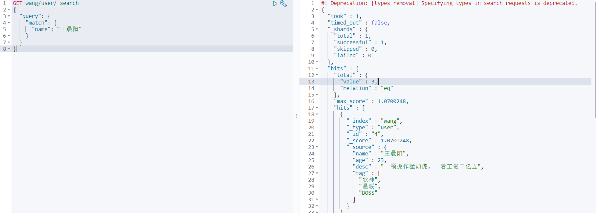

hits：索引和文档信息查询结果总数，查询文档中的数据都可以遍历出来

score：可以通过分数值判断哪个结果更符合


 


### sort

可以对结果进行排序，排序之后分值就没有了所以是null

```
GET wang/user/_search
{
  "query": {
    "match": {
      "name": "王晨阳"
    }
  },
   "_source": ["name","age"],
   "sort": [
     {
       "age": {
         "order": "desc"
       }
     }
   ]
}
```

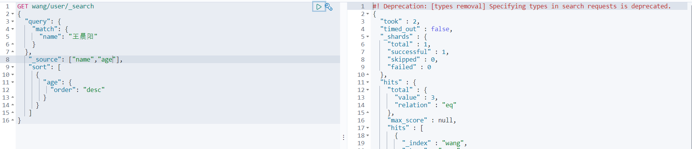


### must

所有条件都要符合才能查出来，相当于where name = 王晨阳 and desc=一顿操作猛如虎，一看工资二百五

```
GET wang/user/_search
{
  "query": {
    "bool": {
      "must": [
        {
          "match": {
            "name": "王晨阳"
          }
        },
        {
          "match": {
            "desc": "一顿操作猛如虎，一看工资二百五"
          }
        }
      ]
    }
  }
}
```


### should

相当于where name = 王晨阳 or desc=一顿操作猛如虎，一看工资二百五

```
GET wang/user/_search
{
  "query": {
    "bool": {
      "should": [
        {
          "match": {
            "name": "王晨阳"
          }
        },
        {
          "match": {
            "desc": "一顿操作猛如虎，一看工资二百五"
          }
        }
      ]
    }
  }
}
```


### must_not

相当于not

```
GET wang/user/_search
{
  "query": {
    "bool": {
      "must_not": [
        {
          "match": {
            "name": "王晨阳"
          }
        },
        {
          "match": {
            "desc": "一顿操作猛如虎，一看工资二百五"
          }
        }
      ]
    }
  }
}
```


### filter

过滤数据

```
GET wang/user/_search
{
  "query": {
    "bool": {
      "must": [
        {
          "match": {
            "name": "王晨阳"
          }
        }
      ],
      "filter": {
        "range": {
          "age": {
            "gte":10,
            "lt": 20
          }
        }
      }
    }
  }
}
```

- gt 大于
- gte 大于等于
- lt 小于
- lte 小于等于

### 分页

from是从第几个开始，size是展示多少个

```
GET wang/user/_search
{
  "query": {
    "match": {
      "name": "王晨阳"
    }
  },
  "from": 0
  , "size": 2
}
```

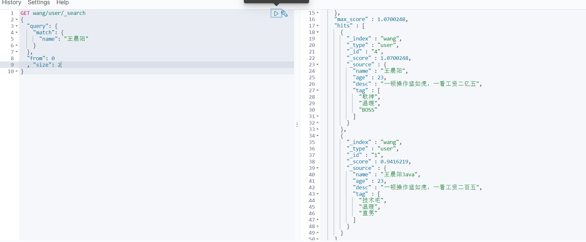


### 版本控制

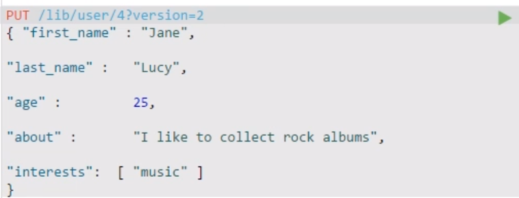


外部版本控制：提供的版本要大于本身的版本

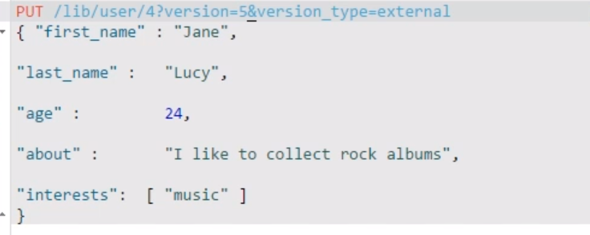


### 精确查询

精确查询单个值

```
GET wang/user/_search?pretty
{
  "query": {
    "term": {
      "age": "18"
    }
  }
}
```

精确查找多个值：

```
GET testdb/_search
{
  "query": {
    "bool":{
      "should": [
        {
          "term": {
            "t1":"22"
          }
        },
        {
          "term":{
            "t1":"33"
          }
        }
      ]
    }
  }
}
```

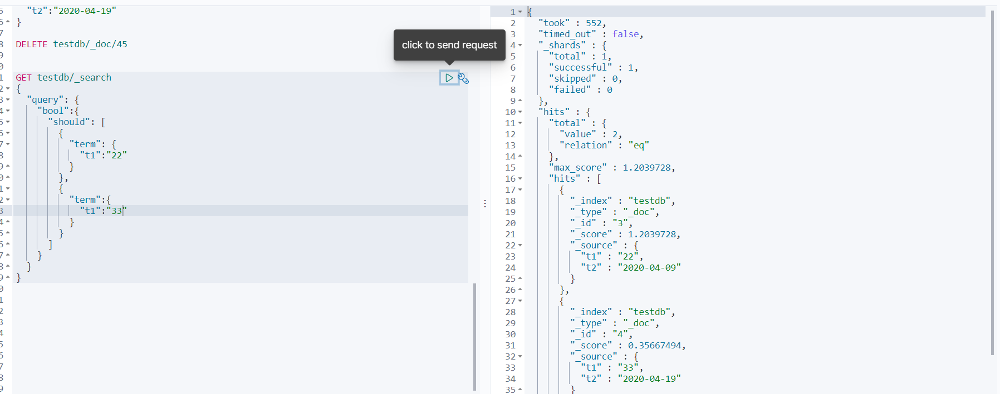

term查询是直接通过倒排索引指定的词条进行精确查找

- trem，直接查询精确的
- match，会使用分词器解析（先分析文档，然后再通过分析的文档进行查询）

两个类型：keyword和standard

- ​	keyword不会被分词器拆分


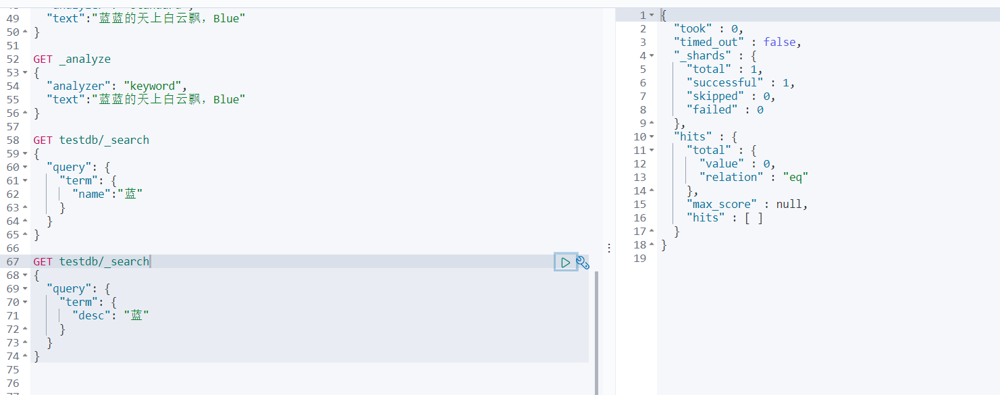

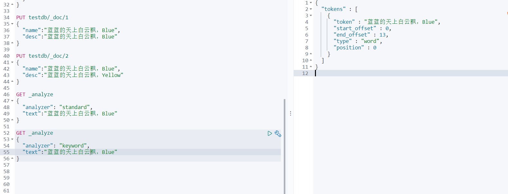

### 高亮查找

```
GET wang/user/_search
{
  "query":{
    "match":{
      "name":"王晨阳"
    }
  },
  "highlight":{
    "fields":{
      "name":{}
    }
  }
}
```

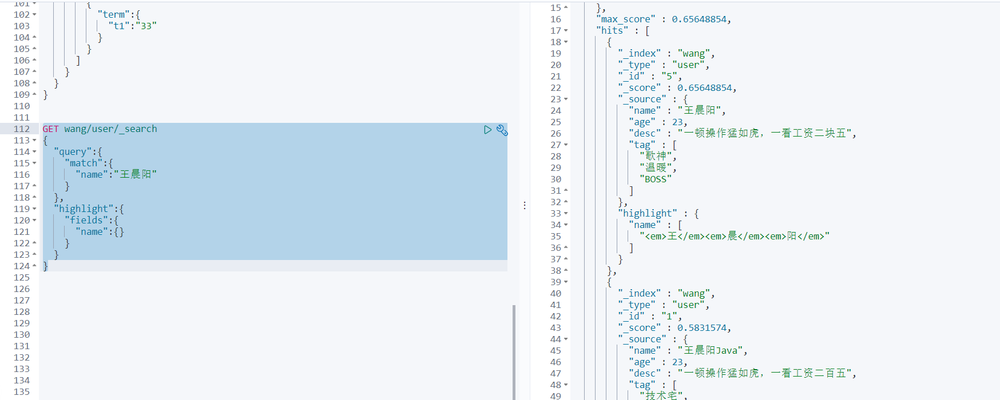

自定义高亮查找

```
GET wang/user/_search
{
  "query":{
    "match":{
      "name":"王晨阳"
    }
  },
  "highlight":{
    "pre_tags": "<p class='key' style='color:red'>",
    "post_tags": "</p>", 
    "fields":{
      "name":{}
    }
  }
}
```

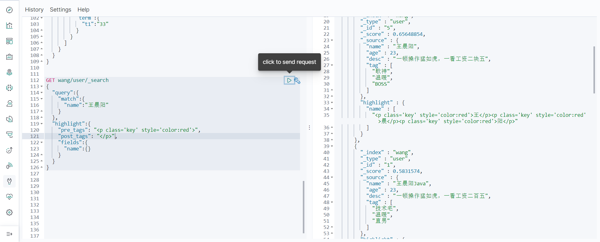

### 匹配多个条件

​	多个条件使用空格隔开，只要满足其中一个条件就可以被查出，这个时候可以通过分值来进行基本判断

```
GET wang/user/_search
{
  "query": {
    "match": {
      "tag": "男 技术"
    }
  }
}
```

### 手动创建映射

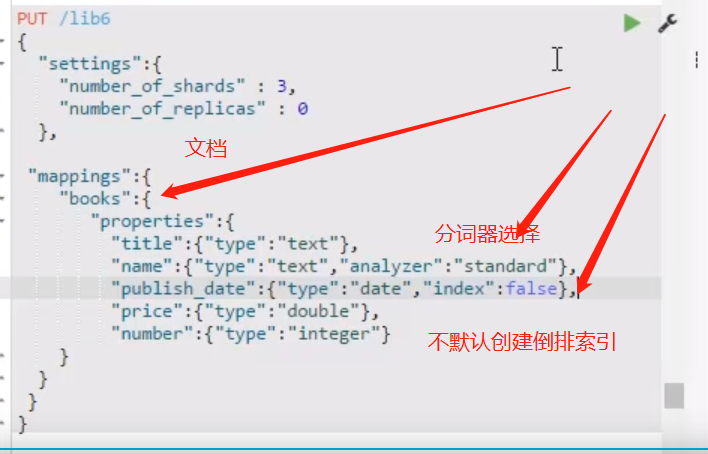

### _search 获取文档全部信息

```
GET /wang/_search
```


### _mapping 获取映射

​	es会自动根据输入的内容判断类型

```
GET /wang/_mapping
```


### _bulk 执行多条语句

```xml
PUT _bulk
{"index"   :{"_index":"dangdang","_type":"book","_id":"1"}}
{"bookName":"红楼梦","auther":"曹雪芹","price":49.9}
{"index"   :{"_index":"dangdang","_type":"book","_id":"3"}}
{"doc"     :{"price":420}}
{"create"  :{"_index":"dangdang","_type":"book","_id":"2"}}
{"booName" :"水浒传","auther":"施耐庵"}
{"delete"  :{"_index":"dangdang","_type":"book","_id":"3"}}

PUT /dangdang/book/_bulk
{"index"   :{"id":"1"}}
{"bookName":"红楼梦","author":"曹雪芹","price":55}
{"index"   :{"_id":"1"}}
{"doc"     :{"price":"198"}}
{"create"  :{"_id":"2"}}
{"booName" :"水浒传","author":"施耐庵"}
{"delete"  :{"_id":"3"}}
```

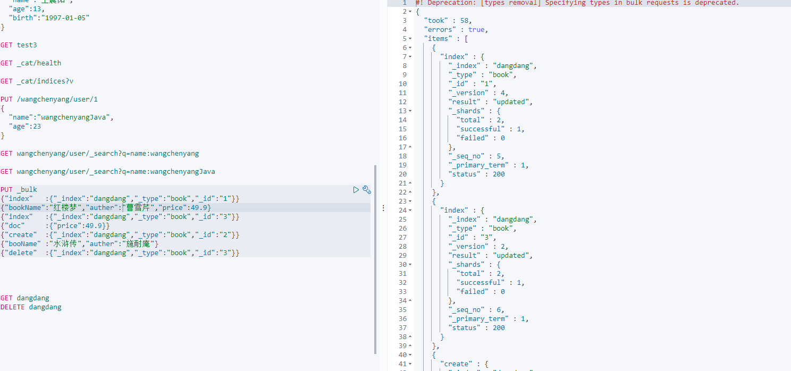

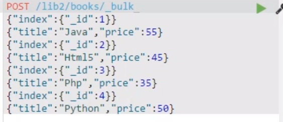

**index和create区别**：

- ​	index：会检查_version。如果插入时没有指定__version，那对于已有的doc，_version会递增，并对文档覆盖。_

​					插入时如果指定_version，如果与已有的文档_version不相等，则插入失败，如果相等则覆盖，_version递增。

- ​	create：也会检查_version，但是对于已有的文档，不会创建新文档，即插入失败。

### _mget 查询多个条目

```
GET _mget
{

  "docs":[
    {"_index":"dangdang",
      "_type":"book",
      "_id":1
      "_source":"price"
    },
    {
      "_index":"dangdang",
      "_type":"book",
      "_id":2
    }
    
    ]
}

GET /dangdang/book/_mget
{
  "docs":[
    {"_id":1},
    {"_id":2}
    ]
}

GET /dangdang/book/_mget
{
  "ids":["1","2"]
}
```

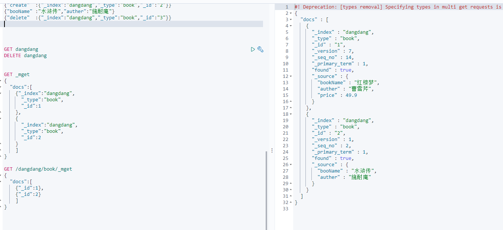


### _source 过滤结果内容

```
GET /dangdang/book/1?_source=bookName
```

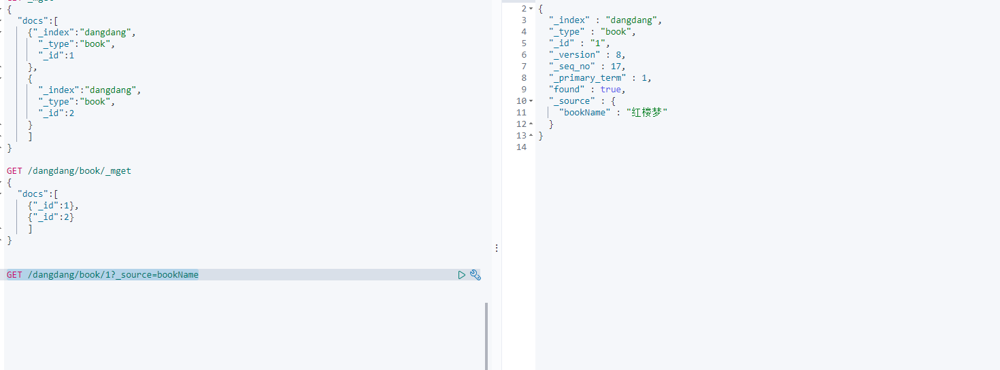

```
GET wang/user/_search
{
  "query": {
    "match": {
      "name": "王晨阳"
    }
  },
   "_source": ["name"]
}

```

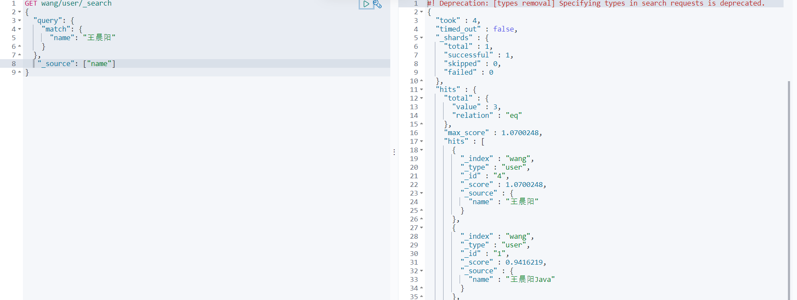

这些功能mysql也可以做，只是效率低下

- 匹配
- 按条件匹配
- 精确匹配
- 区间范围匹配
- 匹配字段过滤
- 多条件查询
- 高亮查询

# 四、集成SpringBoot

## 1.配置

java Rest Client ：https://www.elastic.co/guide/en/elasticsearch/client/java-rest/7.x/index.html

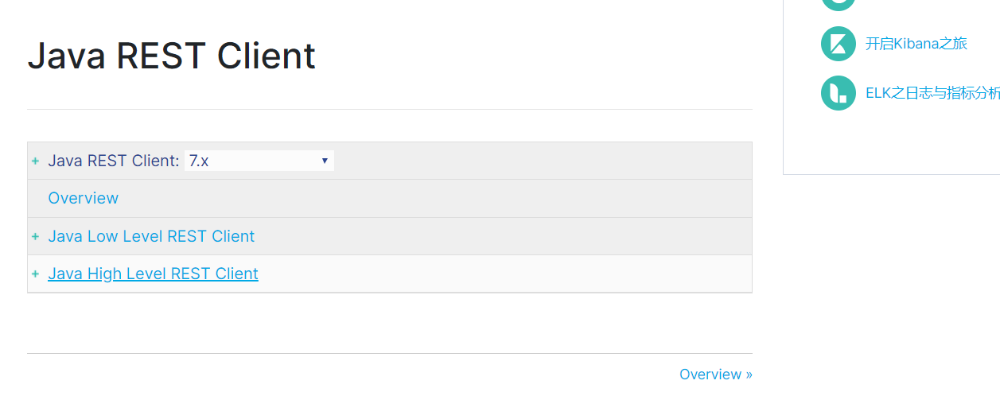

1. 找到原生依赖

   ```xml
   <dependency>
       <groupId>org.elasticsearch.client</groupId>
       <artifactId>elasticsearch-rest-client</artifactId>
       <version>7.10.0</version>
   </dependency>
   ```

2. 找对象

   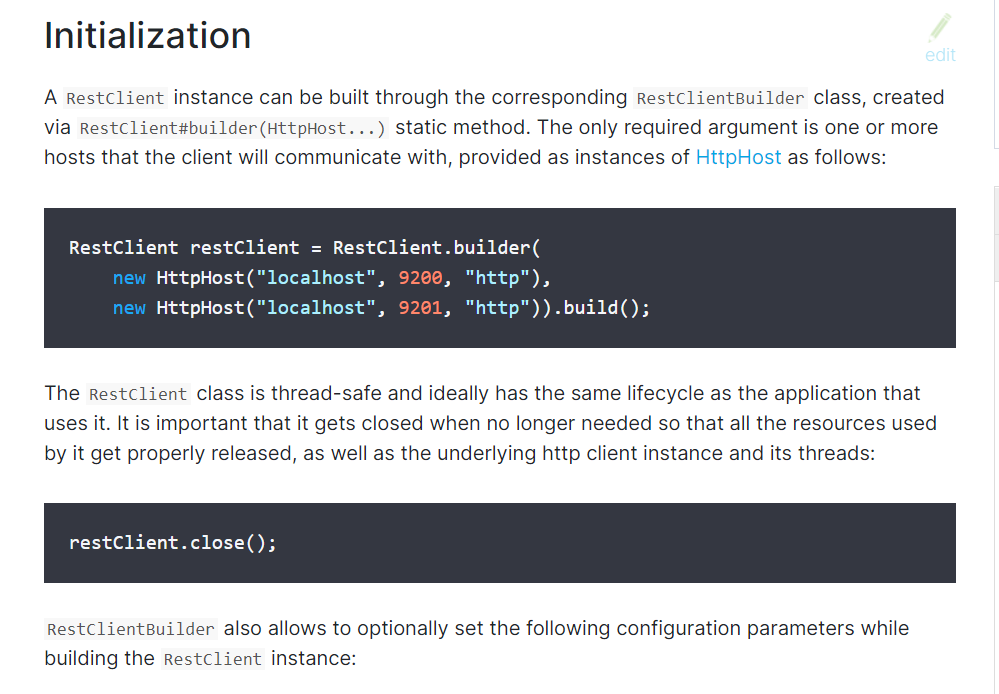

   3. 分析这个方法即可

      **问题：一定要保证我们导入的依赖和我们es的版本一致**

      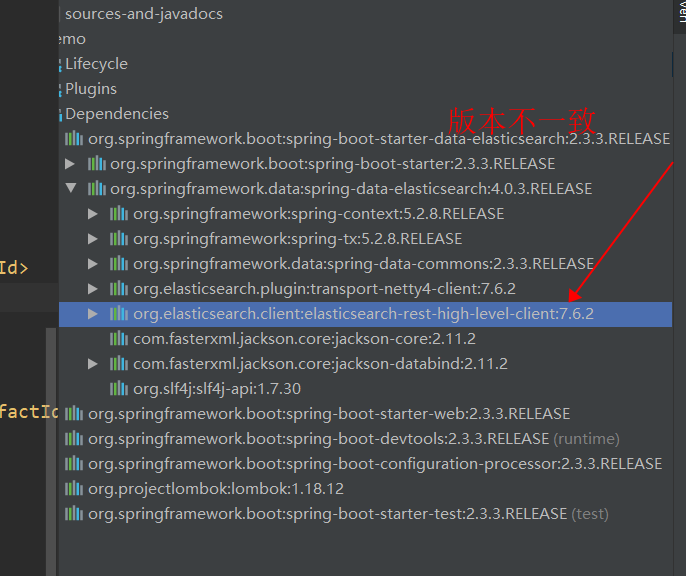

      添加依赖

      


## 2.索引操作

### 2.1创建索引

配置类

```java
@Configuration
public class ElasticSearchConfig{
    @Bean
    public RestHighLevelClient restHighLevelClient(){
        RestHighLevelClient client = new RestHighLevelClient(
                RestClient.builder(
                        new HttpHost("127.0.0.1",9200,"http")));
        return client; 
    }
}
```


创建索引请求

```java
   	@Autowired
   	private RestHighLevelClient restHighLevelClient;

	@Test
    void contextLoads() throws IOException {

        CreateIndexRequest request = new CreateIndexRequest("chen_index");
            //2.客户端执行请求，获取响应
        CreateIndexResponse createIndexResponse = restHighLevelClient.indices().create(request, RequestOptions.DEFAULT);

        System.out.println(createIndexResponse+"------------");
    }
```

### 2.2判断索引是否存在

```java
@Test
    void testExistIndex() throws Exception{
        GetIndexRequest getIndexRequest = new GetIndexRequest("chen_index");
        boolean exits = restHighLevelClient.indices().exists(getIndexRequest,RequestOptions.DEFAULT);
        System.out.println(exits);
    }
```

### 2.3删除索引

```java
Test
    void testDeleteIndex() throws Exception{
        DeleteIndexRequest deleteIndexAction = new DeleteIndexRequest("chen_index");
        AcknowledgedResponse delete = restHighLevelClient.indices().delete(deleteIndexAction,RequestOptions.DEFAULT);
        System.out.println(delete);
    }
```

## 3.文档操作

### 3.1添加文档

导入阿里json依赖

```xml
        <dependency>
            <groupId>com.alibaba</groupId>
            <artifactId>fastjson</artifactId>
            <version>1.2.62</version>
        </dependency>
```


```java
   void testAddDocument() throws IOException {
        User user = new User("Jay",41);
        IndexRequest request = new IndexRequest("chen_index");

        //put chen/_doc/1
        request.id("1");
        request.timeout(TimeValue.timeValueSeconds(1));
        request.timeout("1s");

        //将数据放入请求 json
        request.source(JSON.toJSONString(user), XContentType.JSON);

        //客户端发送请求，获取响应的结果
        IndexResponse indexResponse = restHighLevelClient.index(request,RequestOptions.DEFAULT);

        System.out.println(indexResponse.toString());
        System.out.println(indexResponse.status());
    }
```


### 3.2获取文档

```java
  @Test
    void testGetDocument() throws Exception{
        GetRequest getRequest = new GetRequest("chen_index");
        GetResponse getResponse = restHighLevelClient.get(getRequest,RequestOptions.DEFAULT);
        System.out.println(getResponse.getSourceAsBytes());//打印文档内容
        System.out.println(getResponse);//返回全部内容和命令
    }
```

### 3.3更新文档

```java
    @Test
    void testUpdateDocument() throws Exception{
        UpdateRequest updateRequest = new UpdateRequest("chen_index","1");
        updateRequest.timeout("1s");

        User user = new User("Wangchenyang",15);
        updateRequest.doc(JSON.toJSONString(user),XContentType.JSON);

        UpdateResponse updateResponse = restHighLevelClient.update(updateRequest,RequestOptions.DEFAULT);
        System.out.println(updateResponse.status());
    }
```

### 3.4删除文档

```java
   @Test
    void testUpdateDocument() throws Exception{
        UpdateRequest updateRequest = new UpdateRequest("chen_index","1");
        updateRequest.timeout("1s");

        User user = new User("Wangchenyang",15);
        updateRequest.doc(JSON.toJSONString(user),XContentType.JSON);

        UpdateResponse updateResponse = restHighLevelClient.update(updateRequest,RequestOptions.DEFAULT);
        System.out.println(updateResponse.status());
    }
```

### 3.5批量插入

```java
void testBulkRequest() throws IOException{
        BulkRequest bulkRequest = new BulkRequest();
        bulkRequest.timeout("10s");

        ArrayList<User> userArrayList = new ArrayList<>();
        userArrayList.add(new User("wangchenyang",18));
        userArrayList.add(new User("wangchenyang",18));
        userArrayList.add(new User("wangchenyang",18));
        userArrayList.add(new User("wangchenyang",18));
        userArrayList.add(new User("wangchenyang",18));
        userArrayList.add(new User("wangchenyang",18));

        for (int i = 0 ;i<userArrayList.size();i++){
            bulkRequest.add(
                    new IndexRequest("chen_index")
                    .id(""+(i+1))
                    .source(JSON.toJSONString(userArrayList.get(i)),XContentType.JSON));
        }
        BulkResponse bulkResponse = restHighLevelClient.bulk(bulkRequest,RequestOptions.DEFAULT);
        System.out.println(bulkResponse.hasFailures());
    }
```

### 3.6 查询文档

```java
    //SearchRequest 查询请求
    //SearchSourceBuilder 条件构造
    //HighlightBuilder 高亮
    //TermQueryBuilder 精确查找
    void testSearch() throws IOException{
        SearchRequest searchRequest = new SearchRequest("chen_index");
        //构建搜索条件
        SearchSourceBuilder sourceBuilder = new SearchSourceBuilder();

//        QueryBuilders.termQuery() 精确
//        QueryBuilders.matchAllQuery() 匹配所有

        TermQueryBuilder termQueryBuilder = QueryBuilders.termQuery("name","wangchenyang");
        sourceBuilder.query(termQueryBuilder);
        sourceBuilder.timeout(new TimeValue(60, TimeUnit.SECONDS));

        searchRequest.source(sourceBuilder);

        SearchResponse searchResponse = restHighLevelClient.search(searchRequest,RequestOptions.DEFAULT);
        System.out.println(JSON.toJSONString(searchResponse.getHits()));
        for(SearchHit documentFields:searchResponse.getHits().getHits()){
            System.out.println(documentFields.getSourceAsMap());
        }
    }
```

