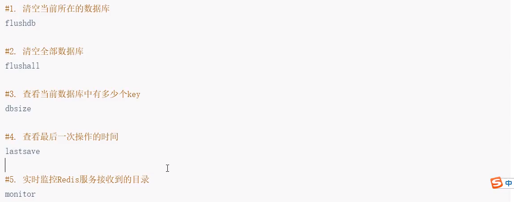

# 一、Redis安装

## 1.下载

## 2.解压

## 3.双击启动

The server is now ready to accept connections on port 6379

## 4.打开客户端测试


# 二、Redis常用命令

## 1.redis存储数据的结构

> 常用5种数据结构
>
> - key-string：一个key对应一个值（最常用，一般用于存储一个值）
> - key-hash：一个key对应一个Map（存储一个对象）
> - key-list：一个key对应一个列表（使用list实现队列和栈）
> - key-set：一个key对应一个集合（不能重复，实现了交集、并集、差集）
> - key-zset：一个key对应一个有序集合（基于分数排序，排行榜）

---

> 另外三种数据结构
>
> HyperLogLog：计算近似值
>
> GEO：地理位置
>
> BIT：一版存储的也是一个字符串，存储的是一个byte[]

## 2.string常用命令

```sh
#1. 添加值
set key value

#2. 取值
get key

#3. 批量操作
mset key value key value...
mget key value key value...

#4. 自增命令
incr key

#5. 自减命令
decr key

#6. 自增或自减指定熟练
incrby key increment
decrby key increnent
```


---


---

## 3.hash常用命令


## 4.list常用命令


## 5.set常用命令


## 6.zset常用命令


## 7.key常用命令


## 8.db常用命令

​	


# 三、java连接redis

> jedis连接Redis， Lettuce连接Redis

## 1.Jedis连接Redis

> 1.创建maven项目
>
> 2.导入相关的依赖
>
> ```xml
>         <!--    1.Jedis-->
>         <dependency>
>             <groupId>redis.clients</groupId>
>             <artifactId>jedis</artifactId>
>             <version>2.9.0</version>
>         </dependency>
> 
>         <!--    2.Junit-->
>         <dependency>
>             <groupId>junit</groupId>
>             <artifactId>junit</artifactId>
>             <version>4.12</version>
>         </dependency>
>         <!--    3.Lombok-->
>         <dependency>
>             <groupId>org.projectlombok</groupId>
>             <artifactId>lombok</artifactId>
>             <version>1.16.20</version>
>         </dependency>
>     </dependencies>
> ```
>
> 3.测试
>
> ```java
>     @Test
>     public void set(){
>         Jedis jedis = new Jedis("127.0.0.1",6379);
>         jedis.set("name","漩涡鸣人");
>         jedis.close();
>     }
> 
>     @Test
>     public void get(){
>         Jedis jedis = new Jedis("127.0.0.1",6379);
>         String value = jedis.get("name");
>         System.out.println(value);
>         jedis.close();
>     }
> ```
>
> 

补充@Data注解与 lombok

> @Data ： 注在类上，提供类的get、set、equals、hashCode、canEqual、toString方法
>  @AllArgsConstructor ： 注在类上，提供类的全参构造
>  @NoArgsConstructor ： 注在类上，提供类的无参构造
>  @Setter ： 注在属性上，提供 set 方法
>  @Getter ： 注在属性上，提供 get 方法
>  @EqualsAndHashCode ：    注在类上，提供对应的 equals 和 hashCode 方法
>  @Log4j/@Slf4j   ： 注在类上，提供对应的 Logger 对象，变量名为 log
>
> ```java
> @Data
> @AllArgsConstructor
> @NoArgsConstructor
> public class Person {
>     private String name;
>     private String address;
>     private Integer age;
>     private String hobbit;
>     private String phone;
> }
> 自动生成的方法
> ```
>
> 

## 2.jedis存储对象到Redis以byte[]

> 准备一个实体类

```java
@Data
@NoArgsConstructor
@AllArgsConstructor
public class User implements Serializable {
    private Integer id;
    private String name;
    private Date birthday;

}

```


> 导入spring-context依赖

```xml
        <dependency>
            <groupId>org.springframework</groupId>
            <artifactId>spring-context</artifactId>
            <version>4.3.18.RELEASE</version>
        </dependency>
```


> 创建Demo测试类，编写内容

```java
    @Test
    public void setByteArray(){
//        1. 连接redis服务
        Jedis jedis = new Jedis("127.0.0.1",6379);

//        2.1 准备key(String)-value(User)
        String key = "User";
        User value = new User(1,"漩涡鸣人",new Date());

//        2.2 将key和value转换为bety[]
        byte[] byteKey = SerializationUtils.serialize(key);
        byte[] byteValue = SerializationUtils.serialize(value);

//        2.3 将key和value存储到Redis
        jedis.set(byteKey, byteValue);

//        3. 释放资源
        jedis.close();
    }

    @Test
    public void getByteArray(){
//        1. 连接redis服务
        Jedis jedis = new Jedis("127.0.0.1",6379);

//        2.1 准备key
        String key ="User";

//        2.2 将key转换为bety[]
        byte[] byteKey = SerializationUtils.serialize(key);

//        2.3 jedis去Redis中获取value
        byte[] value = jedis.get(byteKey);

//        2.4 将value反序列化为user对象
        User user = (User) SerializationUtils.deserialize(value);

        System.out.println(user);
//        3. 释放资源
        jedis.close();
    }
```

## 3.jedis存储对象到Redis以String

> 导入fastJSON依赖
>
> ```xml
> <dependency>
>     <groupId>com.alibaba</groupId>
>     <artifactId>fastjson</artifactId>
>     <version>1.2.47</version>
> </dependency>
> ```

> 测试
>
> ```java
>     @Test
>     public void setString(){
> //            1. 连接redis
>         Jedis jedis = new Jedis("127.0.0.1",6379);
> 
> //            2.1 准备key(String)-value(User)
>         String keyString = "stringUser";
>         User value = new User(2, "宇智波佐助", new Date());
> 
> //            2.2 准备fastJSON将value转化为json字符串
>         String valueString = JSON.toJSONString(value);
> 
> //            2.3 存储到Redis中
>         jedis.set(keyString, valueString);
> 
> //            3. 释放资源
>         jedis.close();
>     }
> 
>     @Test
>     public void getString(){
> //            1. 连接redis
>         Jedis jedis = new Jedis("127.0.0.1",6379);
> 
> //            2.1 准备key
>         String keyString = "stringUser";
> 
> //            2.2 去Redis中查询value
>         String value = jedis.get(keyString);
> 
> //            2.3 将value反序列化为User
>         User user = JSON.parseObject(value,User.class);
>         System.out.println(user);
> //            3. 释放资源
>         jedis.close();
>     }
> ```

## 4.Jedis连接池的操作

```java
  @Test
    public void pool(){
        //1.创建连接池
        JedisPool pool = new JedisPool("127.0.0.1",6379);

        //2.通过连接池获取jedis对象
        Jedis jedis = pool.getResource();

        //3.操作
        String value = jedis.get("StringUser");
        System.out.println(value);

        //4.释放资源
        jedis.close();
    }

    public void pool2(){
        //0. 配置连接池信息
        GenericObjectPoolConfig poolConfig = new GenericObjectPoolConfig();
        poolConfig.setMaxTotal(10);
        poolConfig.setMinIdle(5);
        poolConfig.setMaxIdle(10);

        //1.创建连接池
        JedisPool pool = new JedisPool(poolConfig,"127.0.0.1",6379);

        //2.通过连接池获取jedis对象
        Jedis jedis = pool.getResource();

        //3.操作
        String value = jedis.get("StringUser");
        System.out.println(value);

        //4.释放资源
        jedis.close();
    }
```

5.Redis管道操作

> 因为在操作Redis的时候,执行一个命令需要先发送请求到务器，这个过程需要经历网络的延迟，Redis 还需要给客户端一个响应。
>
> 如果我需要一次性执行很多个命令，上述的方式效率很低，可以通过Redis的管道，先将命令放到客户端的一个Pipeline中，之后一次性的将全部命令都发送到Redis服务，Redis服务一次性的将全部的返回结果响应给客户端。

```java
   @Test
    public void pipelineBefore() {
//        1.创建连接池
        JedisPool pool = new JedisPool("127.0.0.1", 6379);
        long l = System.currentTimeMillis();

//        2.获取一个连接对象
        Jedis jedis = pool.getResource();

//        3.执行incr-100000次
        for (int i = 0; i < 10000; i++) {
            jedis.incr("pp");
        }

//        4.释放资源
        jedis.close();
        System.out.println(System.currentTimeMillis()-l);
    }
    @Test
    public void pipelineAfter() {
//        1.创建连接池
        JedisPool pool = new JedisPool("127.0.0.1", 6379);
        long l = System.currentTimeMillis();

//        2.获取一个连接对象
        Jedis jedis = pool.getResource();

//        3.创建管道
        Pipeline pipeline = jedis.pipelined();

//        4.执行incr-100000次
        for(int i=0;i<10000;i++){
            pipeline.incr("qq");
        }
//        5.释放资源
        jedis.close();
        System.out.println(System.currentTimeMillis()-l);
    }
```

# 四、Redis其他配置以及集群

## 1.修改密码

自己百度，java中可在new JedisPool时候指定使用的密码和仓库

```java
    @Test
    public void poolForAuth(){
        //0. 配置连接池信息
        GenericObjectPoolConfig poolConfig = new GenericObjectPoolConfig();
        poolConfig.setMaxTotal(10);
        poolConfig.setMinIdle(5);
        poolConfig.setMaxIdle(10);

        //1.创建连接池
        JedisPool pool = new JedisPool(poolConfig,"127.0.0.1",6379,3000,"1234",15);

        //2.通过连接池获取jedis对象
        Jedis jedis = pool.getResource();

        //3.操作
        jedis.set("Naurto","漩涡鸣人");

        //4.释放资源
        jedis.close();
    }
```

## 2.Redis持久化机制

### 1.RDB

它是Redis默认的持久化机制

1. RDB持久化文件速度比较快，而且存储的是一个二进制的文件，传输起来很方便。
2. RDB持久化的时机:
save 900 1:在900秒内，有1个key改变了，就执行RDB持久化。
save 300 10:在300秒内，有10个key改变了，就执行RDB持久化。 
save 60 10000:在60秒内，有10000个key改变了，就执行RDB持久化。
3. RDB无法保证数据的绝对安全。

```sh
#代表RDB执行的时机
save 900 1		#900秒之内，有1个key改变了，就执行RDB持久化
save 300 10
save 60 10000

#开启RDB持久化压缩
rdbcompression yes

#RDB持久化文件的名称
dbfilename dump.rdb
```

### 2.AOF

AOF持久化策略默认是关闭的

1.其相对RDB的速度是较慢的，存储的是一个文件，后期会比较大，传输困难

2.AOF相对RDB更安全，但Redis推荐同时开启RDB和AOF

3.如果Redis宕机，那么在其重启后会加载一个持久化文件，优先选择AOF

4.如果开启了RDB，再开启AOF，如果RDB执行了持久化，那么RDB文件的内容会被AOF覆盖掉

```sh
 #代表开启持久化
appendonly no

#代表AOF文件的名称
appendfilename "appendonly.aof" 

#AOF持久化执行的时机，只能选择一个
appendfsync always #每执行一次写，立即持久化到AOF文件中，性能比较低
appendfsync everysec #每秒执行一次持久化
appendfsync no#会根据操作系统、环境的不同，在一定时间内执行持久化
```


## 3.Redis事务

> Redis的事务：一次事务操作，该成功的成功，该失败的失败

>先开启事务，执行一些列的命令，但是密码不会立即执行，会被放在一个队列中，如果你执行事务那么这个队列中的事务全部执行；如果取消事务，一个队列中的命令全部作废。
>
>multi：开启事务
>
>exec：执行事务
>
>watch：监听
>
>discard：取消事务
>
>unwatch：取消监听
>
>如果执行了事务，或者取消了事务，watch监听会自动取消，一般不需要手动执行unwatch

```cmd
127.0.0.1:6379> multi
OK
127.0.0.1:6379> set age 24
QUEUED
127.0.0.1:6379> set birthday 2000-02-02
QUEUED
127.0.0.1:6379> exec
1) OK
2) OK
127.0.0.1:6379> multi
OK
127.0.0.1:6379> set name wangwu
QUEUED
127.0.0.1:6379> set age 33
QUEUED
127.0.0.1:6379> incr name
QUEUED
127.0.0.1:6379> exec
1) OK
2) OK
3) (error) ERR value is not an integer or out of range


另一个客户端改变name，因为被监听所以不会执行事务

127.0.0.1:6379> watch name age
OK
127.0.0.1:6379> multi
OK
127.0.0.1:6379> set name wangwu
QUEUED
127.0.0.1:6379> set age 44
QUEUED
127.0.0.1:6379> exec
(nil)
```

## 4.Redis的主从架构

> 单机版Redis存在读写瓶颈的问题


windows下实现：

**实现Redis主从架构，就需要三台Redis服务器。以及三个Redis配置文件**

- 准备三个Redis.config文件

  1.修改第一个配置文件（当做主配置文件）

  2.修改第二个配置文件（当做从Redis）
  	①修改配置文件中的端口号：6380

  ​    ②修改	**slaveof 127.0.0.1 6379（指定主配置的地址和端口）**

  3.修改第三个配置文件（第二个从Redis）

  ​	①修改配置文件中的端口号：3681
  ​	②修改	**slaveof 127.0.0.1 6379（指定主配置的地址和端口）**

- 启动三个Redis服务器

  第一个：
  redis-server.exe redis1.conf

  第二个：
  redis-server.exe redis2.conf

  第三个：
  redis-server.exe redis3.conf

- 验证：启动不同的Redis客户端

  1. 在主Redis客户端中查看信息：redis-cli -p 6379 ，再输入info
  2. 在从Redis客户端中查看信息：redis-cli -p 6389，再输入info

> 但是主从架构有一个必须注意的问题，就是当主Redis宕机之后，整个服务还是会停止
>
> 所以我们需要引入哨兵机制，帮我们实现当主Redis宕机后，哨兵重新将从Redis选择为主Redis的操作

## 5.哨兵

> 其可以帮助我们解决主从架构中的单点故障问题


> ```sh
> #哨兵需要后台启动
> 
> daemonize yes
> 
> #指定Master节点的ip端口(主)
> 
> sentinel monitor master localhost 6379 2
> 
> #指定Master节点的ip端口(从)
> 
> sentinel monitor master 6379 2
> 
> #哨兵每隔多久监听一次Redis架构
> 
> sentienl down-after-millisenconds master 10000
> ```

## 6.集群


# 五、Redis常见问题

## 1.key的生存时间

​	key的生存时间到了，Redis会立即删除吗？

> 不会立即删除。
>
> - 不定期删除：
>
>   Redis每隔一段时间就会去查看Redis设置了过期时间的key，会再100ms的默认间隔查看3个key。
>
> - 惰性删除：
>
>   当我们去查询一个生存时间过期了的key时，Redis会先查看当前key的生存时间；如果时间已经到了，直接删除当前key并返回一个空值给用户。

## 2.Redis的淘汰机制

> 在Redis内存已经满的时候,添加了一个新的数据，执行淘汰机制。
> 1. volatile-lm：
> 在内存不足时，Ms会再设置过了生存时间的key中干掉一个最近最少使用的key。
> 2. aUkeys-lru ：
> 在内存不足时，Rgdig会再全部的key中干掉一个最近最少使用的key。
> 3. volatile-lfu ：
> 在内存不足时，Redis会再设置过了生存时间的kev中干棹一个最近最少频次使用的kev
> 4. aUkeys-Ifu ：
> 在内存不足 时 ，会再全部的key中干掉一个最近最少频次使用的key。
> 5. volatile-random：
> 在内存不足时，会再设 置 过了生 存 时 间 的key中随机干掉一个。
> 6. allkeys-random：
> 在内存不足时，M1S会再全部的key中随机干掉一个。
> 7. volatile-ttl：
> 在内存不足时，Redis会再设置过了生存时间的kev中干棹一个剩余生存时间最少的kev
> 8. noeviction: ( 默认）
> 在内存不足时，直接报错。
>
> 指定淘汰机制的方式：maxmemory-policy具体策略
>
> 设置Redis最大内存：maxmemory

## 3.缓存问题

### 3.1 缓存穿透


### 3.2 缓存击穿


### 3.3 缓存雪崩


### 3.4 缓存倾斜

